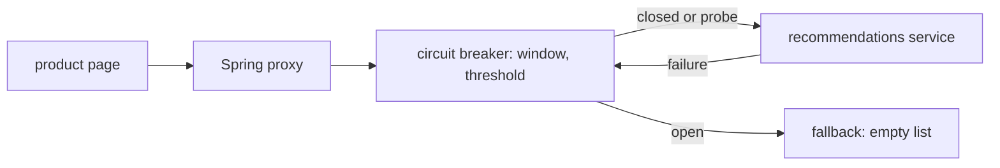

# Circuit Breaker with Resilience4j Pattern — Architecture Diagram

The proxy asks the breaker before a call reaches the service.

Mermaid source

```mermaid
flowchart LR
    P["product page"] --> X["Spring proxy"]
    X --> B["circuit breaker: window, threshold"]
    B -->|closed or probe| S["recommendations service"]
    B -->|open| F["fallback: empty list"]
    S -->|failure| B
```

