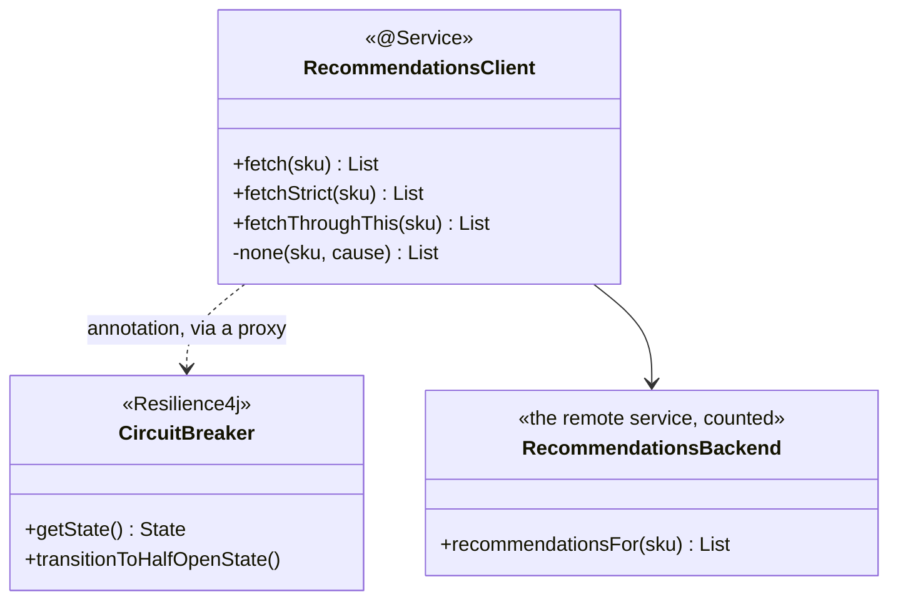

# Circuit Breaker with Resilience4j Pattern — Class Diagram

The client has annotated methods. The breaker's numbers live in configuration.

Mermaid source

```mermaid
classDiagram
    class RecommendationsClient {
        <<@Service>>
        +fetch(sku) List
        +fetchStrict(sku) List
        +fetchThroughThis(sku) List
        -none(sku, cause) List
    }
    class CircuitBreaker {
        <<Resilience4j>>
        +getState() State
        +transitionToHalfOpenState()
    }
    class RecommendationsBackend {
        <<the remote service, counted>>
        +recommendationsFor(sku) List
    }
    RecommendationsClient ..> CircuitBreaker : annotation, via a proxy
    RecommendationsClient --> RecommendationsBackend
```

