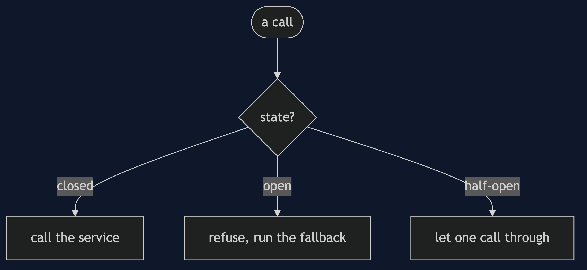
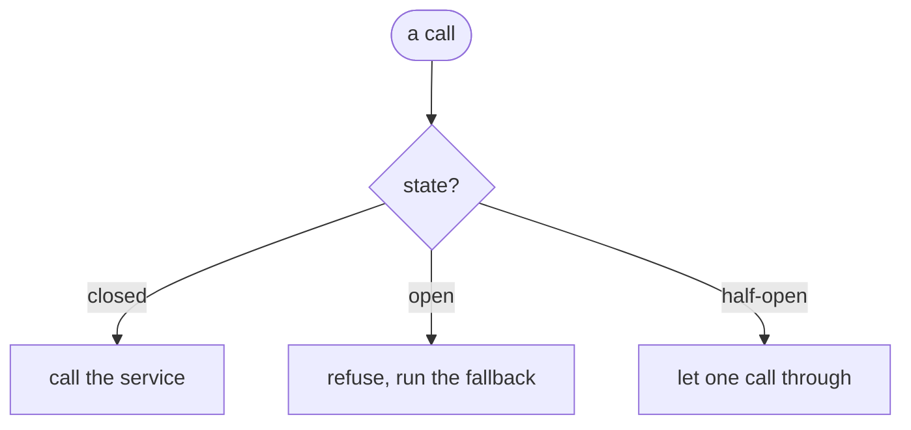

# Circuit Breaker with Resilience4j Pattern — Data Flow Diagram

What the breaker does with a call.

Mermaid source

```mermaid
flowchart TD
    Call(["a call"])
    State{"state?"}
    Go["call the service"]
    Refuse["refuse, run the fallback"]
    Probe["let one call through"]
    Call --> State
    State -- closed --> Go
    State -- open --> Refuse
    State -- half-open --> Probe
```

