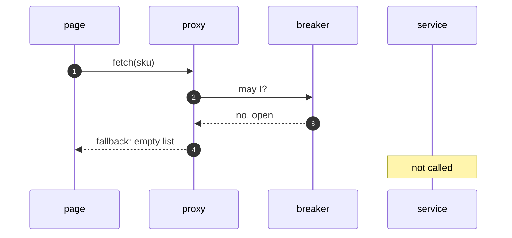

# Circuit Breaker with Resilience4j Pattern — Sequence Diagram

Written for a listener with the screen off.

Say it in words. The page calls fetch. The call goes to the proxy, which asks the breaker for permission. The breaker is open, so it refuses, and the proxy runs the fallback, which returns an empty list. The service is never called. Later the state moves to half-open. The next call is let through as a probe. If it works, the breaker closes.

Mermaid source

The load-bearing sentence: **an open breaker never touches the service.**
