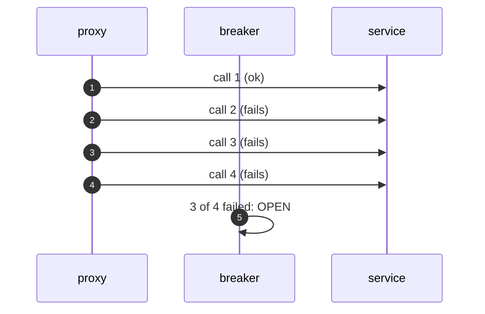
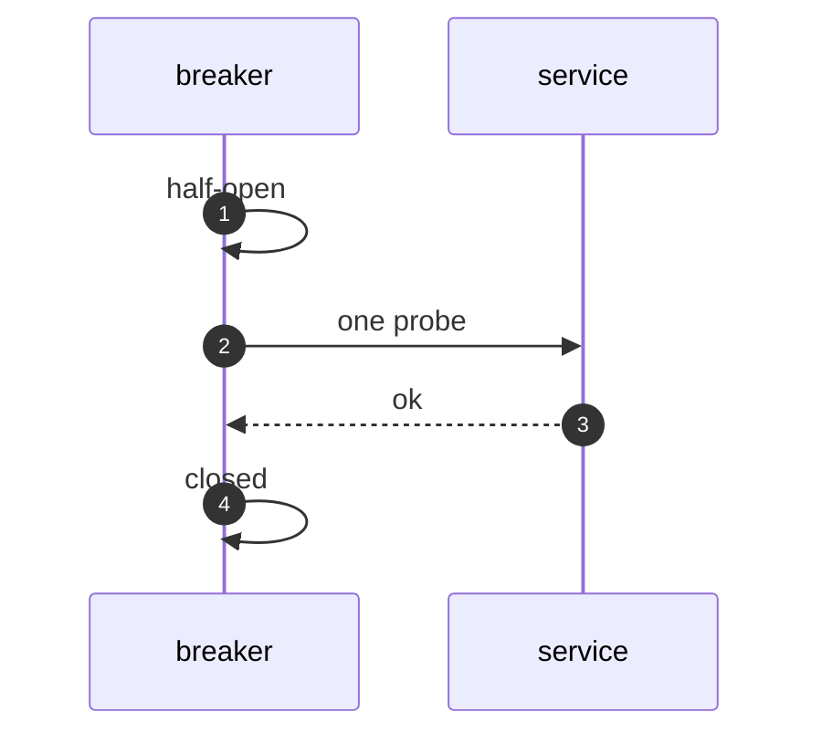

# Circuit Breaker with Resilience4j Pattern — UML Sequence Diagrams

Four sequences.

## 1. Four Calls Open It

Mermaid source

```mermaid
sequenceDiagram
    autonumber
    participant X as proxy
    participant B as breaker
    participant S as service
    X->>S: call 1 (ok)
    X->>S: call 2 (fails)
    X->>S: call 3 (fails)
    X->>S: call 4 (fails)
    B->>B: 3 of 4 failed: OPEN
```

## 2. A Probe

Mermaid source

```mermaid
sequenceDiagram
    autonumber
    participant B as breaker
    participant S as service
    B->>B: half-open
    B->>S: one probe
    S-->>B: ok
    B->>B: closed
```

