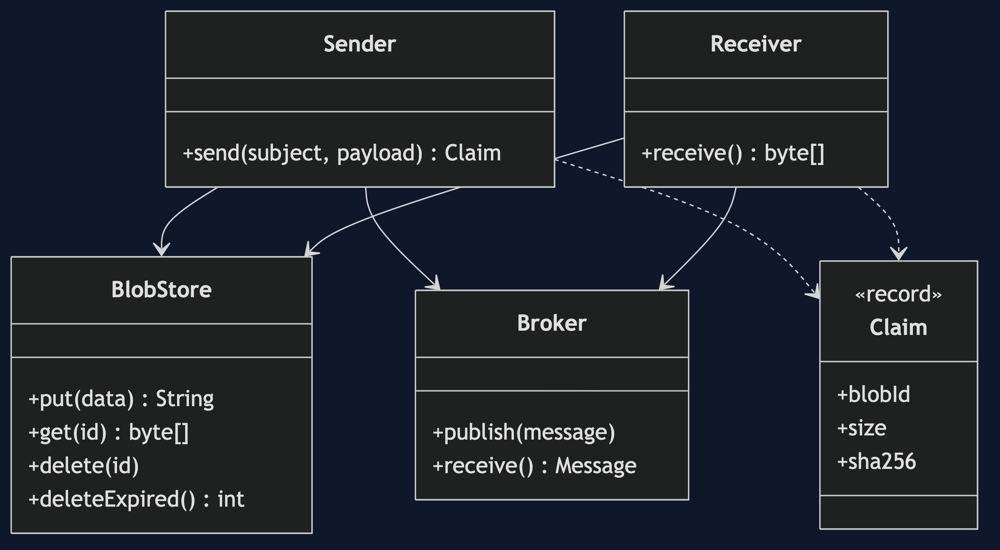
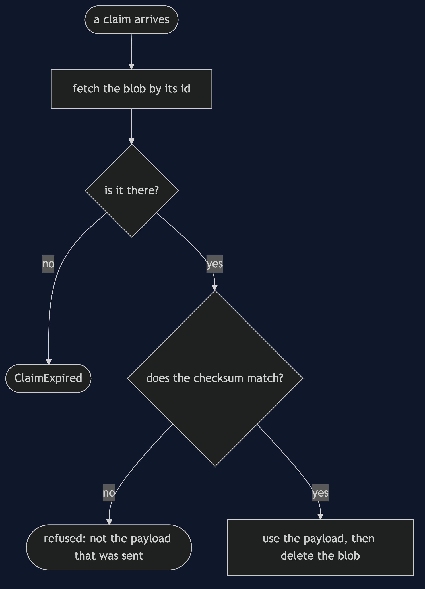
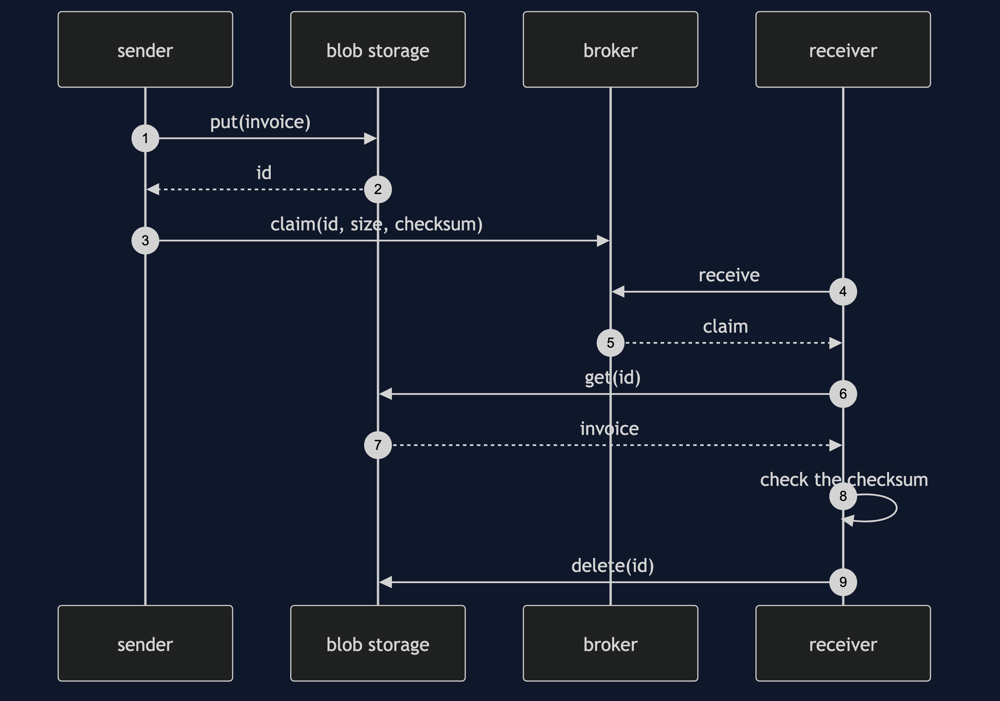
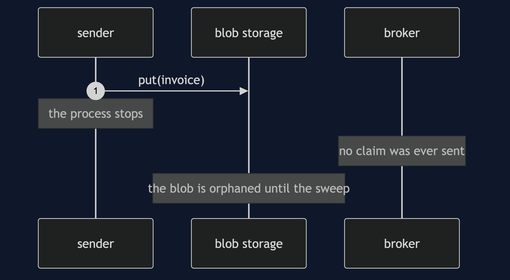

# Claim Check Pattern

```
src/main/java/com/jk/explore/claimcheck/
├── ClaimCheckDemo.java              the six acts
├── Sender.java  Receiver.java       store then send; receive then redeem
├── Claim.java                       an id, a size and a checksum: the ticket
├── BlobStore.java                   cheap storage, with expiry and counted operations
├── Broker.java                      a size limit, and a count of bytes carried
└── Clock.java  MessageTooLarge.java
```

**A claim check sends a ticket through the broker and keeps the luggage in storage.**

This project is in [micro-services-design-patterns](..). It is a messaging pattern that pairs with [Queue-Based Load Leveling](../queue-based-load-leveling-pattern), which it keeps light, and [Transactional Outbox](../transactional-outbox-pattern), which faces the same store-then-send gap.

## Run

```bash
./gradlew run
```

Six acts. Every number quoted below comes from this program's own output.

```
ONE. A message that is too big.
  the invoice is 5000 bytes. message of 5000 bytes is over the broker's limit of 1000.
  most brokers cap the size of a message, and the ones that do not get slow when messages are large.
TWO. Send the ticket, not the luggage.
  the invoice is stored. the message carries a claim: an id of 37 characters, size 5000, checksum 7ad4d4cb072db3a2.
  the receiver redeems it and gets 5000 bytes, identical to what was sent: true.
THREE. What the broker carries.
  100 invoices of 5000 bytes. through a broker with no limit: 500000 bytes. by claim: 5900 bytes.
  the broker moves a small ticket. the storage holds the luggage.
FOUR. Luggage nobody collected.
  10 sent, 6 collected and deleted. blobs still stored: 4.
  after the time limit, the sweep removes 4. stored now: 0.
  a slow receiver arrives with its claim: the blob for this claim expired or was never stored.
FIVE. Is it the same luggage?
  one byte changed in storage. the receiver: the payload is not the one that was sent: the checksum does not match.
  the checksum in the claim is what makes a ticket for a blob safe to trust.
SIX. The bill.
  one invoice, one way: 3 storage operations (put, get, delete) and 2 broker steps. before, there was 1.
  claims that count up: someone holding blob-1 tries blob-2 and reads: ben's invoice.
  random claims: 100000 guesses of the counting kind found 0 invoices. a claim must be hard to guess.
  storing, then sending, can stop between the two, and leave luggage nobody has a ticket for.
```

## Test

```bash
./gradlew test
```

2 test classes, 9 test methods, offline, with nothing installed and no framework.

## Technologies and versions

| What | Version | Why it is here |
| --- | --- | --- |
| Java | 21 | The repository standard, via the Gradle toolchain block |
| Gradle | 9.2.1 | The wrapper in this directory; no separate install needed |
| JUnit 5 | 5.10.2 | Test runner |

No framework. A hand-built project stays plain Java so the mechanism is the whole lesson.

## Learning Material

| Document | What it covers |
| --- | --- |
| [`docs/problem-statement.md`](docs/problem-statement.md) | An invoice too big for the broker |
| [`docs/claim-check-pattern-explained.md`](docs/claim-check-pattern-explained.md) | The pattern, and six acts |
| [`docs/class-diagram.md`](docs/class-diagram.md) | The types |
| [`docs/architecture-diagram.md`](docs/architecture-diagram.md) | A sender, a broker, storage and a receiver |
| [`docs/data-flow-diagram.md`](docs/data-flow-diagram.md) | How a big payload travels |
| [`docs/sequence-diagram.md`](docs/sequence-diagram.md) | Written for a listener with the screen off |
| [`docs/uml-diagram.md`](docs/uml-diagram.md) | Four sequences |
| [`docs/animation.html`](docs/animation.html) | The six acts in a browser |
| [`docs/prerequisites.md`](docs/prerequisites.md) | What you need to know |
| [`docs/session.md`](docs/session.md) | A one-hour taught session |
| [`docs/spec.md`](docs/spec.md) | The generated specification |
| [`docs/youtube.md`](docs/youtube.md) | Title, description and chapters |

### The pattern in one picture



### Where each piece sits


### How one request moves



### Who calls whom, in order



### All four sequences




### Video

Built from [`video/scenes.py`](video/scenes.py) by
[`video/build_video.sh`](video/build_video.sh). The rendered file is not
committed; see the repository README for why.

## Where you have already met this

Amazon SQS's extended client, Azure Service Bus with blob storage, and most systems that email attachments through a queue.

## When this is too much

If payloads are small, a claim check adds two steps for nothing. If the receiver needs the data at once and storage is slow, the ticket costs more than it saves.

## Where this sits

This project is in [`micro-services-design-patterns`](..), and is meant to be read with its neighbours there.
