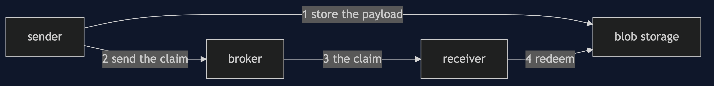
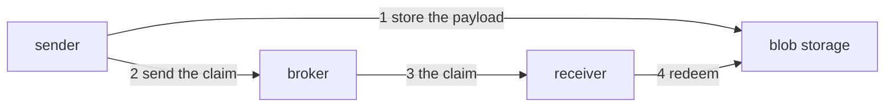

# Claim Check Pattern — Architecture Diagram

The broker carries the ticket. Storage holds the luggage.

Mermaid source

```mermaid
flowchart LR
    S["sender"] -->|1 store the payload| B["blob storage"]
    S -->|2 send the claim| Q["broker"]
    Q -->|3 the claim| R["receiver"]
    R -->|4 redeem| B
```

