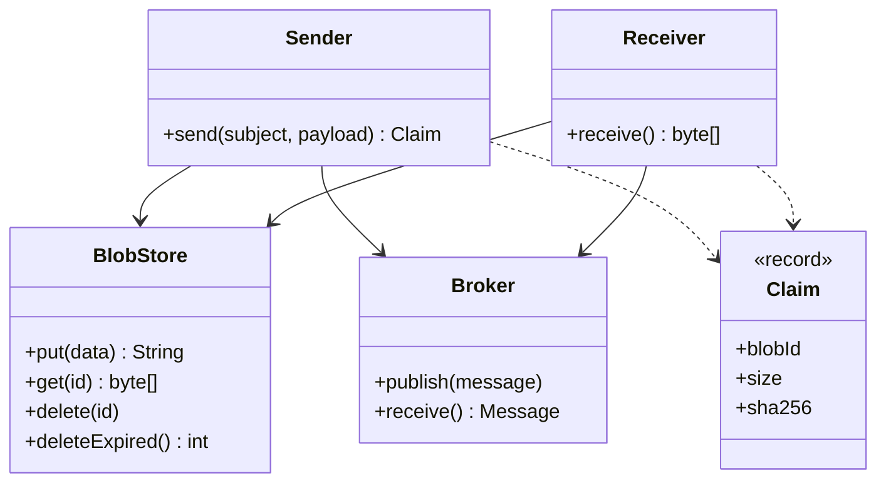

# Claim Check Pattern — Class Diagram

The sender stores and sends a claim. The receiver redeems it.

Mermaid source

```mermaid
classDiagram
    class Sender {
        +send(subject, payload) Claim
    }
    class Receiver {
        +receive() byte[]
    }
    class Claim {
        <<record>>
        +blobId
        +size
        +sha256
    }
    class BlobStore {
        +put(data) String
        +get(id) byte[]
        +delete(id)
        +deleteExpired() int
    }
    class Broker {
        +publish(message)
        +receive() Message
    }
    Sender --> BlobStore
    Sender --> Broker
    Receiver --> Broker
    Receiver --> BlobStore
    Sender ..> Claim
    Receiver ..> Claim
```

