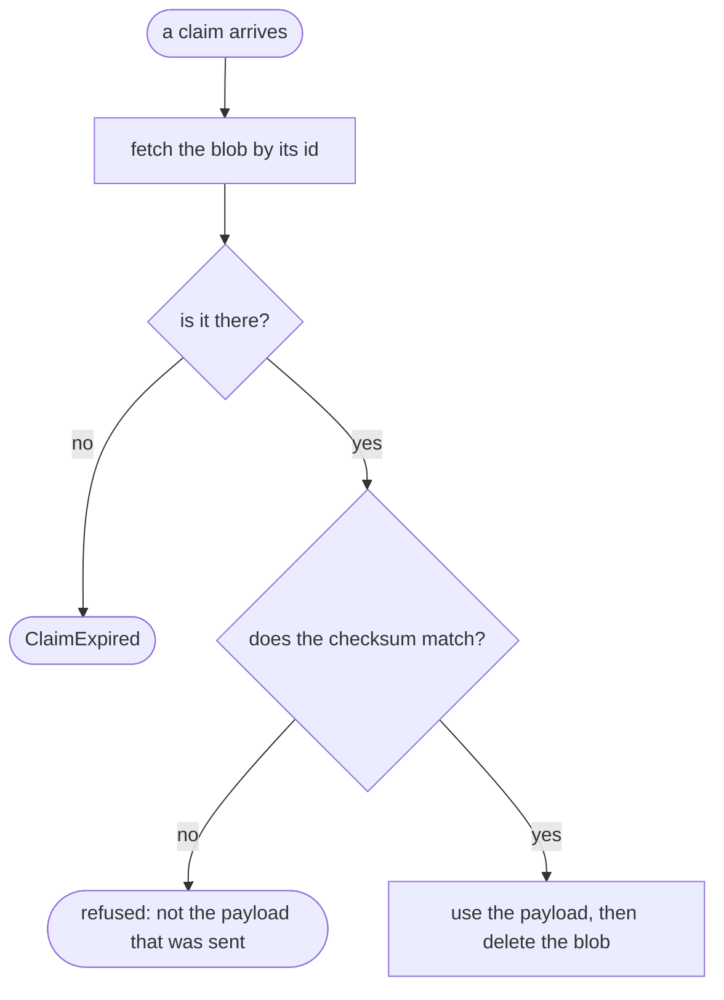

# Claim Check Pattern — Data Flow Diagram

What the receiver does with a claim.

Mermaid source

```mermaid
flowchart TD
    Get(["a claim arrives"])
    Fetch["fetch the blob by its id"]
    Here{"is it there?"}
    Gone(["ClaimExpired"])
    Sum{"does the checksum match?"}
    Bad(["refused: not the payload that was sent"])
    Use["use the payload, then delete the blob"]
    Get --> Fetch --> Here
    Here -- no --> Gone
    Here -- yes --> Sum
    Sum -- no --> Bad
    Sum -- yes --> Use
```

