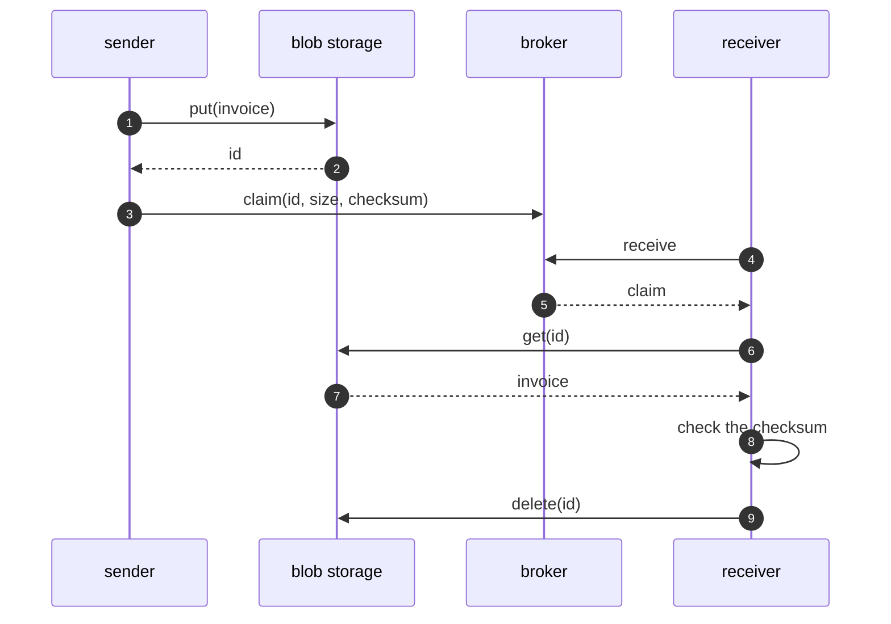

# Claim Check Pattern — Sequence Diagram

Written for a listener with the screen off.

Say it in words. The sender puts the invoice in storage and gets an identifier. It builds a claim from the identifier, the size and a checksum of the invoice, and sends only the claim through the broker. The receiver takes the claim, fetches the invoice from storage by its identifier, checks that its checksum matches, uses it, and deletes it.

Mermaid source

The load-bearing sentence: **the broker only ever sees the ticket.**
