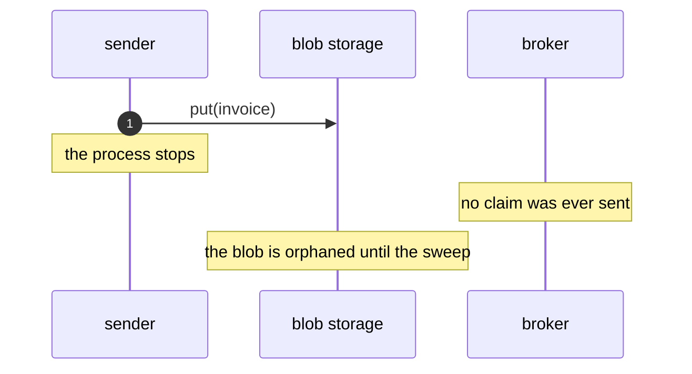

# Claim Check Pattern — UML Sequence Diagrams

Four sequences.

## 1. A Stop Between Storing And Sending

Mermaid source

```mermaid
sequenceDiagram
    autonumber
    participant S as sender
    participant B as blob storage
    participant Q as broker
    S->>B: put(invoice)
    Note over S: the process stops
    Note over Q: no claim was ever sent
    Note over B: the blob is orphaned until the sweep
```

