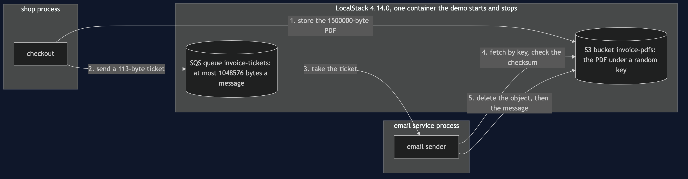

# Claim Check with S3 Pattern — Architecture Diagram

Two services, not one. The invoice lives in S3, the ticket travels through SQS, and both are played by LocalStack in one container that the demo starts and stops.

