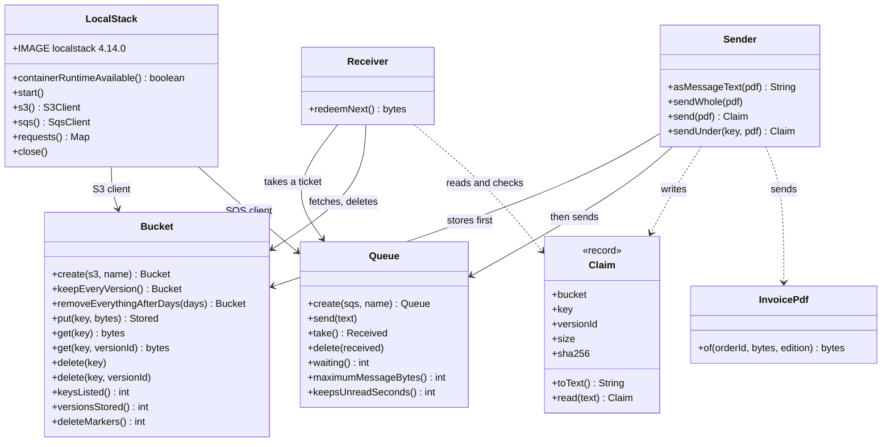

# Claim Check with S3 Pattern — Class Diagram

The pattern is two small classes, `Sender` and `Receiver`, and the ticket between them, `Claim`. `Bucket` and `Queue` are thin wrappers over Amazon S3 and SQS; `LocalStack` owns the container.

Mermaid source

