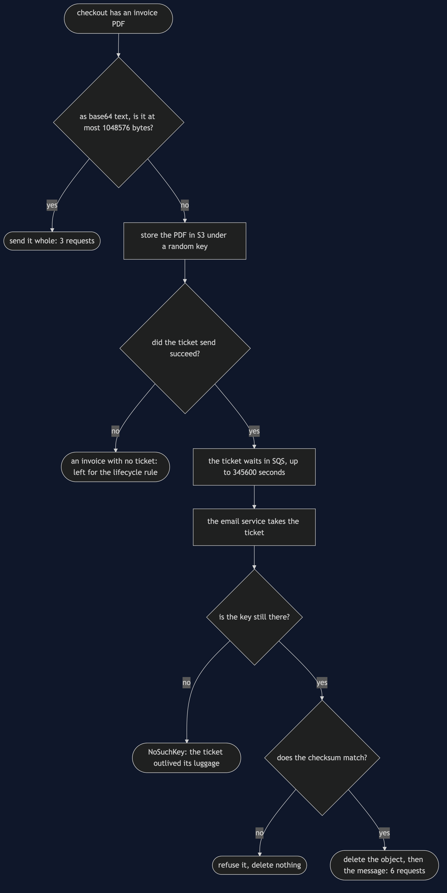
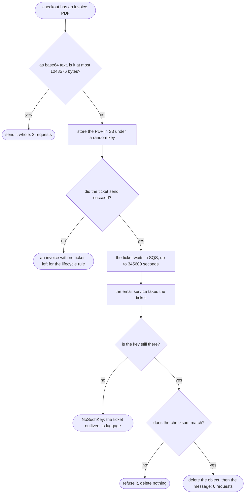

# Claim Check with S3 Pattern — Data Flow Diagram

What happens to one invoice, from the moment checkout has it to the moment both services may forget it.

Mermaid source

```mermaid
flowchart TD
    In(["checkout has an invoice PDF"])
    Fit{"as base64 text, is it at most 1048576 bytes?"}
    Whole(["send it whole: 3 requests"])
    Put["store the PDF in S3 under a random key"]
    Send{"did the ticket send succeed?"}
    Orphan(["an invoice with no ticket: left for the lifecycle rule"])
    Wait["the ticket waits in SQS, up to 345600 seconds"]
    Take["the email service takes the ticket"]
    Get{"is the key still there?"}
    Gone(["NoSuchKey: the ticket outlived its luggage"])
    Check{"does the checksum match?"}
    Refuse(["refuse it, delete nothing"])
    Clear(["delete the object, then the message: 6 requests"])
    In --> Fit
    Fit -- yes --> Whole
    Fit -- no --> Put --> Send
    Send -- no --> Orphan
    Send -- yes --> Wait --> Take --> Get
    Get -- no --> Gone
    Get -- yes --> Check
    Check -- no --> Refuse
    Check -- yes --> Clear
```

