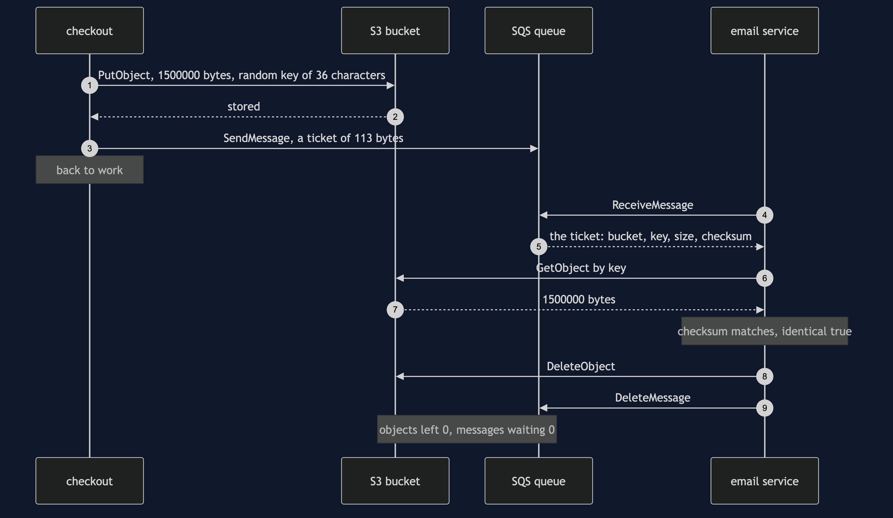
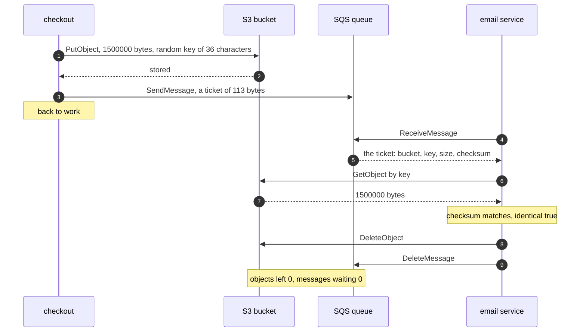

# Claim Check with S3 Pattern — Sequence Diagram

Written for a listener with the screen off.

Say it in words. Checkout has a business customer's invoice, a PDF of one and a half million bytes. First it stores the PDF in an S3 bucket, under a random key thirty-six characters long, and S3 says it is stored. Only then does checkout send a ticket through the SQS queue: a hundred and thirteen bytes of text naming the bucket, the key, the size and a checksum, which is a short fingerprint of every byte. Checkout goes back to work. Later the email service takes the ticket off the queue. It asks S3 for the object with that key, and gets one and a half million bytes back. It works out the fingerprint of what it got and compares it with the one on the ticket. They match. Only now does it delete the object from S3, and after that the ticket from the queue. Nothing is left in either service.

Mermaid source

The load-bearing sentence: **store before you send, and delete the ticket only after the luggage has been fetched and checked.**

For the refusal, the overwritten key, the delete that deletes nothing and the expired luggage, see [`uml-diagram.md`](uml-diagram.md).
