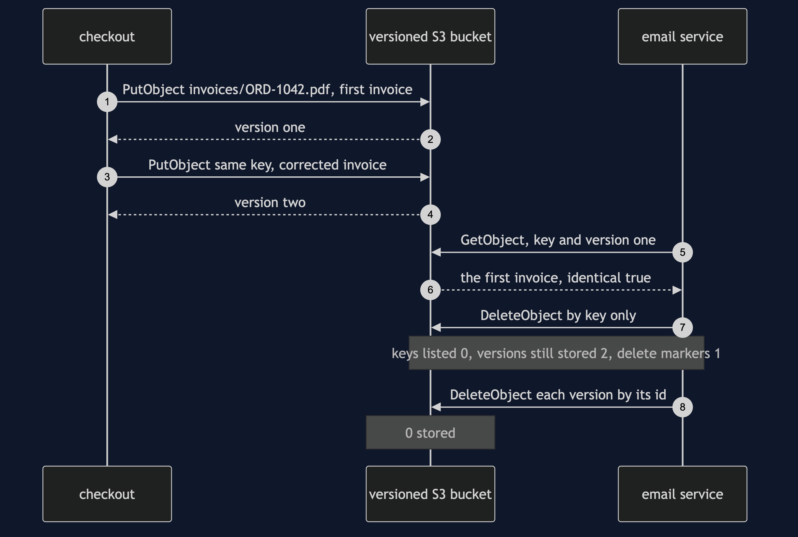
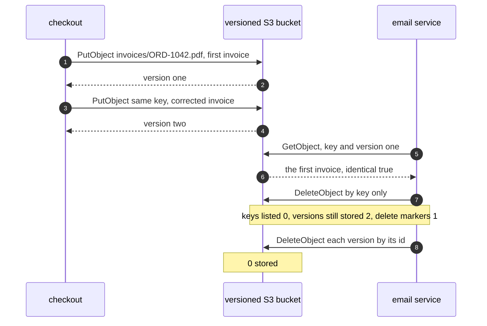
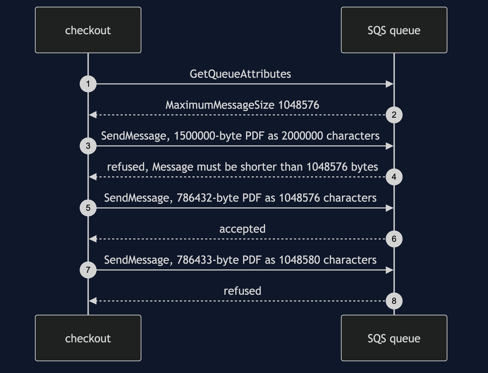
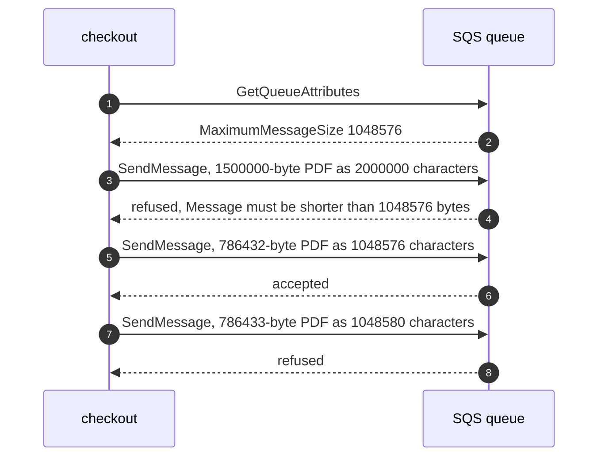
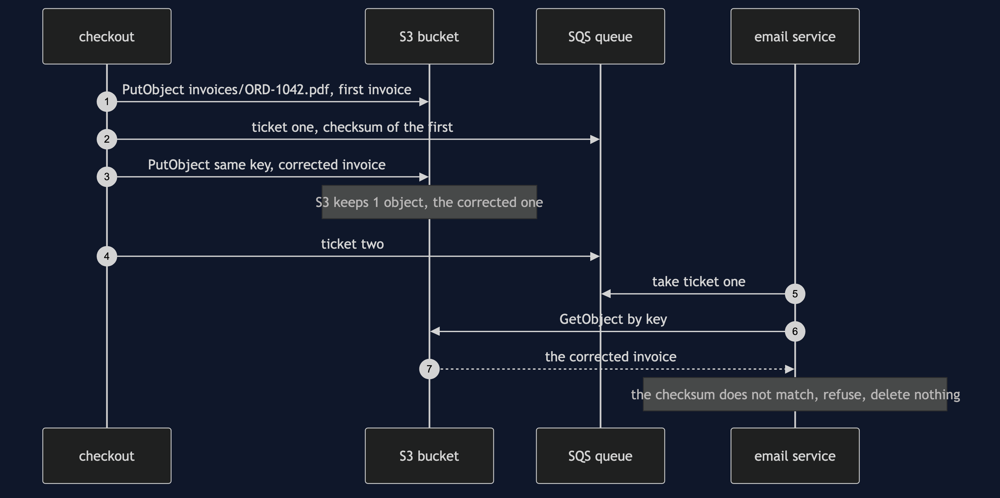
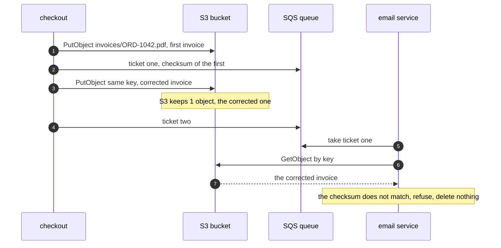
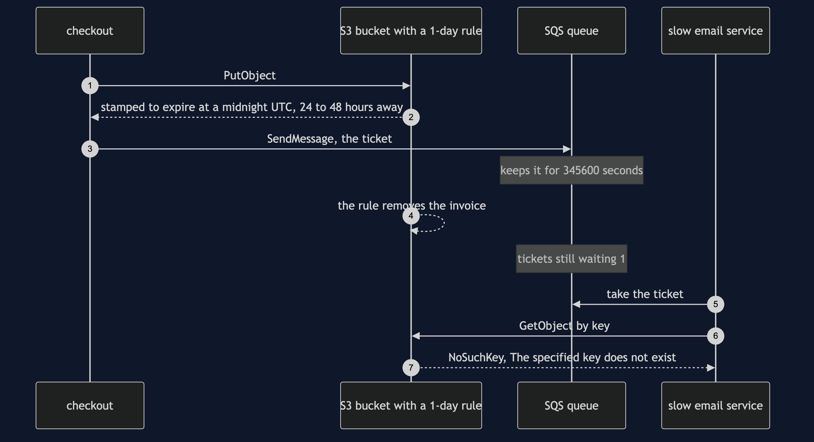
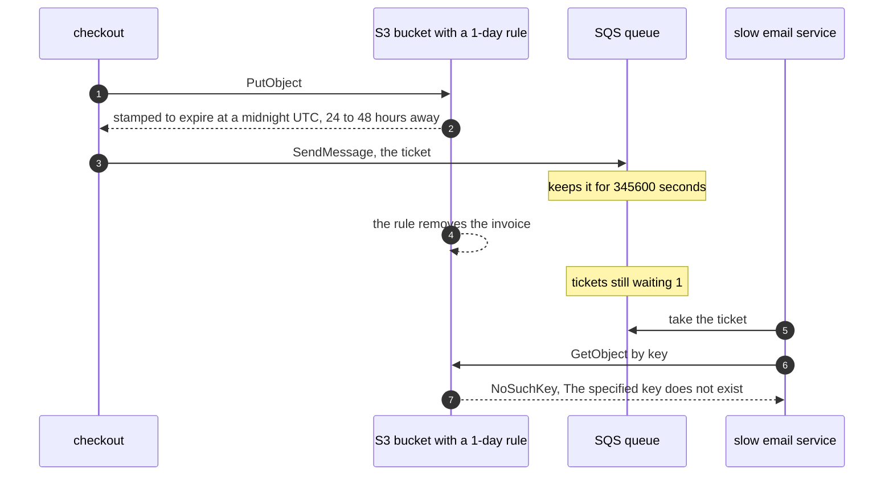

# Claim Check with S3 Pattern — UML Sequence Diagrams

Four sequences. The delete that deletes nothing comes first, because it is the one thing the hand-built version could never show.

## 1. A Delete That Deletes Nothing

A bucket that keeps every version. The same key is stored twice, and the ticket names the first version, so it gets the first invoice back. Then the email service deletes the key as it always does. A listing shows no keys, but both versions are still stored, behind one delete marker.

Mermaid source

## 2. Too Big For The Queue

The whole PDF, as base64 text, sent to SQS. The service refuses it with its own words. The edge is three quarters of the limit.

Mermaid source

## 3. The Same Key, Twice

A bucket keyed by order number, with no versions kept. The corrected invoice replaces the first, and the checksum on the first ticket catches it.

Mermaid source

## 4. The Ticket Outlives Its Luggage

The bucket removes invoices one day after they are stored; the queue keeps an untaken ticket for 345600 seconds, which is four days. The demo removes the invoice the way the rule would.

Mermaid source

