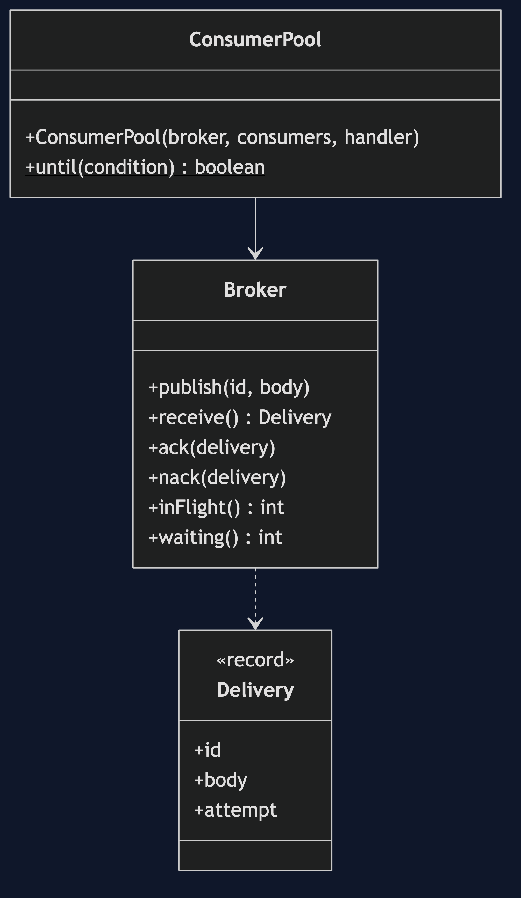
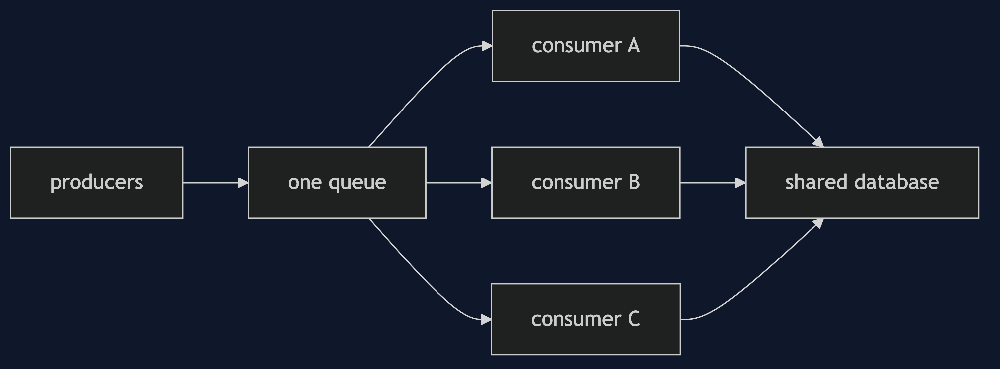
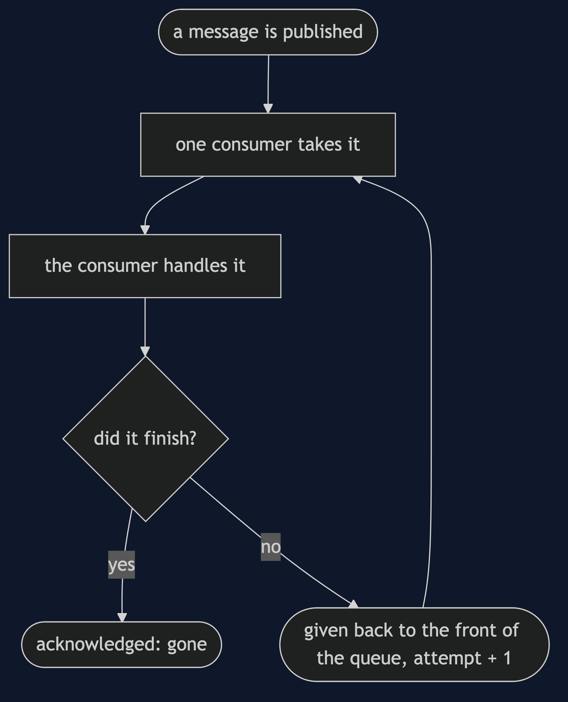
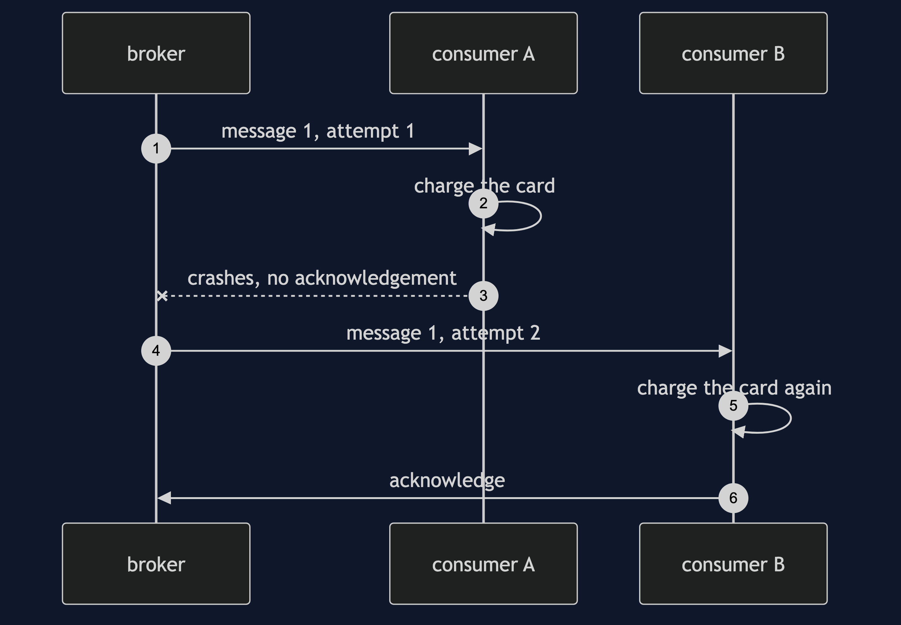
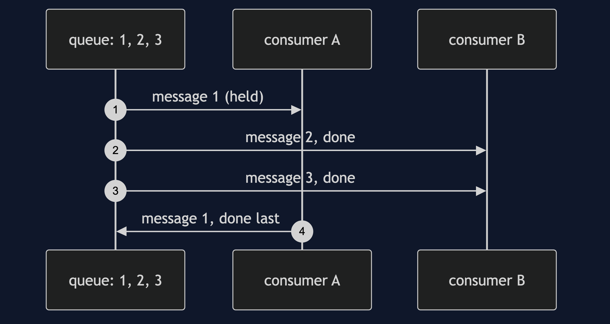

# Competing Consumers Pattern

```
src/main/java/com/jk/explore/competingconsumers/
├── CompetingConsumersDemo.java      the six acts
├── Broker.java                      hands each message to one consumer; takes it back on failure
├── ConsumerPool.java                N threads that loop: take, handle, acknowledge
├── Delivery.java  Gate.java
```

**Competing consumers share one queue. Adding a worker adds capacity, and gives up ordering.**

This project is in [micro-services-design-patterns](..). It is how the queue in [Queue-Based Load Leveling](../queue-based-load-leveling-pattern) is drained faster, and it depends on [Idempotent Consumer](../idempotent-consumer-pattern) for the duplicate it cannot avoid.

## Run

```bash
./gradlew run
```

Six acts. Every number quoted below comes from this program's own output.

```
ONE. One consumer, then three.
  six slow jobs, one consumer: 1 in progress, 5 waiting.
  six slow jobs, three consumers: 3 in progress, 3 waiting.
  the consumers do not talk to each other. they take from the same queue.
TWO. Each message is handled once.
  1000 orders, 4 consumers: handled 1000 times in all, 1000 different orders.
  none twice, none missed. which consumer got which order is not defined, and does not matter.
THREE. The order is not kept.
  orders 1, 2 and 3 published in that order. order 1's consumer is slow. they finished: [2, 3, 1].
  if order 2 depends on order 1, this is a bug. competing consumers give up ordering.
FOUR. A consumer fails, another takes over.
  [attempt 1 fails, attempt 2 succeeds].
  the message was given back and handled again. it was not lost.
FIVE. At least once, so a duplicate.
  a consumer charges the card and then crashes before it can say it finished. charges made: 2.
  the same crash, with a consumer that remembers what it has done: charges made: 1.
SIX. The bill: more consumers, the same downstream.
  6 consumers share a database that lets 2 in at a time. inside it: 2. waiting for a place: 4.
  four of the six are doing nothing useful. adding consumers only helps while the shared thing has room.
```

## Test

```bash
./gradlew test
```

2 test classes, 7 test methods, offline, with nothing installed and no framework.

## Technologies and versions

| What | Version | Why it is here |
| --- | --- | --- |
| Java | 21 | The repository standard, via the Gradle toolchain block |
| Gradle | 9.2.1 | The wrapper in this directory; no separate install needed |
| JUnit 5 | 5.10.2 | Test runner |

No framework. A hand-built project stays plain Java so the mechanism is the whole lesson.

## Learning Material

| Document | What it covers |
| --- | --- |
| [`docs/problem-statement.md`](docs/problem-statement.md) | One worker cannot keep up |
| [`docs/competing-consumers-pattern-explained.md`](docs/competing-consumers-pattern-explained.md) | The pattern, and six acts |
| [`docs/class-diagram.md`](docs/class-diagram.md) | The types |
| [`docs/architecture-diagram.md`](docs/architecture-diagram.md) | A queue and its consumers |
| [`docs/data-flow-diagram.md`](docs/data-flow-diagram.md) | What happens to a message |
| [`docs/sequence-diagram.md`](docs/sequence-diagram.md) | Written for a listener with the screen off |
| [`docs/uml-diagram.md`](docs/uml-diagram.md) | Four sequences |
| [`docs/animation.html`](docs/animation.html) | The six acts in a browser |
| [`docs/prerequisites.md`](docs/prerequisites.md) | What you need to know |
| [`docs/session.md`](docs/session.md) | A one-hour taught session |
| [`docs/spec.md`](docs/spec.md) | The generated specification |
| [`docs/youtube.md`](docs/youtube.md) | Title, description and chapters |

### The pattern in one picture



### Where each piece sits



### How one request moves



### Who calls whom, in order



### All four sequences




### Video

Built from [`video/scenes.py`](video/scenes.py) by
[`video/build_video.sh`](video/build_video.sh). The rendered file is not
committed; see the repository README for why.

## Where you have already met this

Every scaled-out worker service, and every Java `ExecutorService` fed by one queue.

## When this is too much

When one consumer keeps up, extra consumers are cost and risk. When order matters, competing consumers are wrong until the queue is partitioned.

## Where this sits

This project is in [`micro-services-design-patterns`](..), and is meant to be read with its neighbours there.
