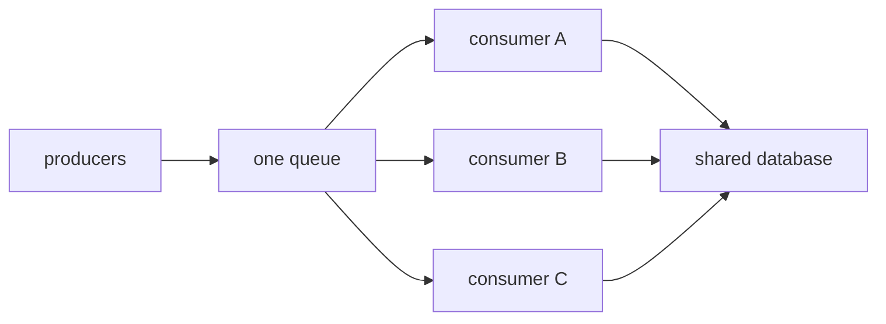

# Competing Consumers Pattern — Architecture Diagram

Consumers do not know each other. They know the queue.

Mermaid source

```mermaid
flowchart LR
    P["producers"] --> Q["one queue"]
    Q --> A["consumer A"]
    Q --> B["consumer B"]
    Q --> C["consumer C"]
    A --> D["shared database"]
    B --> D
    C --> D
```

