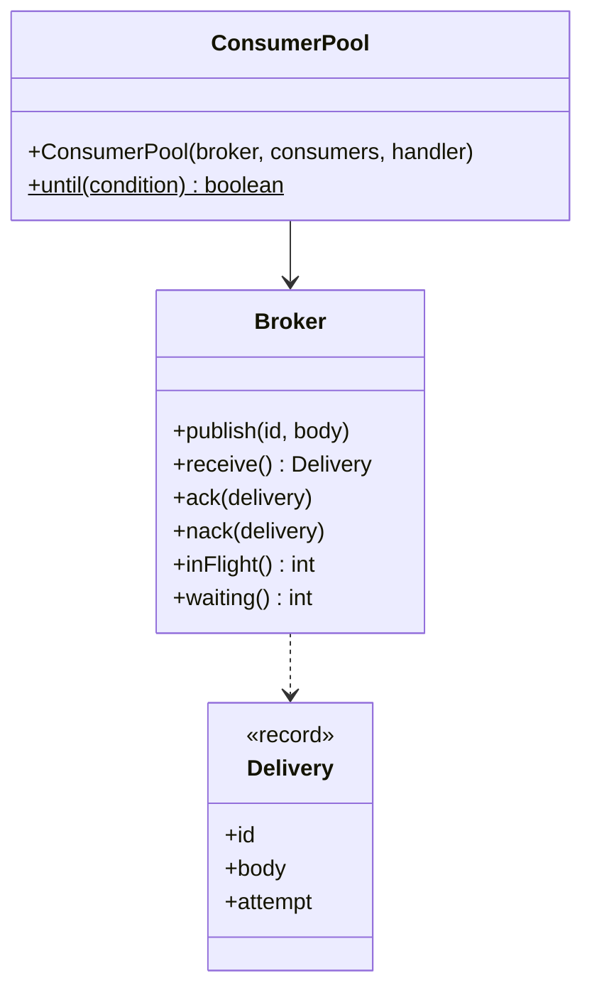

# Competing Consumers Pattern — Class Diagram

A broker hands out messages. A pool of consumers takes them.

Mermaid source

```mermaid
classDiagram
    class Broker {
        +publish(id, body)
        +receive() Delivery
        +ack(delivery)
        +nack(delivery)
        +inFlight() int
        +waiting() int
    }
    class ConsumerPool {
        +ConsumerPool(broker, consumers, handler)
        +until(condition)$ boolean
    }
    class Delivery {
        <<record>>
        +id
        +body
        +attempt
    }
    ConsumerPool --> Broker
    Broker ..> Delivery
```

