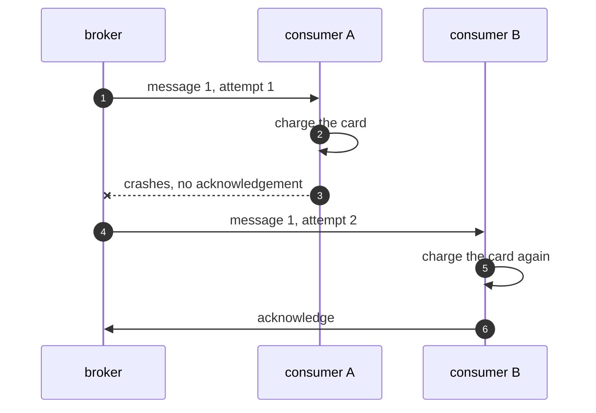

# Competing Consumers Pattern — Sequence Diagram

Written for a listener with the screen off.

Say it in words. A message is published. Consumer A takes it and charges the card. Before it can say it has finished, consumer A crashes. The broker never got an acknowledgement, so it gives the message back. Consumer B takes it. It charges the card again, and acknowledges. The message is gone, and the card has been charged twice.

Mermaid source

The load-bearing sentence: **a queue cannot give exactly once. The consumer has to.**
