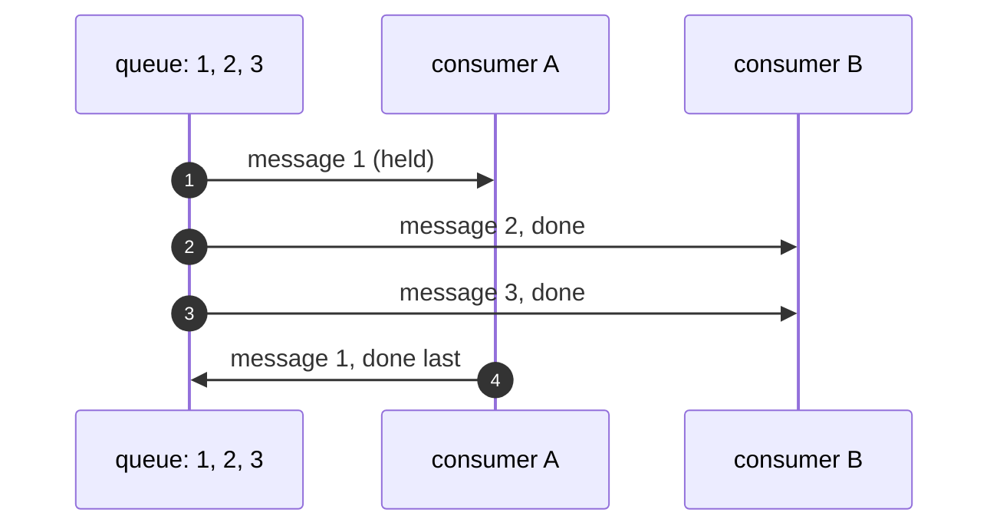

# Competing Consumers Pattern — UML Sequence Diagrams

Four sequences.

## 1. A Held Message

Mermaid source

```mermaid
sequenceDiagram
    autonumber
    participant Q as queue: 1, 2, 3
    participant A as consumer A
    participant B as consumer B
    Q->>A: message 1 (held)
    Q->>B: message 2, done
    Q->>B: message 3, done
    A->>Q: message 1, done last
```

