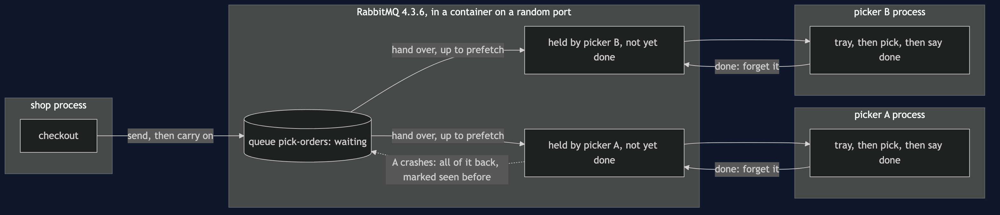
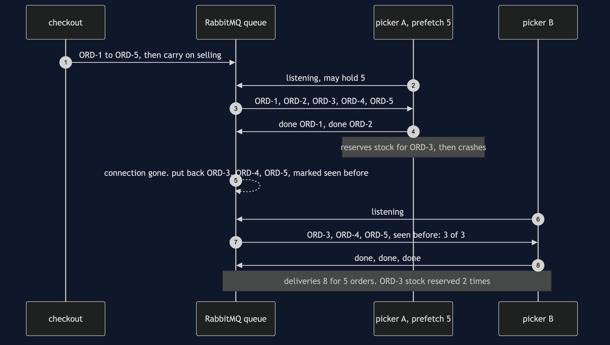

# Competing Consumers with RabbitMQ Pattern

```
src/main/java/com/jk/explore/competingconsumersrabbitmq/
├── RabbitCompetingConsumersDemo.java   the six acts
├── Broker.java                         starts and stops a real RabbitMQ container, on a random port
├── OrderQueue.java                     the one shared queue, as checkout sees it: send, count waiting
├── Picker.java                         the pattern: one competing consumer, with its prefetch and its ack mode
├── PickOrder.java                      the message, and the text it travels as
├── Stock.java                          the stock ledger; counts a reservation made twice
└── Poll.java                           every wait is a question asked until the answer is yes
```

**On a real broker, the consumers do not take work. The broker hands it out. How many orders one picker may be holding at once is a setting called prefetch, RabbitMQ's default for it is no limit, and when a picker dies every order it was holding goes back — marked as seen before, even the ones it never started.**

**This project needs a container runtime.** Docker Desktop, or anything Docker-compatible, must be running before you start. The demo brings a RabbitMQ broker up in a container and takes it down again at the end; nothing is installed and nothing is left behind. With no runtime, the demo prints two sentences saying what to do, and stops, rather than a stack trace.

This project is the real-infrastructure version of the plain-Java Competing Consumers project in this course. That project built the broker as a list inside one Java program, and its consumers each reached in and took one message at a time. This one puts the queue in RabbitMQ, a message broker running as its own process, gives each warehouse picker its own network connection to it, and shows the two settings the real broker makes you choose: how many orders a picker may hold before it says it is done with any, and whether it says done at all.

## Run

```bash
./gradlew run
```

Six acts, against a real broker. Every number quoted below, and in every document and slide in this project, comes from this program's own output. Two runs back to back print exactly the same thing.

```
ONE. One picker, then three.
  12 orders, one picker taking one at a time. being picked: 1. waiting: 11.
  the same 12, three pickers on the same queue. being picked: 3. waiting: 9.
  300 orders, three pickers: 300 picked, 300 different orders. every picker did some, and none did more than half.
  who got which order is the broker's choice, and it changes from run to run.
TWO. No limit: the first picker takes everything.
  12 orders waiting. a slow picker starts first, with no limit set. handed to it: 12. waiting: 0.
  a fast picker joins a moment later. handed to it: 0. it stands idle while the slow one holds 12.
  picked by the slow picker: 12. by the fast one: 0. RabbitMQ's default is no limit.
THREE. Prefetch: how many a picker may hold.
  20 orders, prefetch 10. handed to the slow picker: 10. to the fast one: 10.
  the fast one picks its 10 and stands idle. waiting: 0. still held by the slow one: 10.
  the same 20, prefetch 1. the slow picker holds 1. the fast one picks the other 19.
FOUR. A picker dies mid-work.
  prefetch 5. picker A is handed 5, picks ORD-1 and ORD-2, reserves the stock for ORD-3, and crashes before saying it is done.
  the broker puts back every order it handed to A and was not told was done. waiting again: 3.
  picker B is handed [ORD-3, ORD-4, ORD-5], marked as seen before: 3 of 3. only ORD-3 had been started.
  deliveries: 8 for 5 orders. stock reserved for ORD-3: 2 times. for ORD-4: 1.
FIVE. No saying done.
  picker A tells the broker to count each order as done on handover. handed: 5. waiting: 0.
  the same crash on ORD-3. picked: 2. waiting again: 0. lost: 3. nobody will be handed ORD-3, ORD-4 or ORD-5 again.
SIX. The bill.
  ORD-13 crashes every picker that takes it. 3 pickers, delivered 3 times, marked seen before on 2, picked 0 times. waiting again: 1.
  the broker cannot tell a poison order from a slow one. it will hand it out for ever unless told a limit.
  and every picker must be safe to run twice: act four made 8 deliveries for 5 orders, and reserved the stock for ORD-3 2 times.
  and prefetch is a number somebody has to choose. left unset, one picker took 12 of 12 while another stood idle.
```

The first run pulls the RabbitMQ image, about 161 MB once unpacked, and takes longer. After that a run takes about ten seconds, most of it the broker starting.

**One line is a description, not a number, on purpose.** How the broker spreads 300 orders between three equal pickers is its own scheduling, and the exact split changes from run to run — close to a third each, never the same third twice. So the demo prints what always holds, in words: every picker did some, and none did more than half. The tests assert exactly that range. Every other count in the output is exact, because the demo holds a picker still until the count has been read.

The broker listens inside its container on RabbitMQ's usual port, 5672. Testcontainers maps that to a free port on this machine picked at random, so the demo never collides with a RabbitMQ you already run, or with a second copy of itself.

## Test

```bash
./gradlew test
```

3 test classes, 15 test methods. `PlainPartsTest` needs nothing installed. `RealBrokerTest` starts one broker for the whole class and asks it directly: the first picker with no limit is handed the whole queue, prefetch 10 splits ten and ten however slow one picker is, prefetch 1 lets the fast picker take everything the slow one is not holding, a crash hands back every held order marked as seen before, automatic acknowledgement loses them instead, a poison order goes round for ever, and the spread across equal pickers lands inside its range. `DemoRunsTest` runs the demo and asserts every figure the documents quote.

There is no `Thread.sleep` anywhere under `src/test`. Every wait is a poll on something the broker or a picker can actually be asked about — how many orders are waiting, how many pickers the broker thinks are listening, what a picker has been handed — with a sixty-second limit that fails the test rather than hanging it. The tests that need the broker are skipped when no container runtime is there; the rest still run.

## What the simulation got right, and what it left out

This is the reason this project exists, so it comes before anything else.

**What the plain-Java Competing Consumers project got right.** All of the shape. Several consumers take from one queue and never talk to each other. Adding consumers adds capacity: one picker leaves 11 of 12 waiting, three leave 9. Each message goes to one consumer at a time, so 300 orders are picked 300 times, each a different order. A consumer that fails gives the message back and another takes over. And because the consumer can fail after doing the work but before saying so, delivery is at least once, and the consumer must be safe to run twice. Every one of those lessons holds on RabbitMQ, and this project's first and fourth acts reproduce them.

**What it left out, first, and the headline find: the broker pushes, and by default it pushes everything.** In the simulation each consumer reached into the list and took one message when it was free, so a slow consumer could only ever hold one. A real broker works the other way round. It hands messages down each consumer's connection before they are asked for, and how many it will hand one consumer before hearing done for any of them is a setting called prefetch. RabbitMQ's default is no limit. The second act shows what that means: a slow picker starts first and is handed all 12 waiting orders at once; a fast picker joins a moment later and is handed 0. The fast picker stands idle through the whole queue. Competing consumers that do not compete.

**Second: prefetch is a trade, not a fix.** The third act gives the same slow and fast pickers a limit. With prefetch 10 the broker hands each of them 10; the fast one finishes its 10 and stands idle with the queue empty, while the slow one still holds 10. With prefetch 1 the slow picker holds 1 and the fast one picks the other 19. A low prefetch spreads the work fairly and costs a round trip to the broker between every order; a high one keeps a fast picker busy and lets a slow one sit on work. The simulation never had to choose, because its consumers could only ever hold one.

**Third: handed over is not the same as started.** The simulation handed back exactly the message that failed. On the broker, a picker with prefetch 5 was handed 5, finished 2, and died half-way through the third. The broker does not know which orders the picker had started; it knows only which it had handed over and not heard done for. So it puts back all 3, and every one of them arrives at the next picker marked as seen before — including ORD-4 and ORD-5, which nobody had touched. The mark means "this might be a repeat", never "this is a repeat". ORD-3's stock was really reserved twice; ORD-4's only once.

**Fourth: saying done is a choice, and the other choice loses orders.** The simulation's broker always waited to hear done. RabbitMQ lets a consumer tell it not to bother: count every order as done the moment it is handed over, which RabbitMQ calls automatic acknowledgement. The fifth act runs the same crash that way. The queue was already empty before the crash; afterwards it is still empty, and 3 orders are gone for good.

**Fifth: the simulation counted attempts, and a classic RabbitMQ queue does not.** The simulation's delivery carried an attempt number. A classic RabbitMQ queue carries only a yes-or-no mark, seen before or not. In the sixth act ORD-13 crashes every picker that takes it: 3 deliveries, marked seen before on 2, and it is waiting again. Nothing in the queue will ever stop it. RabbitMQ's other queue type, the quorum queue, does count deliveries and can be given a limit — but that is a setting you have to know to reach for.

**What the simulation showed that this project does not repeat.** It showed ordering being lost between consumers, and a shared database capping how many consumers can do useful work. Both are just as true on RabbitMQ, and neither needs a real broker to see, so this project leaves them to the plain-Java version.

## Technologies and versions

| What | Version | Why it is here |
| --- | --- | --- |
| Java | 21 | The repository standard, via the Gradle toolchain block |
| Gradle | 9.2.1 | The wrapper in this directory; no separate install needed |
| RabbitMQ | 4.3.6 | The broker, as the official `rabbitmq:4.3.6-alpine` container image; the newest release, in its smaller Alpine build |
| RabbitMQ Java client | 5.36.0 | `com.rabbitmq:amqp-client`, the newest release; speaks AMQP 0-9-1 to the broker |
| Testcontainers | 2.0.5 | `testcontainers-rabbitmq`; starts and stops the broker container from inside the demo, on a random free port |
| slf4j-simple | 2.0.17 | Logging for the two libraries above, turned off so the demo's own output is the only output |
| JUnit 5 | 5.10.2 | Test runner |
| A container runtime | Docker 24 or later, or compatible | Runs the broker. Must be running before you start |

Nothing is held back: every version is the newest generally available release. See [`docs/dependencies.md`](docs/dependencies.md) and [`docs/prerequisites.md`](docs/prerequisites.md).

## Learning Material

| Document | What it covers |
| --- | --- |
| [`docs/problem-statement.md`](docs/problem-statement.md) | The plain-Java version, and what is new |
| [`docs/competing-consumers-with-rabbitmq-pattern-explained.md`](docs/competing-consumers-with-rabbitmq-pattern-explained.md) | The broker's words in plain language, and six acts |
| [`docs/class-diagram.md`](docs/class-diagram.md) | The types |
| [`docs/architecture-diagram.md`](docs/architecture-diagram.md) | One queue, several pickers, and where each order is |
| [`docs/data-flow-diagram.md`](docs/data-flow-diagram.md) | What the broker does with one order |
| [`docs/sequence-diagram.md`](docs/sequence-diagram.md) | Written for a listener with the screen off |
| [`docs/uml-diagram.md`](docs/uml-diagram.md) | Four sequences |
| [`docs/animation.html`](docs/animation.html) | The six acts in a browser |
| [`docs/prerequisites.md`](docs/prerequisites.md) | What you need installed, and what you need to know |
| [`docs/session.md`](docs/session.md) | A one-hour taught session |
| [`docs/dependencies.md`](docs/dependencies.md) | What RabbitMQ and Testcontainers are, what they cost, and that skipping this project loses none of the pattern |
| [`docs/spec.md`](docs/spec.md) | The generated specification |
| [`docs/youtube.md`](docs/youtube.md) | Title, description and chapters |

### The pattern in one picture


### Where each piece sits



### How one request moves


### Who calls whom, in order



### All four sequences


### Video

Built from [`video/scenes.py`](video/scenes.py) by
[`video/build_video.sh`](video/build_video.sh). The rendered file is not
committed; see the repository README for why.

## Where you have already met this

Any service scaled out to several copies that all read the same queue: order fulfilment workers, email senders, image resizers, payment settlement jobs. Every RabbitMQ consumer has a prefetch, set or unset. Spring AMQP sets it to 250 unless told otherwise; the plain Java client, as this project shows, leaves it unlimited. Amazon SQS, Azure Service Bus and Kafka consumer groups each have their own version of the same two questions: how much may one worker hold, and when does the broker count a message as done.

## When this is too much

If one consumer keeps up, one consumer is simpler, keeps the order, and needs no thinking about prefetch. If the work must happen in order, several competing consumers are the wrong shape until the queue is split by key. If losing an order on a crash is acceptable, automatic acknowledgement is faster — but it should be a decision written down, not a default nobody noticed. And a broker is a separate system to run, secure, upgrade and watch.

## Where this sits

This project pairs with the plain-Java Competing Consumers project in this course, and is the real-infrastructure version in [`micro-services-design-patterns`](..).
