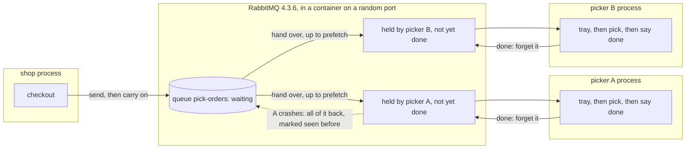

# Competing Consumers with RabbitMQ Pattern — Architecture Diagram

One queue in the broker, several pickers each on their own connection. An order is in one of three places: waiting in the queue, held by a picker and not yet said done, or gone. Prefetch decides how many a picker may hold.

Mermaid source

