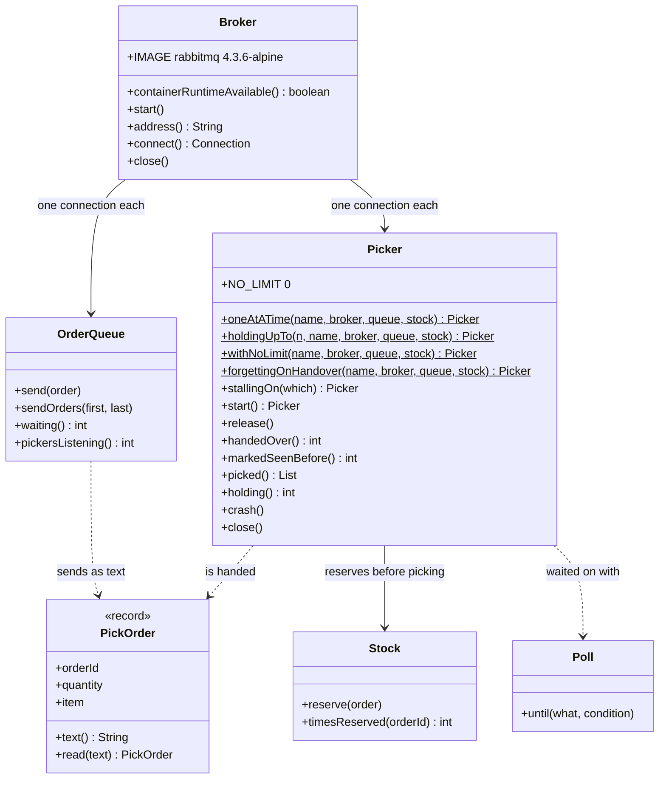

# Competing Consumers with RabbitMQ Pattern — Class Diagram

The pattern is one class, `Picker`: one competing consumer, with its prefetch and its choice of when to say done. `OrderQueue` is the queue as checkout sees it, `Broker` owns the container, and the rest is the store's own vocabulary.

Mermaid source

