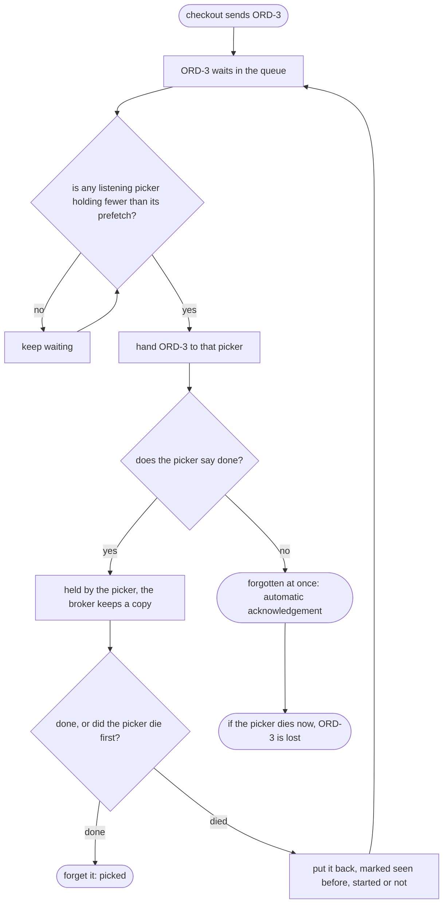

# Competing Consumers with RabbitMQ Pattern — Data Flow Diagram

What the broker does with one pick order, from the moment it is sent to the moment the broker may forget it. The two questions the plain-Java version never asked are the prefetch check and the acknowledgement mode.

Mermaid source

