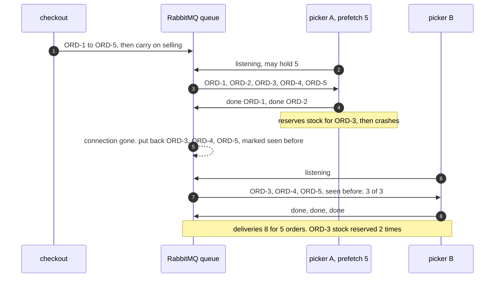

# Competing Consumers with RabbitMQ Pattern — Sequence Diagram

Written for a listener with the screen off.

Say it in words. Checkout sends five pick orders to the broker and goes back to selling. Picker A starts listening and tells the broker it may hold up to five orders at once. The broker hands it all five straight away. Picker A picks order one and says done, then order two and says done, and the broker forgets each of them. Picker A starts order three: it reserves the stock, and then it crashes, before it says done. The broker notices the connection has gone. It does not know that picker A had started only order three; it knows only that orders three, four and five were handed over and never said done. So it puts all three back in the queue, marked as seen before. Picker B starts listening and is handed all three, each with the mark on it. Picker B picks them and says done for each. Order three's stock has now been reserved twice. Eight deliveries, five orders picked, nothing waiting.

Mermaid source

The load-bearing sentence: **the broker forgets an order only when a picker says it is done, and a picker that dies hands back everything it was holding — which is how much it was allowed to hold, not how much it had started.**

For the default of no limit, the lost orders under automatic acknowledgement and the poison order, see [`uml-diagram.md`](uml-diagram.md).
