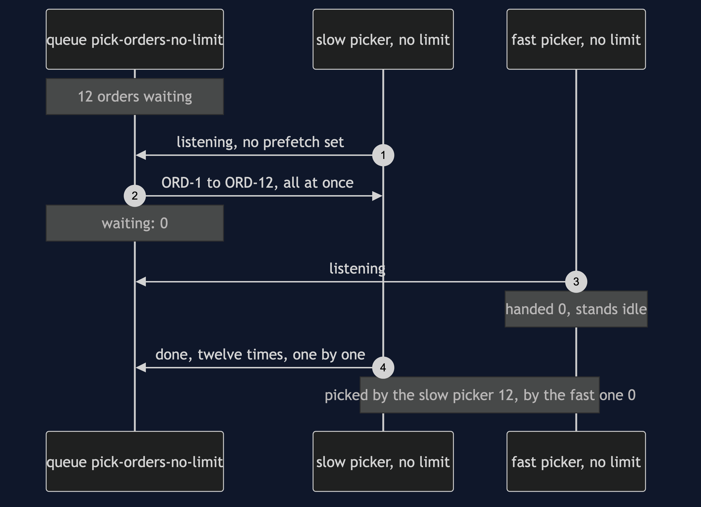
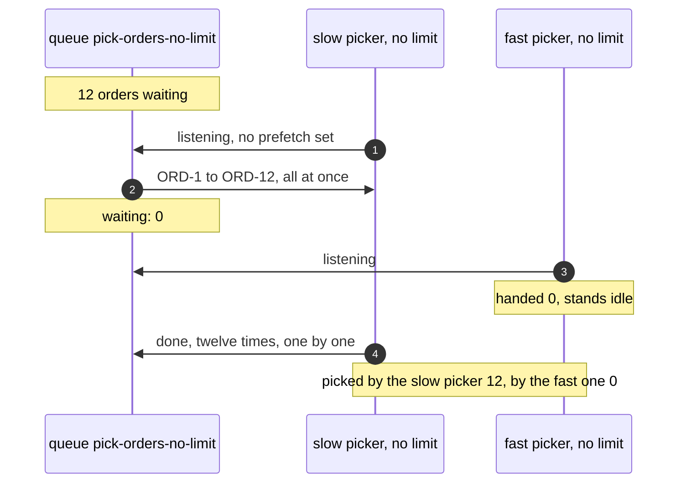
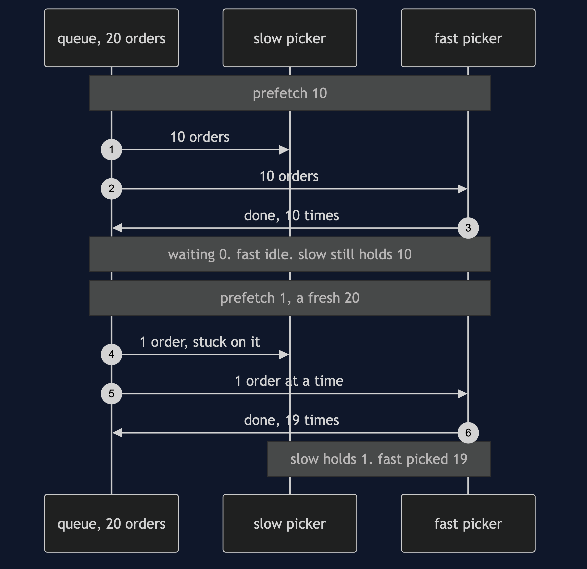
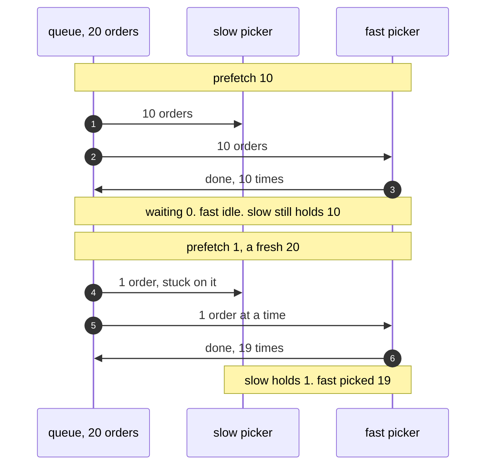
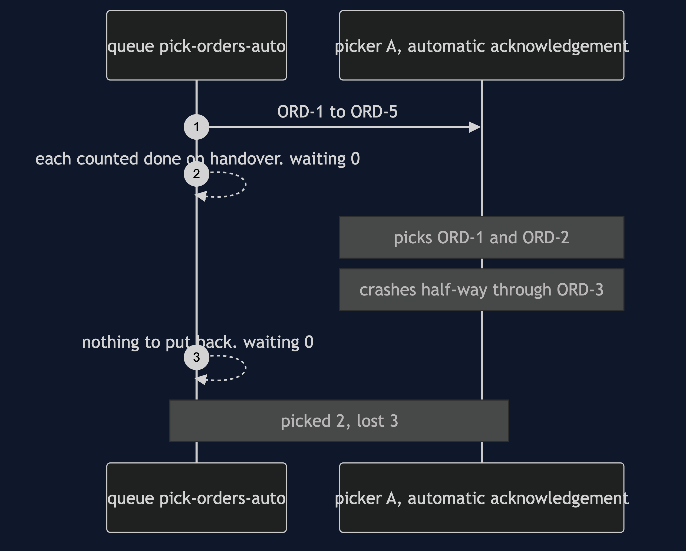
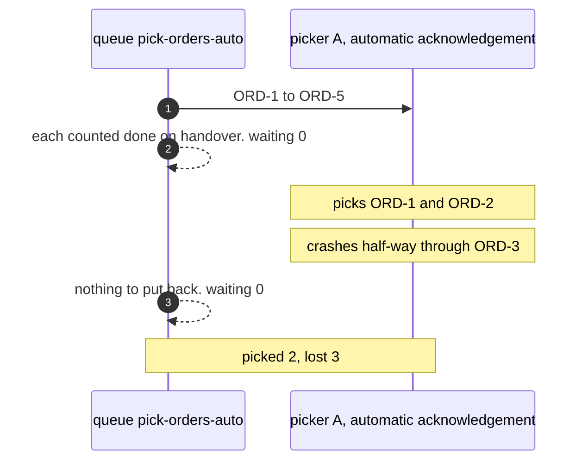
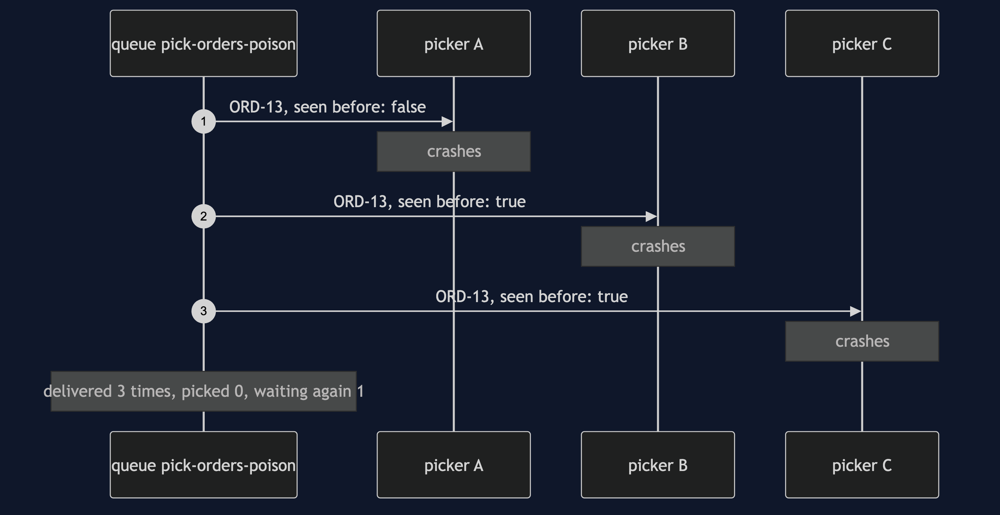
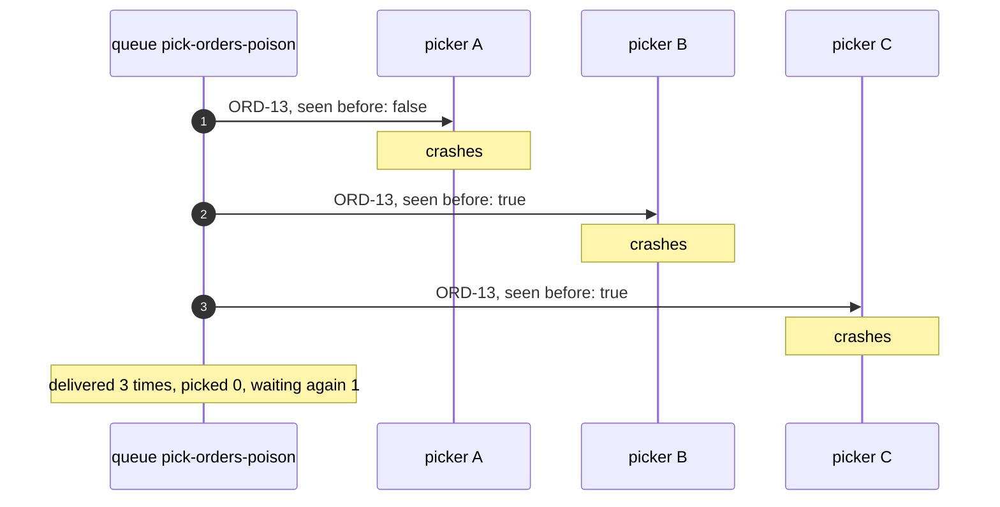

# Competing Consumers with RabbitMQ Pattern — UML Sequence Diagrams

Four sequences. The default of no limit comes first, because it is the one thing the plain-Java version, whose consumers took one message at a time, could never show.

## 1. No Limit: The First Picker Takes Everything

Twelve orders are waiting. A slow picker starts first with no prefetch set, which in RabbitMQ means no limit. The broker hands it all twelve at once. A fast picker joins a moment later and is handed nothing, because nothing is left waiting.

Mermaid source

## 2. Prefetch Ten, Then Prefetch One

The same slow and fast pickers, with a limit. With ten, each is handed ten and the fast one ends up idle while the slow one sits on ten. With one, the slow picker holds one and the fast one picks the other nineteen.

Mermaid source

## 3. The Same Crash, Without Saying Done

Picker A tells the broker to count every order as done on handover, which RabbitMQ calls automatic acknowledgement. It is handed five, picks two, and crashes half-way through the third. The broker had already forgotten all five, so three are lost.

Mermaid source

## 4. A Poison Order

ORD-13 crashes every picker that takes it. The broker puts it back each time, marked only as seen before, never with a count. After three pickers it is waiting again, and nothing in a classic queue will ever stop it.

Mermaid source

