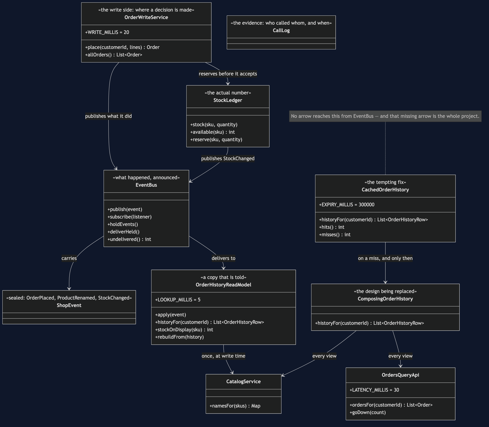
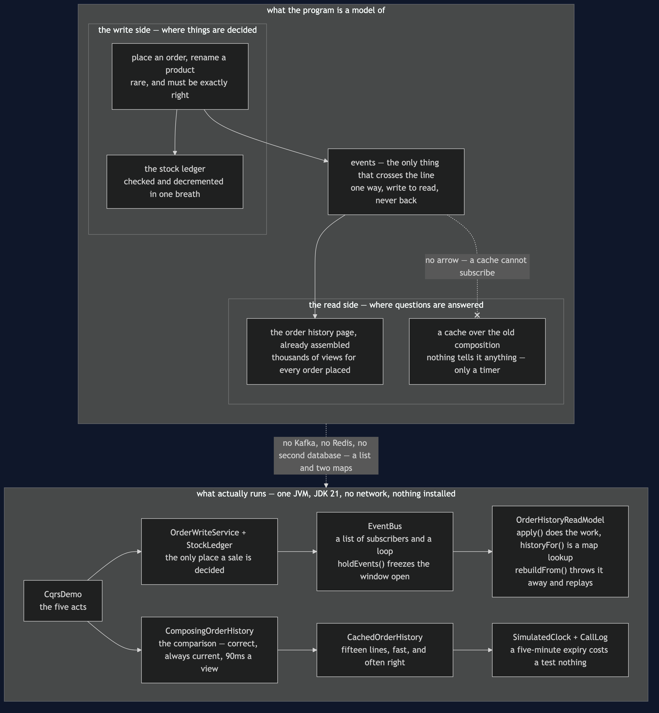
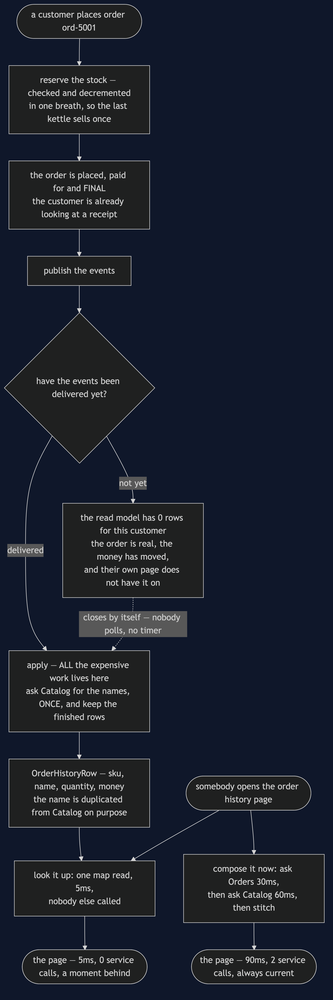
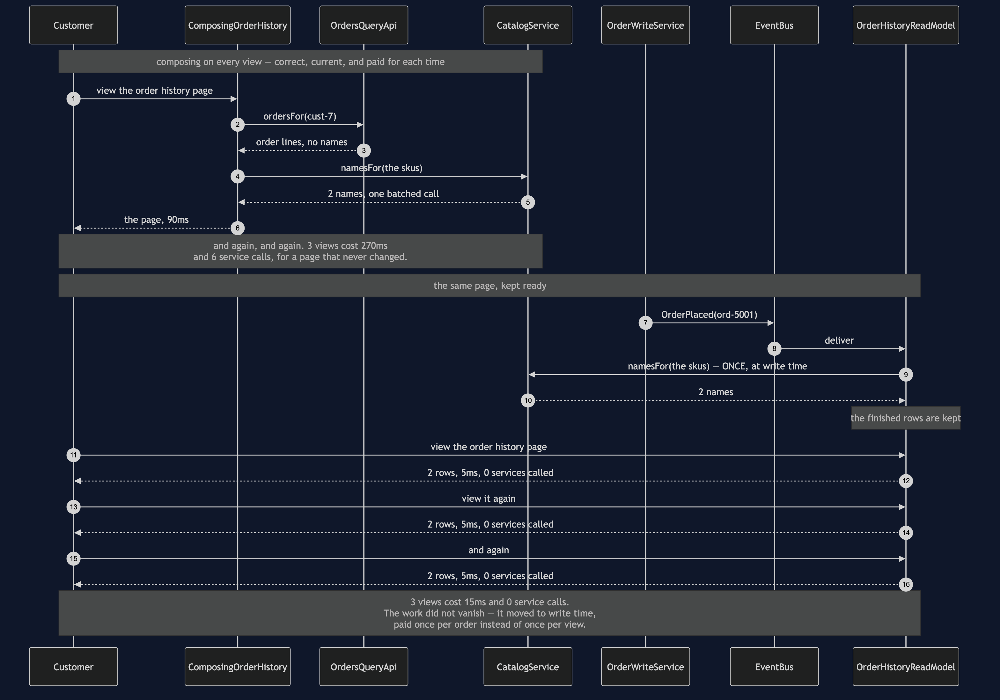
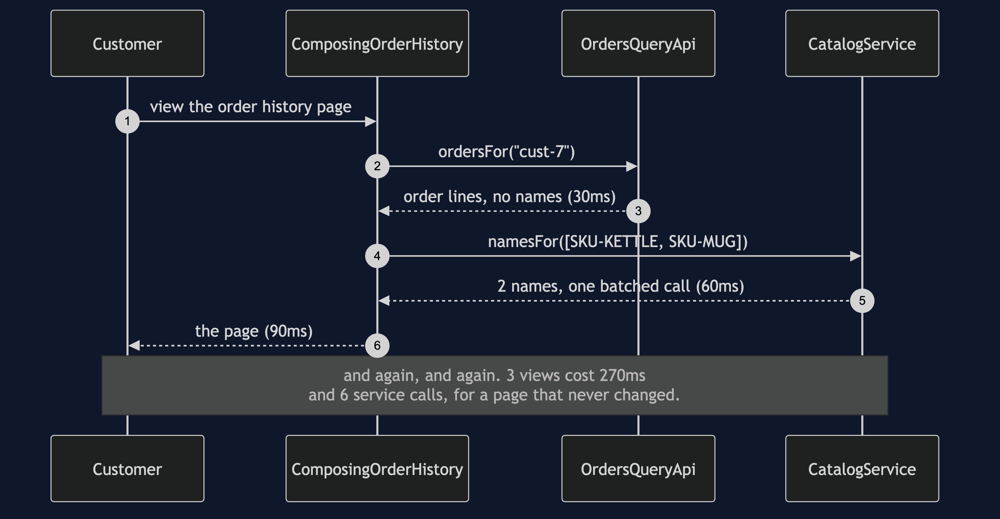
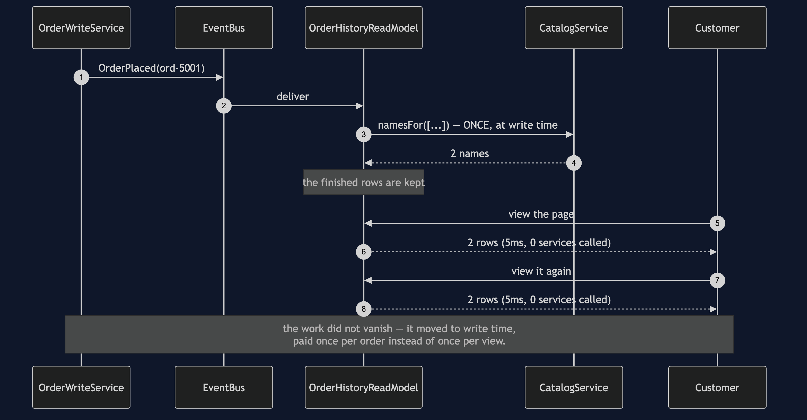
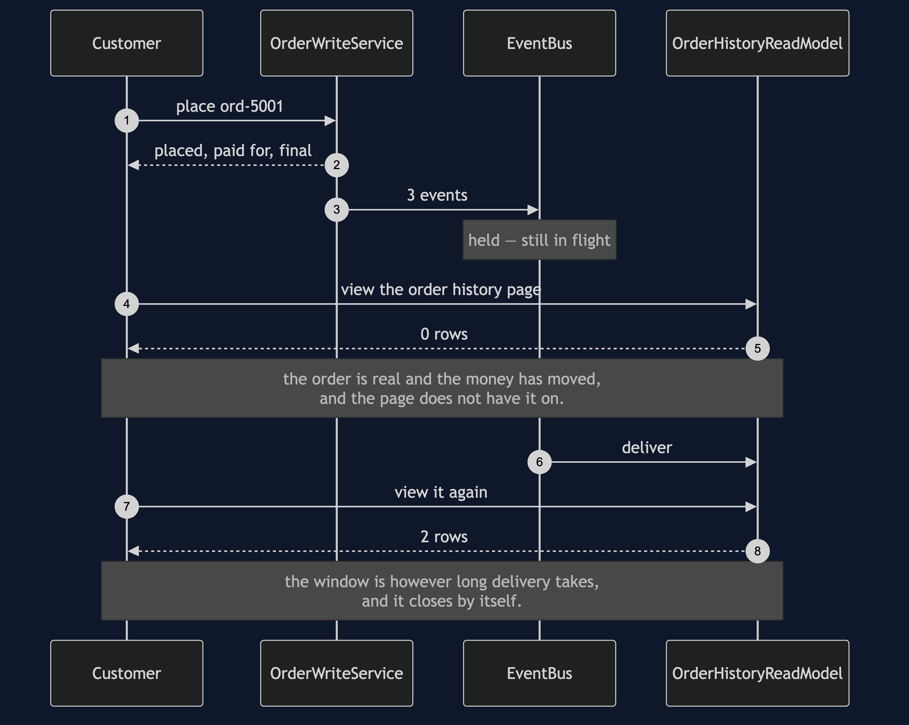
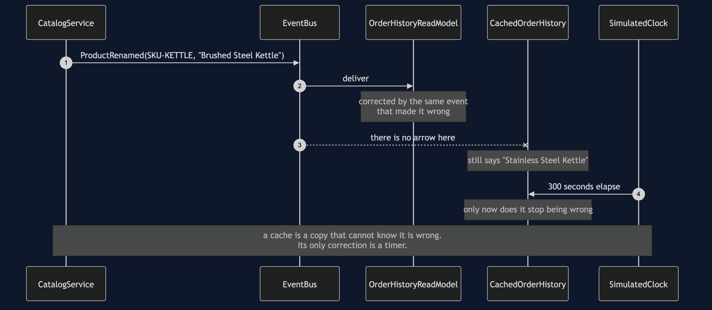
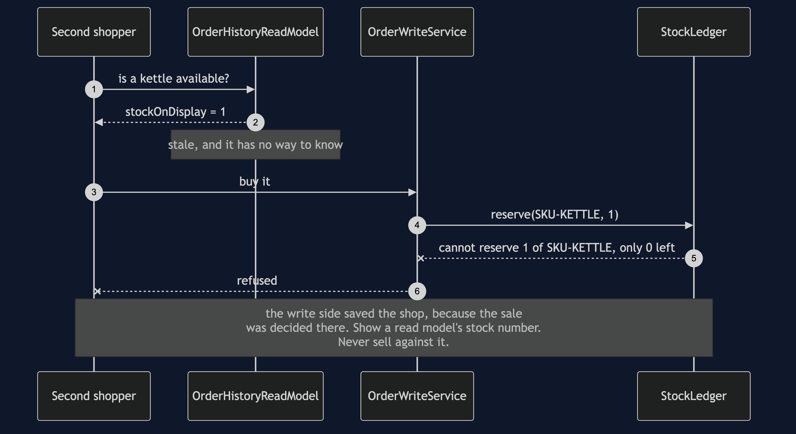

# CQRS

**In plain words:** keep two shapes of the same data — one built for changing it safely,
and a second, pre-assembled one built purely for reading quickly. Every change to the
first sends an update to the second.

**Everyday analogy:** a library's card catalogue. The books on the shelves are the real
thing, and there is exactly one copy of each — that is where changes happen. The card
catalogue is a second, redundant copy of the same information, arranged by author and by
title, existing only so that nobody has to walk the shelves to find something. Both facts
you need are in the analogy: looking up a card is far faster than searching the shelves,
and a book that arrived this morning may not have a card yet. Reading something a moment
out of date is exactly what "eventually consistent" means, and it is fine for a catalogue
and fatal for the count of how many copies are left to lend.

In the shop, a customer's order history page is read thousands of times more often than an
order is placed. Composing it from two services on every view is slow and, since the page
does not change between views, pointless.

## Composing on every view

```
     80ms ->   110ms  Orders           OK
    110ms ->   170ms  Catalog          OK
    170ms ->   200ms  Orders           OK
    200ms ->   260ms  Catalog          OK
    260ms ->   290ms  Orders           OK
    290ms ->   350ms  Catalog          OK
  3 views cost 270ms and 6 service calls
```

Three refreshes, six calls, and three identical pages. Nothing is wrong with
`ComposingOrderHistory` — it is the previous project's answer, and for a page nobody looks
at it is the right one. It also has one real advantage the read model can never claim: it
is always up to the second.

## The page kept ready

```
     80ms ->    85ms  ReadModel        SERVED    2 row(s), 0 other services called
     85ms ->    90ms  ReadModel        SERVED    2 row(s), 0 other services called
     90ms ->    95ms  ReadModel        SERVED    2 row(s), 0 other services called
  3 views cost 15ms and 0 service calls
  the work did not vanish: Catalog was called 1 time when the order was placed
```

`OrderHistoryReadModel` has two halves, and reading them separately is the fastest way to
understand the pattern.

The `apply` half runs when an event arrives — when an order is placed, or a product
renamed. All the expensive work is here, including the one call to Catalog that turns skus
into names. The `historyFor` half is one lookup in a map: no join, no composition, nobody
else called.

**CQRS does not make work disappear. It moves work from the read to the write.** That is a
good trade exactly when reads outnumber writes, and a bad one when they do not.

`OrderHistoryRow` stores the product name, duplicating what Catalog holds. The duplication
is the point rather than a mistake — the page is already the page. The price is
`ProductRenamed` events and the code that applies them.

## The window where it is wrong

```
  ord-5001 is placed, paid for, and final
  events still in flight: 3
  rows on the customer's order history page: 0
  events delivered -> rows on the page: 2
```

A customer places an order and does not see it on their own order history page. This is
the honest cost, and `EventBus.holdEvents()` exists so that it can be shown rather than
described. Note what the window is: **however long delivery takes, and it closes by
itself.** Nobody polls, nobody retries, and no timer is involved.

## Why a cache is not the same thing

```
  Catalog renamed the kettle
  cache says:      Stainless Steel Kettle
  read model says: Brushed Steel Kettle
  the cache will keep saying that for 300 seconds, because nothing tells it otherwise
```

`CachedOrderHistory` is a five-minute expiry over the composition. It is fifteen lines,
it is fast, every test in `CachedOrderHistoryTest` passes, and it is often the right
answer.

The difference from a read model is not speed, and it is not staleness — both are stale.
It is **why** each one is stale and for how long:

- A read model is wrong until the event arrives, and is corrected *by the event that made
  it wrong*.
- A cache is wrong for however long its timer says, whatever happens. The customer places
  an order, the cache is told nothing, and it keeps serving the older page. It cannot know
  it is wrong, because nothing tells it.

`itServesAPageItKnowsNothingAbout` pins that down, and `thereIsNoFreeSetting` pins down
the escape everybody tries: dropping the expiry to a second does not make the cache
correct, it just pays for the composition again every second.

## The number you must never read from a read model

```
  read model still shows on the shelf: 1
  the ledger actually has: 0
  a second shopper arrives and the read model says yes
  the ledger refused: cannot reserve 1 of SKU-KETTLE, only 0 left
```

`StockLedger` is the write side's count of what is on the shelf. It is checked and
decremented in the same breath, so two shoppers reaching for the last kettle cannot both
succeed. The read model also carries a stock number, and it is faster to read, and it is
right there.

Showing it is fine — "only 2 left" sells kettles. **Selling against it is a bug that only
appears on the busiest day of the year**, because it is by design a moment out of date, and
a moment is all it takes to sell the same kettle twice. In the demo the write side is what
saves the shop, purely because the sale was decided there.

If you take one thing from CQRS, take that line.

## The other two costs

**The read model is a second thing to build, test, back up and migrate.** It is a whole
store with its own schema, its own deploys, and its own bugs, and its bugs are the awkward
kind: it is wrong and nothing throws.

**It will need rebuilding.** `rebuildFrom` throws the projection away and replays the
events, and the demo rebuilds two rows from six events. Every read model needs that
method, because the comfortable answer to "it is wrong, now what" is that it can be
discarded and rebuilt from facts held somewhere else. A read model that cannot be rebuilt
is not a projection — it is a second copy of the truth, and now there are two truths.

One free benefit worth noticing: `readsSurviveAnOutage` shows the read model answering
while Catalog is down. It needs nobody at read time, so nobody at read time can break it.

## One JVM, no infrastructure

No Kafka, no Redis, no second database. `EventBus` is a list of subscribers and a loop;
the read model is two maps; `SimulatedClock` makes a five-minute cache expiry cost a test
nothing. Nothing sleeps. Swapping in a real broker would change none of the reasoning
above, which is exactly why the pattern can be taught this way.

## Technologies and versions

Nothing here is a range and nothing is `latest`: a course that worked last year and does
not work today is worse than one that never took the dependency.

| What | Version | Why it is here |
| --- | --- | --- |
| Java | 21 | The repository standard, requested through the Gradle toolchain block |
| Gradle | 9.2.1 | The wrapper in this directory; no separate install needed |
| JUnit 5 | 5.10.2 | The 18 tests, through `junit-bom` so the Jupiter artefacts cannot disagree |

That is the entire list, and the short version of it is the point. **This project has no
runtime dependency at all** — the `dependencies` block in `build.gradle` names nothing but
JUnit, and JUnit is `testImplementation`. There is no Kafka, no Redis, no second database
and no container; the event bus is a list of subscribers and a loop, and the read model is
two maps. Every one of the twelve projects in this category is built the same way, so a
reader who can run one can run all of them, offline, with a JDK and nothing else.

## Learning Material

| Document | What it covers |
| --- | --- |
| [`docs/problem-statement.md`](docs/problem-statement.md) | A page composed correctly on every single view, and why a cache is the obvious answer and the wrong one |
| [`docs/cqrs-pattern-explained.md`](docs/cqrs-pattern-explained.md) | The departures board, the five acts, and the part most treatments skip — what the split costs |
| [`docs/class-diagram.md`](docs/class-diagram.md) | The two sides and the bus between them, including the arrow to the cache that is missing on purpose |
| [`docs/architecture-diagram.md`](docs/architecture-diagram.md) | Which side of the split each box lives on, what crosses the line between them, and in which direction |
| [`docs/data-flow-diagram.md`](docs/data-flow-diagram.md) | The same page along both routes: where the expensive work happens, and what a reader sees during the gap |
| [`docs/sequence-diagram.md`](docs/sequence-diagram.md) | Three views, composed and then projected — 270ms and six calls against 15ms and none |
| [`docs/uml-diagram.md`](docs/uml-diagram.md) | All five acts as sequences: composing, projecting, the staleness window, the rename, and the last kettle |
| [`docs/animation.html`](docs/animation.html) | Two fast copies drifting apart in a browser, and only one of them finding out |
| [`docs/prerequisites.md`](docs/prerequisites.md) | What you need to know, what you explicitly do not (event sourcing, any broker), and 60-second primers |
| [`docs/session.md`](docs/session.md) | A one-hour taught session with exercises |
| [`docs/spec.md`](docs/spec.md) | The generated specification, with measured test counts and timings |
| [`docs/youtube.md`](docs/youtube.md) | Title, description and chapters for the video |
| [`video/README.md`](video/README.md) | The video pipeline, the scene list, and how to rebuild it |

### The pattern in one picture

The class diagram, the two sides and the bus between them — and the thing to look for is
the arrow that is missing, from the bus to the cache. A cache cannot subscribe, and that
is the whole difference between the two.



### What runs where

The lower half is the literal truth: one JVM, a list and two maps. The upper half is the
shop split in two, with events crossing the line in one direction only and a stock ledger
that stays firmly on the deciding side.



### How the data moves

The same page along both routes, with the expensive box appearing once on one of them and
once per view on the other. The gap in the middle is a real state, not an error.



### Who calls whom, in order

Three views each way. Watch where Catalog is called: on every view above, and once before
anybody looked at anything below.



### All five acts

The full set from [`docs/uml-diagram.md`](docs/uml-diagram.md), in the order that document
argues them.

**One. Composing the page on every view.** Correct, always current, and paid for three
times over for a page that never changed.



**Two. The page kept ready by the events.** The work moved to write time, paid once per
order instead of once per view.



**Three. Eventually consistent, shown honestly.** The order is final, the money has moved,
and the customer's own page has nothing on it.



**Four. The cache that cannot know it is wrong.** One copy is corrected by the event that
made it wrong; the other waits out a timer.



**Five. The last kettle.** Show a read model's stock number. Never sell against it.



### Video

The narrated walkthrough is built from [`video/scenes.py`](video/scenes.py) by
[`video/build_video.sh`](video/build_video.sh). It runs about eighteen minutes
across sixteen scenes, and the rendered file is not committed — see the
repository README for why — so producing it takes about ten minutes on macOS.
