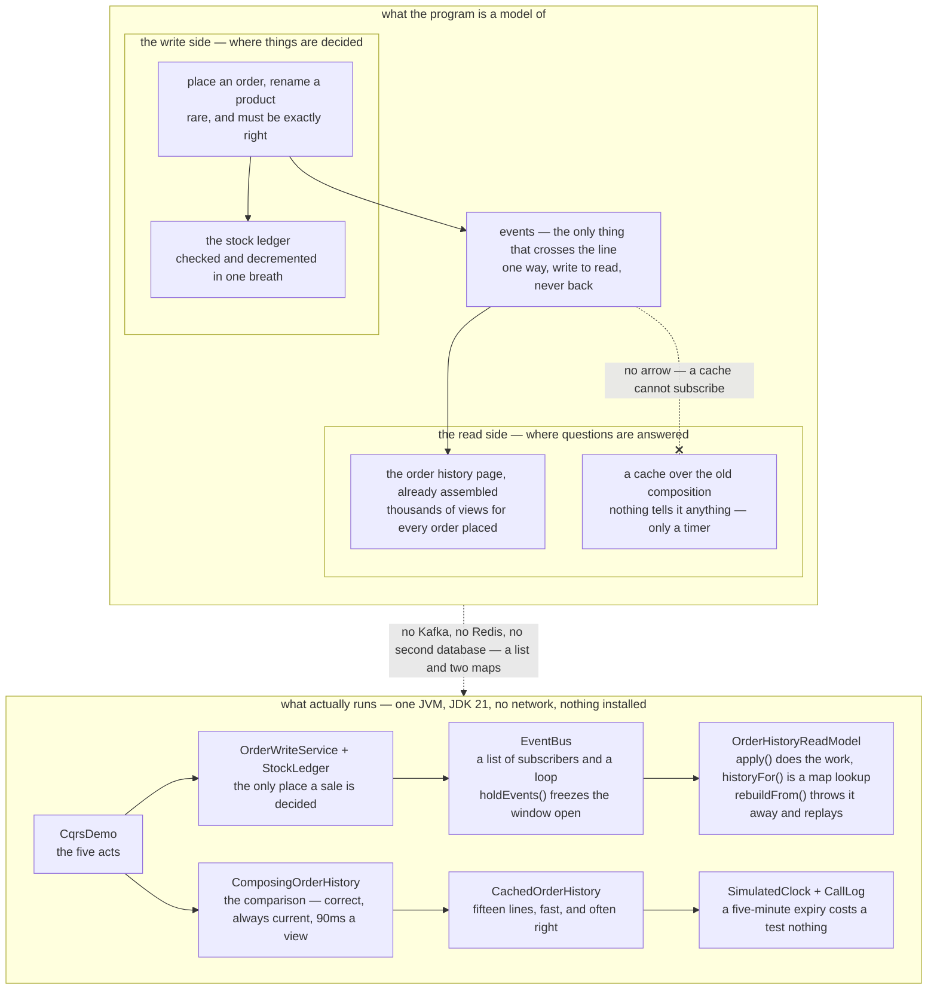

# CQRS — Architecture Diagram

Where each piece of this project sits, and — because this project starts nothing — what
each piece *stands for*. The class diagram shows the types and the sequences show when
each call is made; this one answers the question those two cannot, which is **which side
of the split every box lives on, and what is allowed to cross the line between them**.

Read the picture as two halves stacked. The upper half is what the program is a model of:
one shop with two stores of the same information, a write side that decides things and a
read side that only answers questions. The lower half is the literal truth: one Java
program, a list of subscribers, two maps, and a clock that only moves when something
moves it.

There are three things on the upper half worth finding before you read anything else.

The first is that **the arrow between the two sides goes one way only**. The write side
announces what happened and the read side listens. There is no route back. The moment a
decision starts flowing from the projection back to the write side, you have rebuilt the
bug that act five is about.

The second is that the **cache hangs off the read path with no arrow into it at all**. That
missing arrow is the entire difference between a cache and a read model. Both are stale;
only one of them is ever told.

The third is `StockLedger`, drawn firmly on the write side. It is checked and decremented
in the same breath, and it is the only box in the picture that is allowed to decide whether
a sale happens.

Mermaid source

## What the diagram is telling you to count

**Two stores of the same information, and that is the whole cost.** `OrderHistoryRow`
holds the product name that `CatalogService` also holds. The duplication is the point
rather than a mistake — the page is already the page — but it means a second thing to
build, test, back up and migrate, with its own schema, its own deploys and its own bugs.
Its bugs are the awkward kind: it is wrong and nothing throws.

**The work did not vanish, it moved.** The one call to Catalog that turns skus into names
happens inside `apply`, once per order placed, instead of inside `historyFor`, once per
view. Three views cost 270ms and six service calls the old way, and 15ms and none the new
way, with Catalog called once at write time. That is a good trade exactly when reads
outnumber writes, and a bad one when they do not.

**Zero is a bigger number than five.** Five milliseconds against ninety is latency, and
latency is the headline. Zero services called at read time is availability: a test takes
Orders down and the page still renders, which the composing version could never do. A read
model needs nobody at read time, so nobody at read time can break it.

**`rebuildFrom` is on the diagram because every read model needs one.** It throws the
projection away and replays the events, rebuilding two rows from six in the demo. A read
model that cannot be rebuilt is not a projection — it is a second copy of the truth, and
now there are two truths and no way to tell which is wrong.

## What it deliberately leaves out

**There is no broker.** `EventBus` delivers in-process, in order, exactly once, and
never fails. A real broker does none of those things for free, which is why
[Transactional Outbox](../transactional-outbox-pattern) and
[Idempotent Consumer](../idempotent-consumer-pattern) are separate projects at the end of
this category. Swapping in Kafka would change none of the reasoning here, and all of the
plumbing.

**There is no event store.** The events flow past and are applied; they are not the system
of record. That is event sourcing, which is a different pattern that pairs well with this
one and is not required by it.

**The staleness window is opened by hand.** `EventBus.holdEvents()` exists so the window
can be *shown* rather than described: the order is placed, paid for and final, three events
are in flight, and the customer's own order history page has nothing on it. Note what the
window is — however long delivery takes, and it closes by itself. Nobody polls, nobody
retries, and no timer is involved. That last clause is exactly what a cache cannot say.
