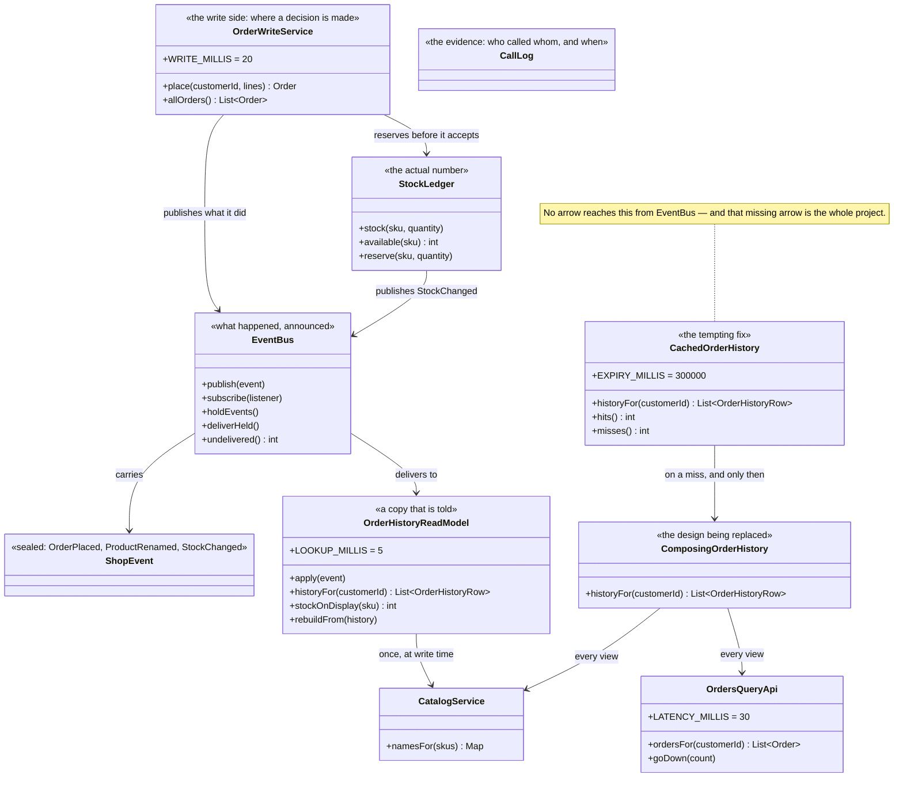

# CQRS — Class Diagram

## The Two Halves

The diagram splits down the middle, and the split is the pattern.

**On the write side** are `OrderWriteService` and `StockLedger`. This is where
something is decided. An order is placed only if the ledger will reserve the stock,
and the ledger holds the actual number — not a copy of it, not a recent view of it,
the number. Everything a customer is charged for happens here.

**On the read side** is `OrderHistoryReadModel`. It decides nothing. It holds rows
that are already assembled and hands them over, and `LOOKUP_MILLIS = 5` is what that
costs. Crucially, serving a page from it calls no other service at all.

Between the two halves is `EventBus`, and it only goes one way: the write side
announces, the read side listens. The read side has no route back.

## The Missing Arrow

The most important thing in the diagram is the arrow that is not there.

`CachedOrderHistory` has no connection to `EventBus`. It cannot. A cache is not a
subscriber; it is a box that remembers what it was given and forgets on a timer. When
Catalog renames a product, the event goes out, the read model updates — and the cache
sits there, confidently wrong, until `EXPIRY_MILLIS` runs out.

That is the difference between the two copies, and it is structural rather than a
matter of configuration. `aRenameCannotInvalidateIt` and
`itIsCorrectedByATimerAndNothingElse` are that missing arrow, written as tests.

## Why `ComposingOrderHistory` Is Still Here

It is the design being replaced, and it is kept because the comparison has to be
fair. It uses `OrdersQueryApi` and `CatalogService` on **every** view, and it does so
correctly — the catalog call is batched. `composingPaysEveryTime` measures it, and
`aReadCostsOneLookup` measures the alternative. Neither number means anything without
the other.

## The Event Type

`ShopEvent` is a sealed interface with three records: `OrderPlaced`,
`ProductRenamed`, `StockChanged`. Sealed matters here for a small, practical reason —
`OrderHistoryReadModel.apply` switches over it, and the compiler will tell you when a
new kind of event has been added and the projection has not been taught about it.

That is a real hazard in this pattern. A projection that silently ignores an event it
has never heard of is exactly how a read model drifts away from the truth without
anybody noticing.

## `CallLog` And `SimulatedClock`

Both designs produce an identical page, so the only way to see the difference between
them is to count calls and read the clock. `CallLog` records who was called, when,
and what came back, and `SimulatedClock` advances by fixed amounts — thirty
milliseconds for an Orders call, sixty for Catalog, five for a read-model lookup.

Nothing in this project sleeps. The timings in act one and act two are exact,
repeatable on any machine, and free.

## `EventBus.holdEvents()`

This exists for one scene only, and it is not a trick. Act three needs to show a
customer whose order is placed, paid for and final, looking at a page with nothing on
it — so delivery is held, the page is read, and then delivery is allowed to catch up.

Real message delivery takes time. `holdEvents` makes that duration visible instead of
leaving it to a paragraph of prose.
