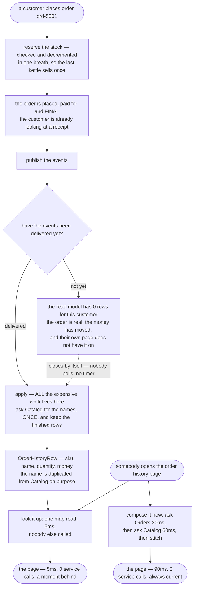

# CQRS — Data Flow Diagram

One order history page, followed along both routes: composed on every view, and kept ready
by the events. The architecture diagram says which side each box lives on; this one says
**where the expensive work happens, and what a reader sees during the gap**.

The thing to follow is that the two routes do the same amount of work in total. The
composition route pays 90 milliseconds and two service calls *every time somebody looks*.
The projection route pays the same work once, when the order is placed, and then answers
from a map. Nothing is saved; something is moved.

Follow the event arrow especially. It leaves the write side after the order is already
final, and everything downstream of it is behind by however long delivery takes. During
that window the page is wrong, and it is wrong in the specific way that matters: the
customer's own order is missing from their own page.

Mermaid source

## What the picture is telling you

**The expensive box appears exactly once on the lower route.** `apply` holds the call to
Catalog, and it runs when an order is placed or a product is renamed — rare events.
`historyFor` holds nothing but a map lookup. Reading those two halves of
`OrderHistoryReadModel` separately is the fastest way to understand the pattern: all the
work is in one, and none of it is in the other.

**Three views make the arithmetic obvious.** Along the top route, three refreshes cost
270ms and six service calls and produce three identical pages. Along the bottom, they cost
15ms and none, with Catalog called once when the order was placed. Reverse the ratio —
more orders than views — and the top route wins.

**The gap node is drawn as a real state, not an error.** Nothing has failed. The order is
correct, the payment is correct, the events are correct, and the page is empty. This is the
honest cost of the pattern, and `EventBus.holdEvents()` exists so that it can be shown in a
demo rather than described in a paragraph.

**The dotted arrow out of the gap has no timer on it.** The window is however long delivery
takes, and it closes by itself, corrected by the very event that made it wrong. Hold that
sentence next to the cache.

**The name in `OrderHistoryRow` is duplicated data and that is deliberate.** The page is
already the page. The price of that is `ProductRenamed` events and the code that applies
them, and the benefit is that no join and no second service stand between a reader and
their answer.

## The cache route, which looks the same and is not

`CachedOrderHistory` is a five-minute expiry over the composition. It is fifteen lines, it
is fast, every test in its class passes, and it is often the right answer — reach for it
first.

The difference from a read model is not speed, and it is not staleness; both are stale. It
is **why** each one is stale and for how long. A read model is wrong until the event
arrives and is corrected by that event. A cache is wrong for however long its timer says,
whatever happens: Catalog renames the kettle, the read model says "Brushed Steel Kettle",
and the cache goes on saying "Stainless Steel Kettle" for three hundred seconds because
nothing tells it otherwise. It cannot know it is wrong. Dropping the expiry to a second
does not fix that — it just pays for the composition again every second, which is what
`thereIsNoFreeSetting` asserts.

## The one number that must not come from here

`StockLedger` is the write side's count of what is on the shelf. The read model also
carries a stock number, and it is faster to read, and it is right there. Showing it is
fine — "only 2 left" sells kettles. **Selling against it is a bug that only appears on the
busiest day of the year**, because a read model is by design a moment out of date, and a
moment is all it takes to sell the same kettle twice. In the demo the read model says one
is on the shelf, the ledger has none, and the shop is saved purely because the sale was
decided on the write side.

If you take one thing from this diagram, take that: everything that costs a customer money
happens on the left, against the number that is checked and decremented in the same breath.
