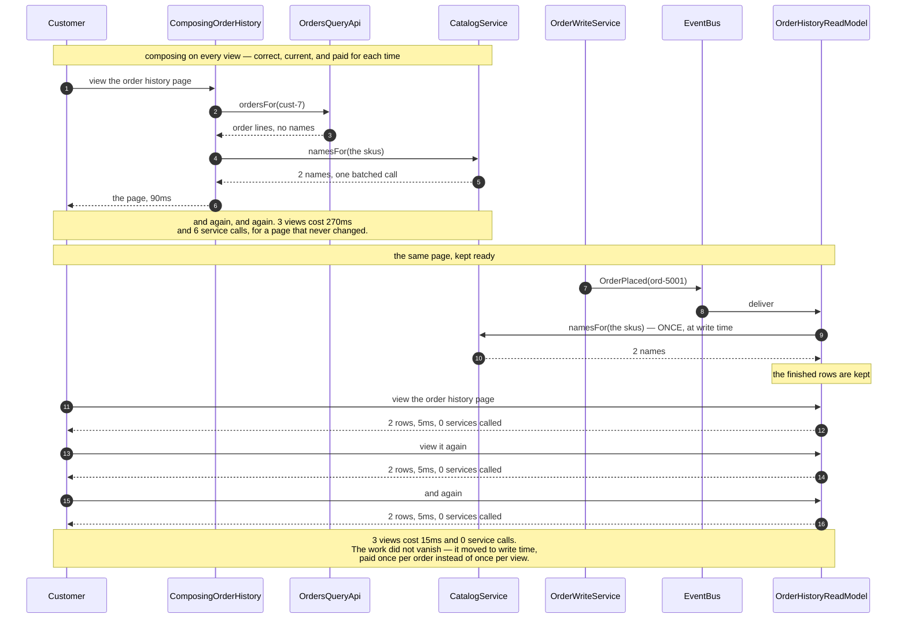

# CQRS — Sequence Diagram

The one sequence worth having in your head before the others make sense: the same order
history page served three times, first by composing it on every view and then by reading a
projection that was built once, when the order was placed.

[`uml-diagram.md`](uml-diagram.md) holds the full set of five acts, including the staleness
window, the cache and the last kettle. This document puts the two routes side by side,
because the pattern is a trade and a trade is only visible as a comparison.

The clock runs in the notes and every figure is one the demo prints. Watch where Catalog is
called. In the upper half it is called on every view; in the lower half it is called once,
before anybody has looked at anything.

Mermaid source

## Reading the timings

**Ninety milliseconds against five, and zero is the more interesting number.** Latency is
the headline, but the service-call count is the deeper change. A read that calls nobody
cannot be broken by anybody: a test takes Orders down and the projection still serves the
page, which the composing version could never do.

**Catalog is called the same way in both halves — once, batched.** `namesFor` takes a list
in both routes, so the comparison is fair. The difference is not how the names are fetched,
it is *when*: once per view, or once per order placed.

**The break-even is a ratio, not a threshold.** Three views of one order is already a clear
win. One view of one order is a clear loss — the projection paid for a page nobody read.
Since an order history page is read thousands of times more often than an order is placed,
the shop is comfortably on the right side of it, and a different page might not be.

**Nothing here sleeps.** `SimulatedClock` advances thirty milliseconds for an Orders call,
sixty for Catalog and five for a read-model lookup, so every figure above is exact,
repeatable on any machine, and free — including the five-minute cache expiry in act four.

## What the comparison does not show

**The window where the projection is wrong.** It comes after this sequence: the order is
placed, paid for and final, the events are still in flight, and the customer's own page has
nothing on it. The window is however long delivery takes, and it closes by itself, corrected
by the same event that made it wrong. That last part is what separates it from a cache,
which is wrong for as long as its timer says and is never told anything.

**The second thing to run.** The projection is a whole store with its own schema, its own
deploys and its own bugs, and its bugs are the quiet kind — it is wrong and nothing throws.
`rebuildFrom` is the answer to that: throw the projection away and replay the events, which
the demo does to rebuild two rows from six. A read model that cannot be rebuilt is not a
projection, it is a second copy of the truth.

**The number that must not be sold against.** The projection carries a stock count, and it
is faster to read and right there. Showing it is fine; deciding a sale with it is a bug
that surfaces on the busiest day of the year. `StockLedger` on the write side is checked
and decremented in one breath, and in the demo that is the only reason the last kettle is
not sold twice.
