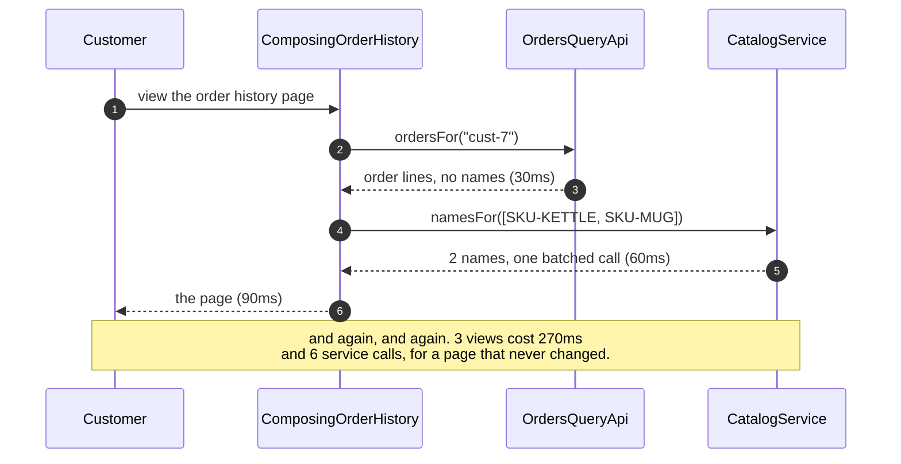
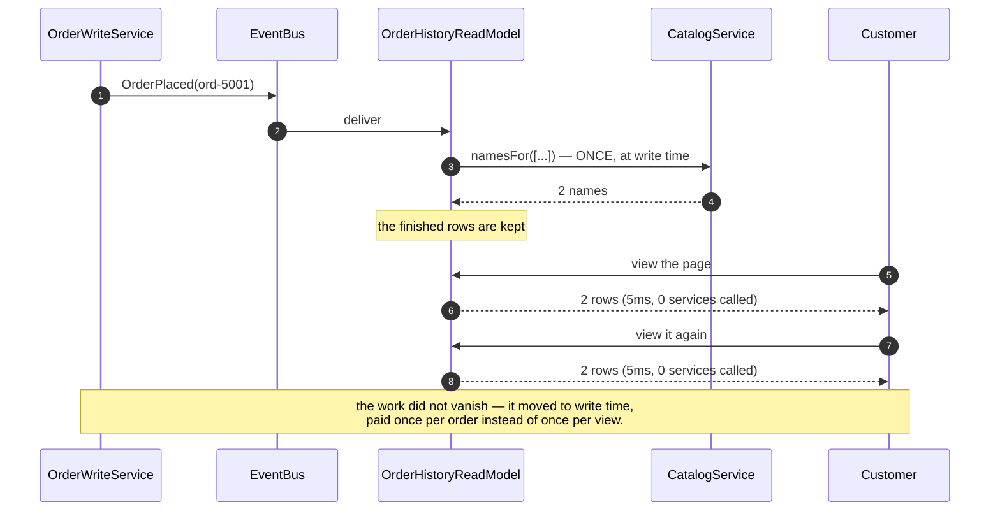
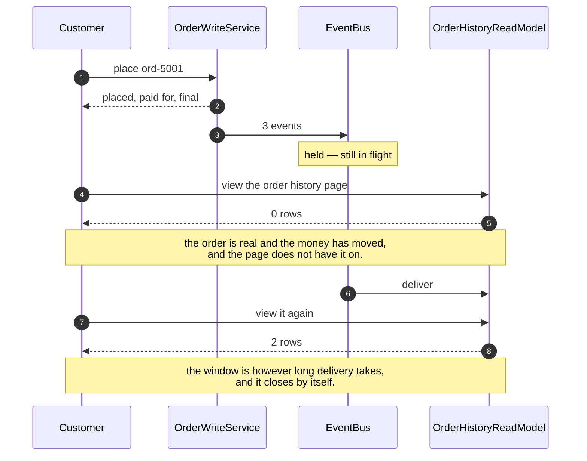
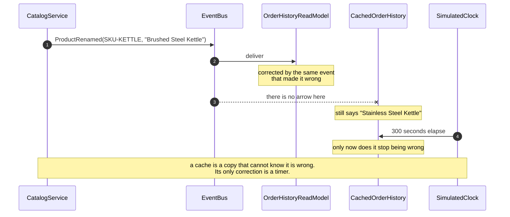
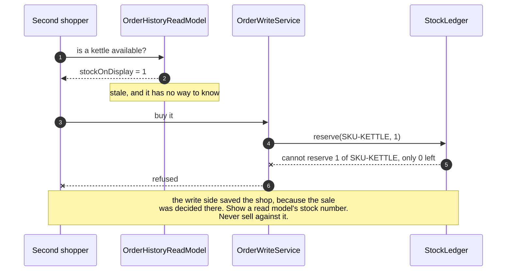

# CQRS — Sequence Diagrams

Five acts, as sequences. Only the first is rendered to an image; the rest are here as
mermaid source, because what makes them different is the words on the arrows rather
than the shapes.

## Act One — Composing The Page On Every View

## Act Two — The Page Kept Ready By The Events

## Act Three — Eventually Consistent, Shown Honestly

## Act Four — The Cache That Cannot Know It Is Wrong

## Act Five — The Last Kettle

## Notes On Reading These

**Act one and act two are the same page.** That is what makes the comparison fair:
ninety milliseconds and two service calls against five milliseconds and none. Both
numbers come from `CallLog`, and both are asserted —`composingPaysEveryTime` and
`aReadCostsOneLookup`.

**The zero in act two is the bigger number.** Five milliseconds against ninety is
latency, and latency is the headline. Zero service calls is availability:
`readsSurviveAnOutage` takes Orders down and the page still renders, which the
composing version could never do.

**The arrow in act two goes only one way.** The write side announces; the read side
listens. There is no route back from the projection to the write side, and that is
deliberate — the moment a decision starts flowing back the other way, you have
rebuilt the problem act five is about.

**Act four's most important arrow is the one marked as not existing.** A cache cannot
subscribe. It is not a matter of configuration, and no expiry setting fixes it —
`thereIsNoFreeSetting` closes that door on purpose.

**Act five is the rule that has to survive production.** The read model is allowed to
be wrong about stock, because nothing is decided by it. Everything that costs a
customer money happens on the write side, against the ledger that holds the actual
number.

**Nothing here sleeps.** `SimulatedClock` advances thirty milliseconds for an Orders
call, sixty for Catalog and five for a read-model lookup, so every timing above is
exact, repeatable on any machine, and free.
