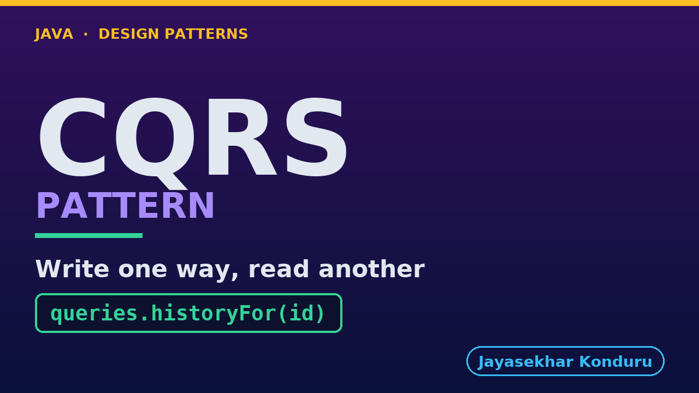

# YouTube — CQRS Pattern

Everything needed to publish `video/cqrs-pattern-explained.mp4`. Copy the fields straight out of this file.

Chapter timings are generated from the video's `.srt`. Re-run `python3 docs/make_youtube_docs.py cqrs` after any change to the narration, or they will be wrong.

## Title

```
CQRS in Java - Order History Without the Joins
```

46 characters — under the 60 YouTube shows before truncating in search results.

## Description

The first two lines are what a viewer sees above the fold, so they carry the hook rather than the boilerplate.

```
Learn CQRS in Java 21 through one order history page: written once, read a thousand times. The composing version is read generously — the catalog call is batched, nobody would object to it — and it costs two hundred and seventy milliseconds, six service calls, and a quieter problem: the page needs other services to be up. So cache it. That is a good idea and it is taken seriously before it is taken apart, because a cache cannot answer one question: how would it ever find out it is wrong? A rename settles it — one copy still says the old name, and the other was corrected by the very event that made it wrong. That is the difference between a cache and a read model, and no expiry setting bridges it. Then the bill, honestly: the work moved to write time rather than vanishing, there is a second copy to keep, and there is a window where that copy is behind — shown rather than described. The rule to carry away is the last line: show a read model's number, never decide with it.

CHAPTERS
00:00 Introduction
01:01 The Shop, And One Page
02:06 Composed On Every View
02:46 Act One — Composing On Every View
03:53 So Cache It
04:47 The Cache, Honestly
05:38 Act Four — The Rename
06:45 A Copy That Is Told
07:48 The Whole Mechanism
08:57 Act Two — The Page Kept Ready
10:22 What You Are Actually Buying
11:08 Act Three — The Window, Shown
12:18 Who Does What
13:34 Act Five — The Last Kettle
15:04 What To Remember
15:45 Thanks for Watching

SOURCE CODE, WRITTEN NOTES AND AN INTERACTIVE ANIMATION
https://github.com/jk-boot-up/java-design-patterns/tree/main/gradle-java/micro-services-design-patterns/cqrs-pattern

WHAT YOU NEED FIRST
Java 21 and a working knowledge of classes and interfaces. No prior design-pattern knowledge is assumed. The full prerequisites are in docs/prerequisites.md in the repository.
```

## Chapters

YouTube renders these as chapters only if there are at least three and the first is at `00:00`.

```
00:00 Introduction
01:01 The Shop, And One Page
02:06 Composed On Every View
02:46 Act One — Composing On Every View
03:53 So Cache It
04:47 The Cache, Honestly
05:38 Act Four — The Rename
06:45 A Copy That Is Told
07:48 The Whole Mechanism
08:57 Act Two — The Page Kept Ready
10:22 What You Are Actually Buying
11:08 Act Three — The Window, Shown
12:18 Who Does What
13:34 Act Five — The Last Kettle
15:04 What To Remember
15:45 Thanks for Watching
```

## Tags

```
cqrs pattern, read model java, event driven, design patterns, java design patterns, gang of four, java 21, software design, clean code, object oriented design, java tutorial, ecommerce, programming tutorial
```

206 characters, under YouTube's 500 limit.

## Thumbnail



**Upload `docs/thumbnail.png`** — 1280×720, the size YouTube recommends, generated by `docs/make_thumbnails.py`. It is deliberately not the same image as the video's opening frame: a thumbnail is judged at about 360 pixels wide in a search result, so this one carries only the pattern name, one line of promise and one short piece of code, each set large enough to survive the shrink.

`video/poster.png` is the 1920×1080 opening frame, produced by the video build. It stays in the repository as the title card; it is not what gets uploaded.

YouTube will not pick the thumbnail up on its own — upload it under **Details → Thumbnail → Upload file**. A custom thumbnail requires a verified channel.

## Upload checklist

- [ ] Upload `video/cqrs-pattern-explained.mp4` (1080p, H.264, 30 fps, AAC 48 kHz — already YouTube's recommended settings, no re-encode needed)
- [ ] Set the video language to **English** first, or the subtitle option may not appear
- [ ] Add subtitles: *Video elements → Add subtitles → Upload file → With timing* → `video/cqrs-pattern-explained.srt`
- [ ] Upload `docs/thumbnail.png` as the thumbnail — do not let YouTube auto-pick a frame
- [ ] Paste the title, description and tags from above
- [ ] Add to the **Java Design Patterns** playlist, in learning order
- [ ] Wait for 1080p processing before sharing the link — code slides are unreadable at 360p

## Cards and end screen

End screen links to whichever pattern video goes up next — set it at upload time rather than assuming an order.

Add a card partway through pointing at the playlist, so a viewer who arrives at this pattern from search can find the rest of the series.

## Runtime

Approximately 17:25, narrated at 145 words per minute.
