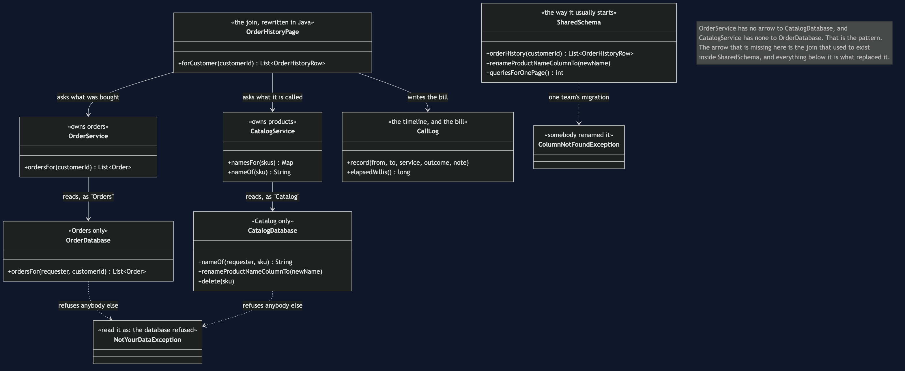
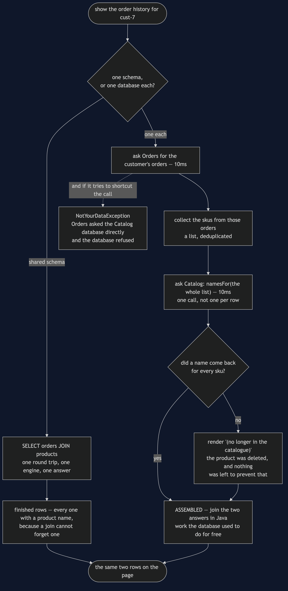
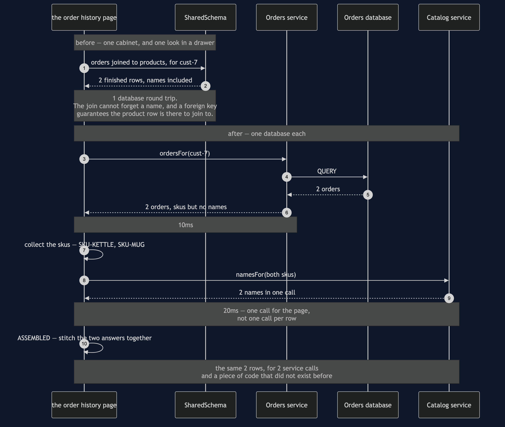
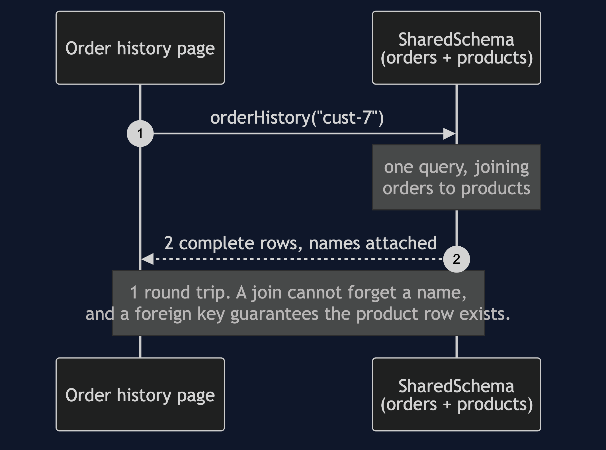
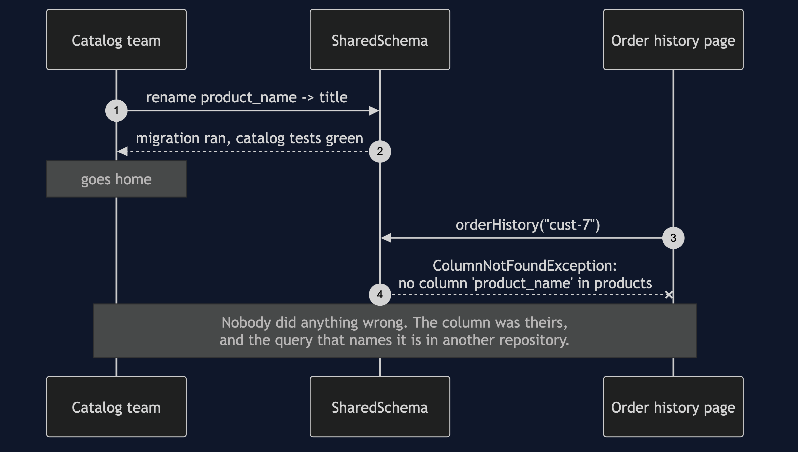
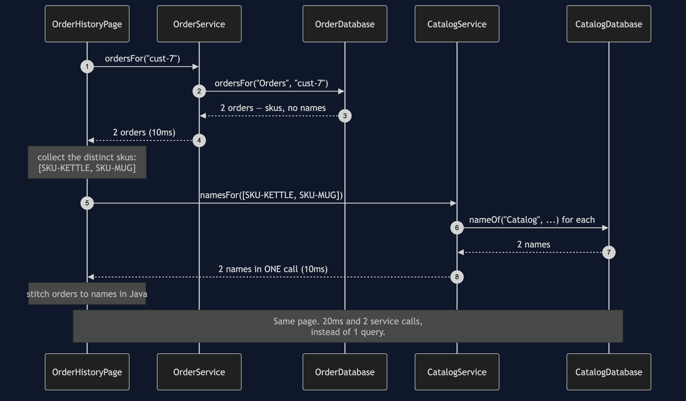
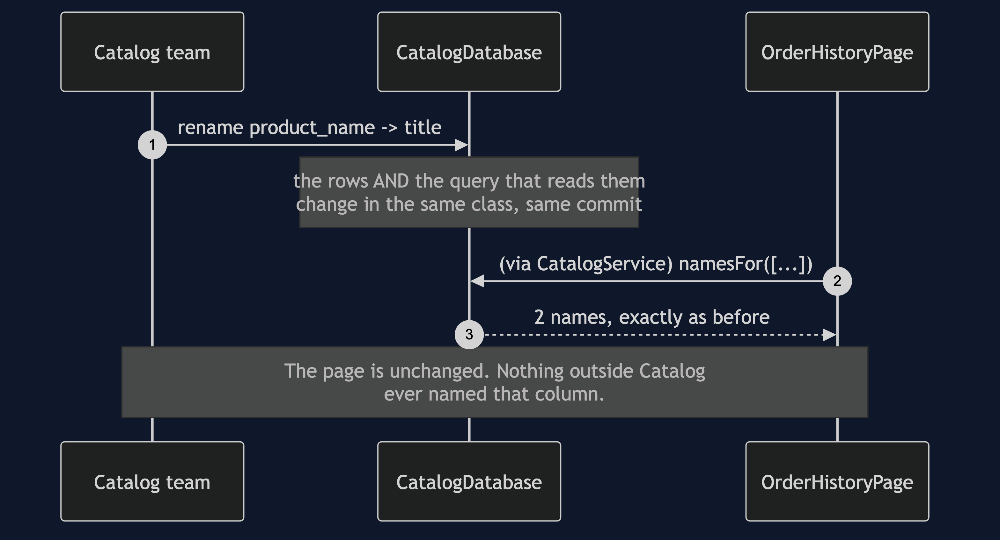
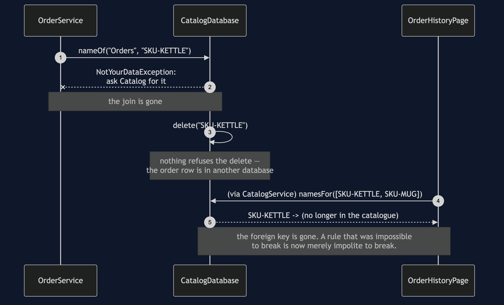

# Database per Service

**In plain words:** each service keeps its own data and nobody else is allowed to read
it directly. If you want somebody else's data, you ask them for it.

**Everyday analogy:** two departments that stop sharing a filing cabinet. While they
share it, either one can reorganise the folders and break the other without knowing.
Once each has its own cabinet, they are free to reorganise — and the price is that a
question spanning both departments now needs two conversations instead of one look in a
drawer. Everything difficult in the rest of this category is that price being paid.

In the shop, `Orders` and `Catalog` share one schema, and the order history page joins
across both tables. It is fast, it is correct, and it means the catalog team cannot
rename a column without breaking checkout.

## The shared database, working

```
  ord-101   SKU-KETTLE   Stainless Steel Kettle       x1
  ord-102   SKU-MUG      Blue Stoneware Mug           x4
  database round trips: 1
```

One query. One join, done by an engine that is extremely good at joins. Every row has
a product name, because a join cannot forget one, and a foreign key guarantees the
product row is there to be joined to. If a shop can live like this, it should. Read
`SharedSchema` before reading anything else in this project, and read it generously —
the rest of the category is the story of giving this up.

## The shared database, breaking

```
  catalog team: migration ran, catalog tests green, done
  order history page: no column 'product_name' in products -- somebody renamed it
```

The catalog team renamed a column in a table they own. Their migration was correct.
Their tests passed. They had no way of knowing that a query in somebody else's
repository named that column, because it is not in their code, not in their tests, and
not in their build.

`SharedSchemaTest` pins this down, and **every test in that class passes** — including
`aRenameBreaksTheOrderHistoryPage`. That is the shape of the problem. The failure is
not a bug in anybody's code. It lives in the space between two teams, which is exactly
the space that no test suite owns.

## The split, doing the same job for more money

```
      0ms ->    10ms  Orders           OK        2 order(s)
     10ms ->    10ms  OrderDb          QUERY     2 order(s) for cust-7
     10ms ->    20ms  Catalog          OK        2 name(s) in one call
     20ms ->    20ms  HistoryPage      ASSEMBLED 2 row(s) from 2 services
  the same page took 20ms and 2 service calls instead of 1 query
```

Same page. Two network calls and an assembly step in Java instead of one query. Ask
Orders what the customer bought, collect the skus, ask Catalog what they are called,
stitch. `OrderHistoryPage` is that stitching, and the next project — API Composition —
is about doing it properly.

Note `CatalogService.namesFor`, which takes a list. It is not a convenience. Asking
once per sku would turn a four-row page into four network calls and a fifty-row page
into fifty. The batch call is the difference between an assembly step and a disaster.

## The pattern is a refusal

There is no algorithm here. `OrderDatabase` and `CatalogDatabase` each take the name
of whoever is asking and throw `NotYourDataException` at anybody else. That is the
whole pattern.

In a real shop nothing throws that exception, because the rule is not enforced in
Java. The Orders service is given database credentials that simply cannot see the
Catalog tables, and an attempt to read them fails as a permissions error. Read
`NotYourDataException` as "the database refused". It is a class here only so that the
rule is visible in a project small enough to read.

## What it buys

```
Act 4 - the same rename, against a database Catalog owns
  ord-101   SKU-KETTLE   Stainless Steel Kettle       x1
  ord-102   SKU-MUG      Blue Stoneware Mug           x4
  the page is unchanged.
```

The rename that broke act 2 is now a non-event. Nothing outside Catalog ever named
that column, so nothing outside Catalog can be surprised by it changing.

That is worth being precise about, because it is easy to oversell. Splitting the
database bought no speed — the query engine was perfectly happy before, and act 3 is
in fact *slower*. It bought no correctness. What it bought is that a team can change
its mind without asking permission, and can deploy that change without coordinating a
release with a team it has never met. That is an organisational benefit, and it is the
only one on offer. If the two teams are the same three people, it is not worth the
price.

## What it costs

Two things, and the second is the one people forget.

**The join is gone.** Act 5 tries to read a product name from Orders and is refused.
Every question that spans both services is now two calls and some code, and every
report that used to be a `SELECT` with three joins now needs somewhere else to live.

**The foreign key is gone.**

```
  b) Catalog deletes a product that an order refers to:
  ord-101   SKU-KETTLE   (no longer in the catalogue) x1
```

The order still refers to `SKU-KETTLE`. Nothing stopped the delete, because there is no
constraint left to stop it — the two rows are in different databases. `Orders` now
holds a sku that `Catalog` has never heard of, and `OrderHistoryPage` has to decide
what to render, so it renders `(no longer in the catalogue)` rather than crashing.

The page surviving is the good news and the bad news at once. A rule that used to be
*impossible* to break is now merely impolite to break. It lives in code, in tests, and
in agreements between teams — which is to say, in hope. The two projects at the end of
this category, Transactional Outbox and Idempotent Consumer, exist because hope is not
quite enough.

## One JVM, no infrastructure

No Docker and no real database. `SharedSchema`, `OrderDatabase` and `CatalogDatabase`
store rows in maps, and a column is a map key so that a rename is a real rename rather
than a story about one. `SimulatedClock` makes the network latency in the timeline
exact and free, so no test sleeps.

## Technologies and versions

Nothing here is a range and nothing is `latest`: a course that worked last year and does
not work today is worse than one that never took the dependency.

| What | Version | Why it is here |
| --- | --- | --- |
| Java | 21 | The repository standard, requested through the Gradle toolchain block |
| Gradle | 9.2.1 | The wrapper in this directory; no separate install needed |
| JUnit 5 | 5.10.2 | The 16 tests, through `junit-bom` so the Jupiter artefacts cannot disagree |

That is the entire list, and the short version of it is the point. **This project has no
runtime dependency at all** — the `dependencies` block in `build.gradle` names nothing but
JUnit, and JUnit is `testImplementation`. There is no JDBC driver, no Postgres, no ORM and
no container; a table is a map and a column is a map key, which is what makes a rename in
act two a real rename rather than a story about one. Every one of the twelve projects in
this category is built the same way, so a reader who can run one can run all of them,
offline, with a JDK and nothing else.

## Where this sits

The five projects before this one were about calls going wrong. This one is about who
owns what, and it is the constraint the remaining four projects all answer to: API
Composition assembles a page without a join, CQRS builds a queryable copy when
assembling is not enough, and Saga replaces the transaction that used to span both
tables.

## Learning Material

| Document | What it covers |
| --- | --- |
| [`docs/problem-statement.md`](docs/problem-statement.md) | Two teams share a schema, one of them renames a column correctly, and somebody else's page dies |
| [`docs/database-per-service-pattern-explained.md`](docs/database-per-service-pattern-explained.md) | The shared filing cabinet, the five acts, and the part most treatments skip — what the split costs |
| [`docs/class-diagram.md`](docs/class-diagram.md) | The structure, including the arrows that are missing on purpose between each service and the other's database |
| [`docs/architecture-diagram.md`](docs/architecture-diagram.md) | Who may read what, both arrangements side by side, and the line that is deliberately not drawn |
| [`docs/data-flow-diagram.md`](docs/data-flow-diagram.md) | One order history page both ways: what work moves out of the database and into your code |
| [`docs/sequence-diagram.md`](docs/sequence-diagram.md) | Before and after in call order — one query and 10ms, against two calls, 20ms and an assembly step |
| [`docs/uml-diagram.md`](docs/uml-diagram.md) | All five acts as sequences: one query, then a broken page, then two calls and an assembly |
| [`docs/animation.html`](docs/animation.html) | The guarantees being handed back one at a time, step by step in a browser |
| [`docs/prerequisites.md`](docs/prerequisites.md) | What you need to know, what you explicitly do not (SQL, any real database), and 60-second primers |
| [`docs/session.md`](docs/session.md) | A one-hour taught session with exercises |
| [`docs/spec.md`](docs/spec.md) | The generated specification, with measured test counts and timings |
| [`docs/youtube.md`](docs/youtube.md) | Title, description and chapters for the video |
| [`video/README.md`](video/README.md) | The video pipeline, the scene list, and how to rebuild it |

### The pattern in one picture

The class diagram, and the thing to look for is what is missing: neither service has an
arrow to the other's database. The pattern is that absence, and nothing else.



### What runs where

The lower half is the literal truth: one JVM, rows in maps. The upper half is the shop
drawn twice — one cabinet shared by two departments, then one cabinet each and a
conversation between them.


### How the data moves

The same order history page along both routes. One is a query; the other is four steps,
one of which exists only because a product can now be deleted while an order still names
it.



### Who calls whom, in order

Before and after in call order. Note which way the inequality goes: the split version is
the slower one, and always will be.



### All five acts

The full set from [`docs/uml-diagram.md`](docs/uml-diagram.md), in the order that document
argues them.

**One. One database, one query.** Fast, correct, and the thing the rest of this category is
about giving up.



**Two. The catalog team renames a column.** A correct migration, green tests, and a dead
page belonging to somebody they have never met.



**Three. Two databases, two calls, one assembly.** The same page for more money, with the
join now written in Java.



**Four. The same rename, against a database Catalog owns.** A non-event, and the only thing
the split actually bought.



**Five. The bill.** A refused read, and a deleted product that an order still refers to —
with nothing left to prevent it.



### Video

The narrated walkthrough is built from [`video/scenes.py`](video/scenes.py) by
[`video/build_video.sh`](video/build_video.sh). It runs about seventeen and a half
minutes across sixteen scenes, and the rendered file is not committed — see the
repository README for why — so producing it takes about ten minutes on macOS.
