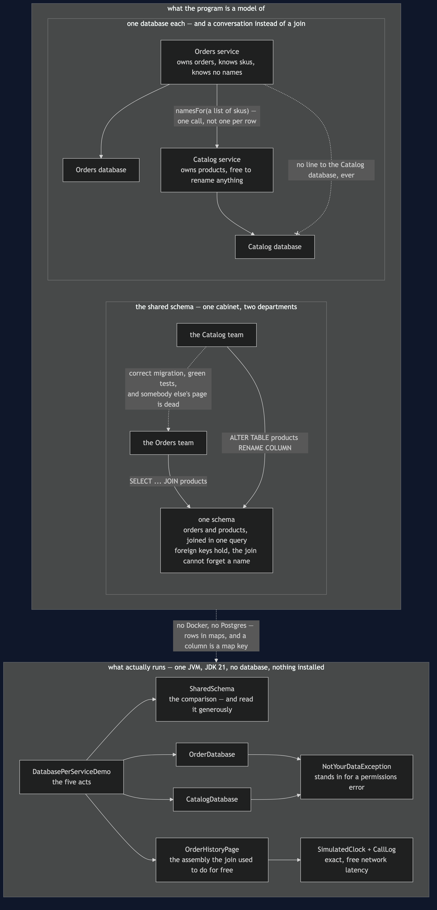
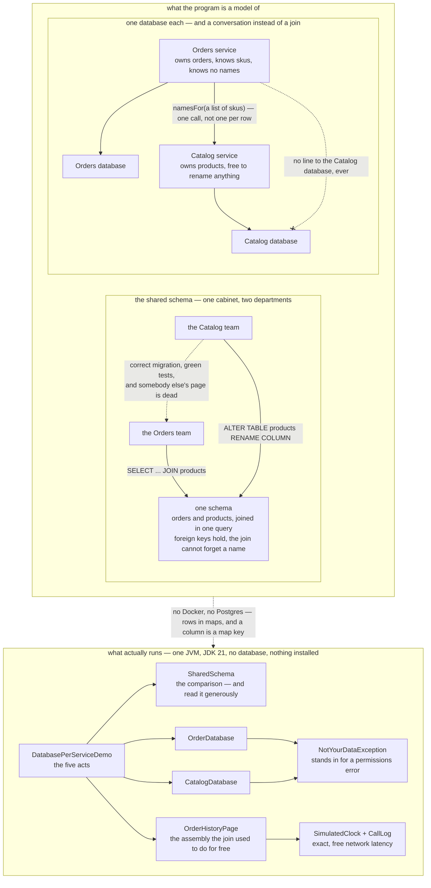

# Database per Service — Architecture Diagram

Where each piece of this project sits, and — because this project starts nothing — what
each piece *stands for*. The class diagram shows the types and the sequences show the
order of the calls; this one answers the question those two cannot, which is **who is
allowed to read what**.

Read the picture as two halves stacked. The upper half is the shop drawn twice: on the
left the arrangement the shop starts with, one schema that both teams reach into; on the
right the arrangement it ends with, one database each and a service call between them. The
lower half is the literal truth — one Java program, rows in maps, and a column that is a
map key so that a rename is a real rename rather than a story about one.

The whole pattern is in one detail of the right-hand arrangement: **there is no arrow from
Orders to the Catalog database.** Not a slow arrow, not a discouraged arrow — none. That
absence is not a simplification of the diagram; it is the design. Everything the pattern
buys and everything it costs follows from a line that is not drawn.

In this project the refusal is a Java exception, `NotYourDataException`. In a real shop
nothing throws it, because the rule is not enforced in Java at all: the Orders service is
given credentials that simply cannot see the Catalog tables, and an attempt to read them
fails as a permissions error. Read the exception as "the database refused". It is a class
here only so the rule is visible in a project small enough to read.

Mermaid source

## What the diagram is telling you to count

**One arrow on the left where the right has three.** The shared schema answers the order
history page with a single query, performed by an engine that is extremely good at joins,
and it is both faster and simpler than anything on the right. Act three is *slower* than
act one. If a shop can live with the left-hand picture it should.

**The dotted crossed-out line is the entire pattern.** There is no algorithm in this
project. `OrderDatabase` and `CatalogDatabase` each take the name of whoever is asking and
refuse everybody else. That is a refusal, not a mechanism, which is why this is one of the
shortest projects in the category and one of the most consequential.

**`namesFor` takes a list, and that is load-bearing.** One call for the whole page rather
than one call per row. Asking per sku turns a four-row page into four network calls and a
fifty-row page into fifty, which is the difference between an assembly step and a disaster.

**Two guarantees are on the left-hand database and on neither of the right-hand two.** The
join cannot forget a product name, and the foreign key cannot let a product be deleted
while an order refers to it. Splitting hands both of those back. Nothing in the right-hand
picture prevents `Catalog` deleting `SKU-KETTLE` while `ord-101` still names it.

## What it deliberately leaves out

There is no read model. When assembling a page from two services stops being enough —
because the page needs filtering, sorting or paging across both — the answer is a
queryable copy, and that is [CQRS](../cqrs-pattern).

There is no distributed transaction, because there is no such thing worth having here. The
transaction that used to span both tables is replaced by a sequence of local ones with
compensations, which is [Saga](../saga-pattern).

And there is no messaging. The right-hand picture shows a synchronous call because it is
the simplest thing that demonstrates the refusal. The two projects that close this category
— [Transactional Outbox](../transactional-outbox-pattern) and
[Idempotent Consumer](../idempotent-consumer-pattern) — exist because the rules the foreign
key used to enforce now live in code, in tests, and in agreements between teams, which is
to say in hope.
