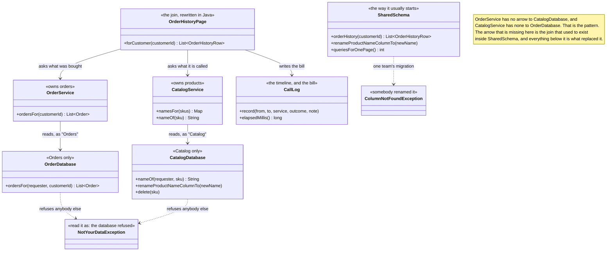

# Database per Service — Class Diagram

Mermaid source

## What the arrows are saying

**`SharedSchema` is drawn on its own, connected to nothing.** It is not a collaborator
in the split design; it is the design being replaced, kept in the project so the two
can be compared side by side. Read it first and read it generously. It does the whole
order history page in one method and one round trip, and it does it correctly. The only
arrow leaving it goes to `ColumnNotFoundException`, which is what a correct migration by
a team that owns the column does to a query owned by somebody else.

**The most important thing on this diagram is the pair of arrows that are not here.**
`OrderService` does not point at `CatalogDatabase`, and `CatalogService` does not point
at `OrderDatabase`. In the shared design there was no need for an arrow at all, because
one query read both tables at once. The split does not so much redirect that arrow as
forbid it, and everything else on the diagram — the two services, the page that calls
both, the assembly step in the middle — exists to replace the one thing that arrow used
to do.

**Both databases take the name of the requester as their first parameter, and that
parameter is the entire pattern.** `ordersFor("Orders", customerId)` succeeds;
`nameOf("Orders", sku)` throws. There is no algorithm here, nothing adaptive, nothing to
tune. The pattern is a refusal.

**`NotYourDataException` is stereotyped "read it as: the database refused" on
purpose.** In a real shop this class does not exist. The Orders service is given
credentials that cannot see the Catalog tables, and a cross-service read fails as a
permissions error before it reaches any Java. The exception is here so the rule is
visible in a project small enough to read — and if the rule in your system is a comment
asking people not to, you do not have this pattern, you have a wish.

**`OrderHistoryPage` is the price, made into a class.** What used to be one query is now
three steps: ask Orders, collect the skus, ask Catalog once for all of them, and stitch.
Note that it calls `namesFor` with a list rather than `nameOf` in a loop — the batch is
the difference between an assembly step and fifty network calls. Doing this assembly
step properly is the subject of the next project, API Composition.

**Nothing on this diagram enforces referential integrity, and nothing can.**
`CatalogDatabase.delete(sku)` will happily remove a product that an order refers to,
because the constraint that used to forbid it lived in a database that no longer holds
both rows. `OrderHistoryPage` therefore has to decide what to render for a sku nobody
recognises. That decision — a placeholder rather than a crash — is a business rule now,
sitting in application code, where a foreign key used to sit in a schema.

**`CallLog` is here because the argument is a comparison, not a claim.** Both designs
produce exactly the same page, so the only way to see the difference is to count round
trips and measure elapsed time. The demo prints the timeline rather than the page for
that reason.
