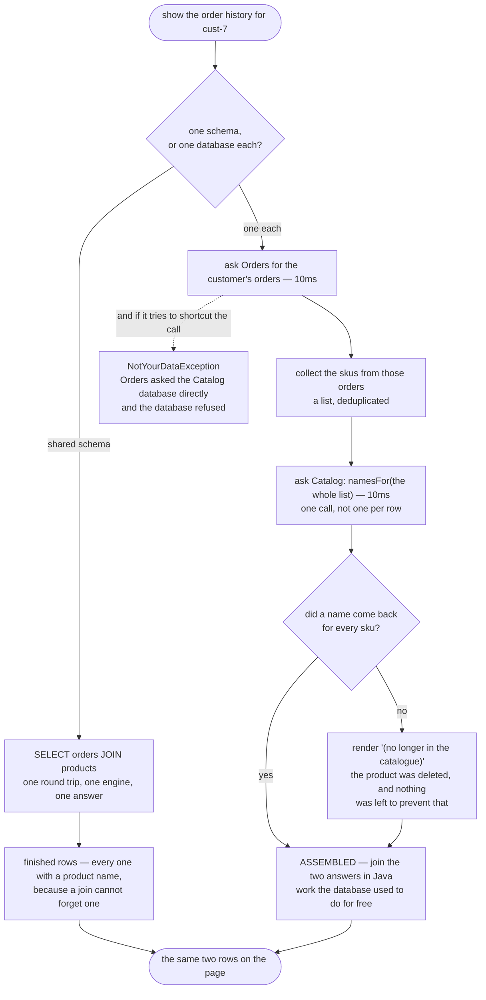

# Database per Service — Data Flow Diagram

One page — a customer's order history — followed from the request to the rendered rows,
both ways. The architecture diagram says who may read what; this one says **what work
moves from the database engine into your code when the join goes away**.

The left-hand path is one query. A shopper's id goes in and finished rows come out, joined
by something that has been optimised for decades and cannot forget a product name.

The right-hand path does the same job in four steps: ask Orders, collect the skus, ask
Catalog for those names in a single call, stitch. That stitching is `OrderHistoryPage`, and
it is ordinary Java that somebody now has to write, test and keep correct.

Follow the fork near the bottom of the right-hand path. It has no counterpart on the left,
and it is the price of the split made concrete: a sku may come back with **no name at all**,
because `Catalog` is free to delete a product that an order still refers to and there is no
foreign key left to stop it. The page must decide what to render, so it renders `(no longer
in the catalogue)`.

Mermaid source

## What the picture is telling you

**The right-hand path is longer, and it is also slower.** 20ms and two service calls
against 10ms and one query. No part of this pattern makes anything faster. It is worth
saying plainly, because the split is often sold as a performance move and it is not one.

**What moved is the work, not the requirement.** The page still needs a product name beside
every sku. Previously an engine guaranteed that; now `OrderHistoryPage` does, in code you
maintain, with a branch for the case the engine made impossible.

**The batch call is the difference between an assembly step and a disaster.** `namesFor`
takes a list because asking once per row turns a fifty-row page into fifty network calls.
Getting this wrong is the single most common way a freshly split system becomes slow.

**The missing-name branch is a rule downgraded, not a rule broken.** A foreign key made the
delete *impossible*. Now it is merely impolite, and what stands in its place is code, tests
and agreements between teams. The page surviving is the good news and the bad news at once.

**The refusal is a dead end, on purpose.** There is no fallback path from
`NotYourDataException` to the data. The point of the pattern is that the shortcut does not
exist, because a shortcut that exists will eventually be taken by somebody under deadline.

## What the split actually buys

Not speed and not correctness — the diagram shows it losing on both counts. What it buys is
on a different axis entirely, and act four of the demo is the whole argument: the Catalog
team renames a column, and the order history page is **unchanged**, because nothing outside
Catalog ever named that column.

On the shared schema the identical rename produced a correct migration, green catalog tests,
and a dead page belonging to a team the catalog team may never have met.
`SharedSchemaTest` pins that down and **every test in it passes**, including
`aRenameBreaksTheOrderHistoryPage` — the failure is not a bug in anybody's code, it lives in
the space between two teams, which is precisely the space no test suite owns.

That benefit is organisational: a team can change its mind without asking permission, and
deploy without coordinating a release. It is the only one on offer here. If the two teams
are the same three people, it is not worth the price.
