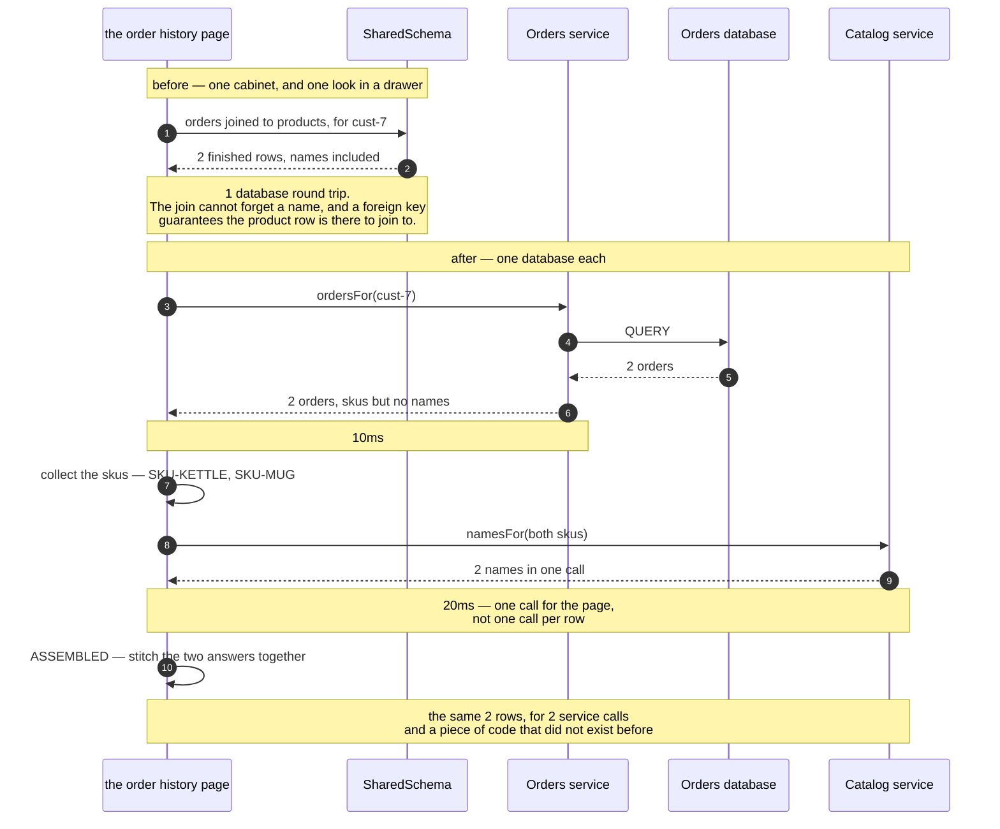

# Database per Service — Sequence Diagram

The one sequence worth having in your head before the others make sense: the same order
history page, built first with one query and then with two service calls and some Java.

[`uml-diagram.md`](uml-diagram.md) holds the full set of five acts, including the rename
that breaks a page and the rename that does not. This document puts the before and after in
a single picture, because the pattern is a trade and a trade only makes sense as a
comparison.

The clock runs in the notes, and the figures are the ones the demo prints: one round trip
in the shared version, 20ms and two calls in the split one. Note which way round that
inequality goes. The split version is the slower one, it will always be the slower one, and
any explanation of this pattern that skips past that is selling something.

Mermaid source

## Reading the timings

**Ten milliseconds became twenty, and one call became two.** That is the honest headline.
The database engine was not the bottleneck and splitting it did not make anything faster —
act three is slower than act one, and the demo prints both so the comparison is not a
matter of opinion.

**The stitching step is a message the page sends to itself.** Those two self-arrows are
work that used to happen inside the database and now happens in your code: collect the
skus, match names back to rows, decide what to do about anything missing.
`OrderHistoryPage` is small, and it is still a thing somebody has to own.

**`namesFor` is called once with both skus.** Watch for that shape whenever you see this
pattern applied. The per-row version of this diagram has a loop in it, and a fifty-row page
then costs fifty network calls — which is how a freshly split system acquires a reputation
for being slow.

**Orders returns skus and no names, and it is not being unhelpful.** It genuinely does not
know them, and has no way to find out other than by asking. That ignorance is what the
pattern purchased.

## What changes in the acts either side

**Act two — the rename, on the shared schema.** The catalog team runs a correct migration
against a table they own, their tests pass, and the order history page dies with `no column
'product_name' in products`. No arrow in that sequence is wrong. The failure lives in the
gap between two teams.

**Act four — the same rename, split.** The sequence above is completely unaffected.
`Catalog` renames whatever it likes inside its own database, `namesFor` still returns names,
and the page is unchanged. That is what the extra 10ms and the extra code were bought with.

**Act five — the bill.** Two sequences, both short. In the first, Orders tries to read a
product name from the Catalog database directly and is refused — there is no fallback arrow,
because the shortcut is supposed to be impossible. In the second, Catalog deletes a product
that `ord-101` still refers to, nothing stops it, and the page renders `(no longer in the
catalogue)`. A rule that used to be impossible to break is now merely impolite to break, and
what replaces it is code, tests and agreements between teams.
