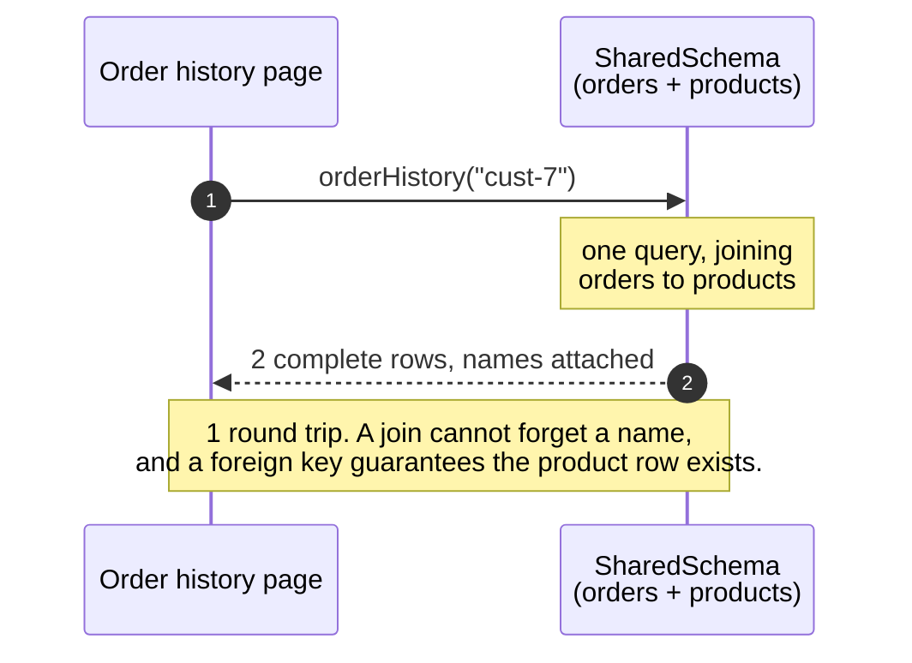
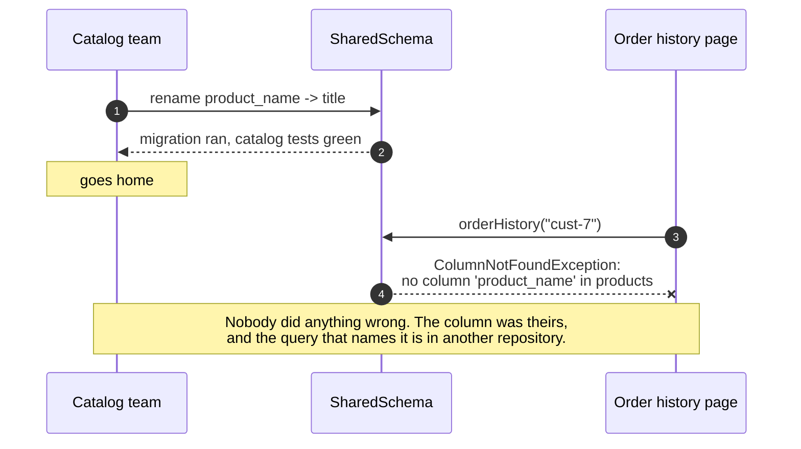
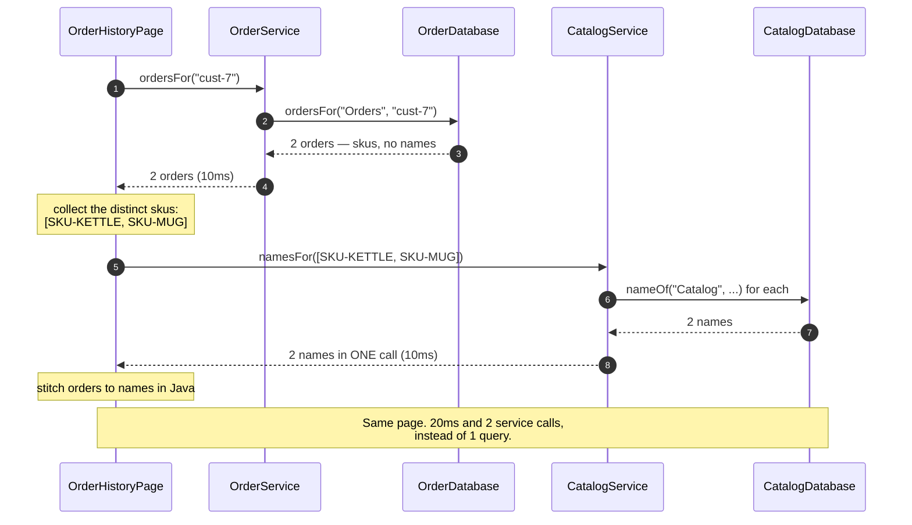
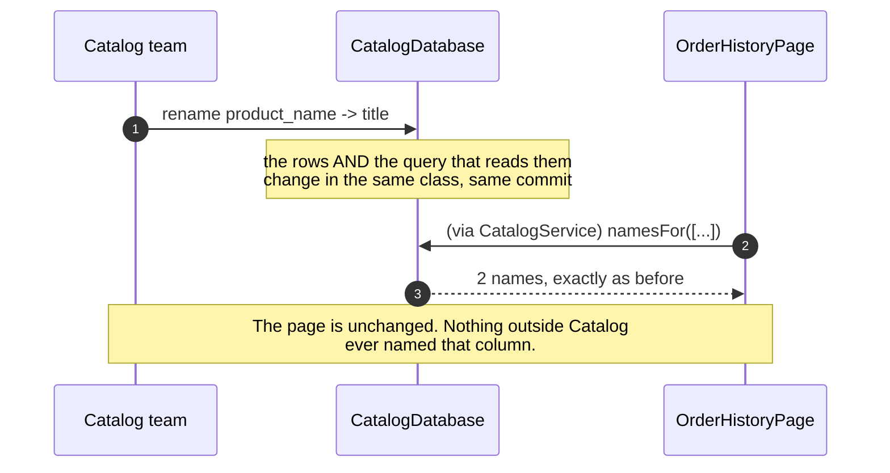
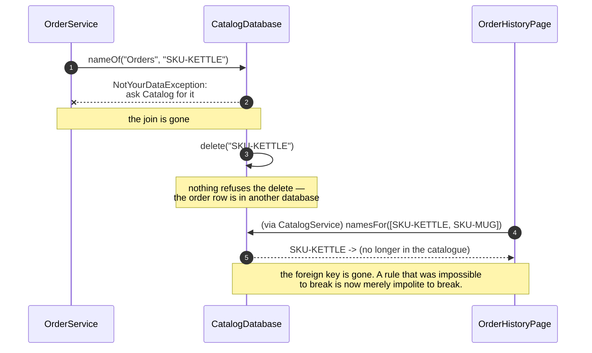

# Database per Service — Sequence Diagrams

Five acts, as sequences. The interesting differences between them are in the words on the
arrows rather than in the shapes, so read the notes rather than the outlines.

## Act One — One Database, One Query

Mermaid source

## Act Two — The Catalog Team Renames A Column

Mermaid source

## Act Three — Two Databases, Two Calls, One Assembly

Mermaid source

## Act Four — The Same Rename, Against A Database Catalog Owns

Mermaid source

## Act Five — The Bill

Mermaid source

## Notes On Reading These

**The two round-trip counts are the argument.** Act one is one query. Act three is two
service calls plus an assembly step, for exactly the same page —
`itProducesTheSamePage` asserts that the two pages are identical, which is what makes
the comparison fair. Everything else in this project is about whether that extra cost
is worth paying.

**The batch call in act three is deliberate.** `namesFor` takes a list, and Catalog is
called once regardless of how many rows the page has. If it were `nameOf` in a loop,
act three would have one arrow per row and a fifty-row page would be fifty network
calls. `itAsksCatalogOnce` holds the line.

**The requester name on every database arrow is the pattern.** `ordersFor("Orders",
…)` succeeds and `nameOf("Orders", …)` throws, and that difference is all there is to
it. In production the check is not in Java at all — it is database credentials that
cannot see the other service's tables.

**Nothing here sleeps.** `SimulatedClock` advances by ten milliseconds per service
call, so the timings in act three are exact and free, and the whole suite runs in about
a second.

**Act five is two separate losses, and they are usually taught as one.** The first is
the join: cross-service questions now cost two calls and some Java. The second is the
foreign key: an order can outlive the product it names, and something in application
code has to decide what to show. The second is the expensive one, and it is why Saga,
Transactional Outbox and Idempotent Consumer are separate projects.
