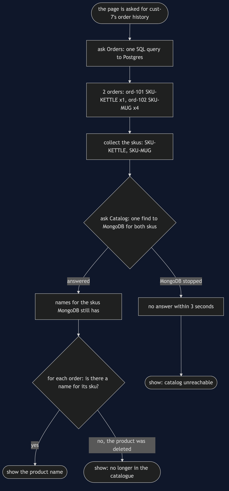
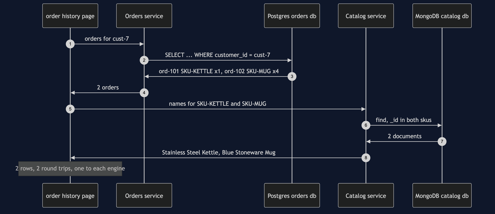
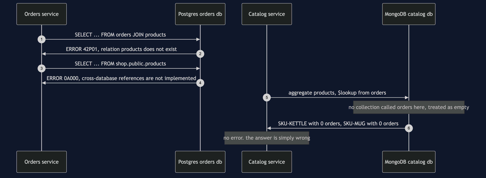
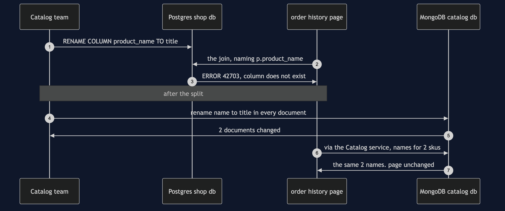
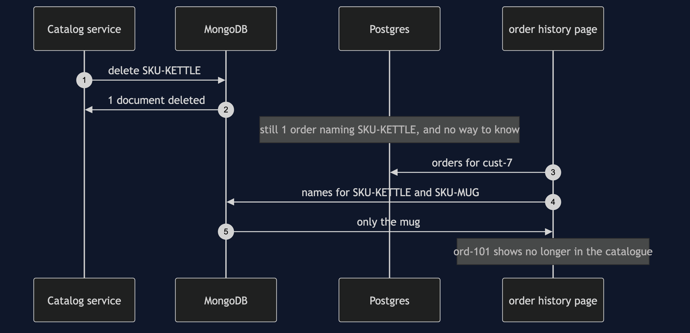
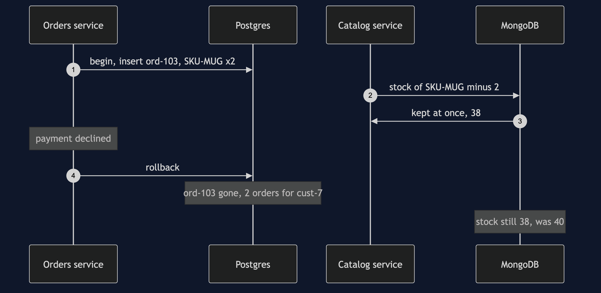

# Database per Service with Containers Pattern

```
src/main/java/com/jk/explore/databaseperservicecontainers/
├── DatabasePerServiceWithContainersDemo.java   the six acts
├── Engines.java            starts and stops one Postgres and one MongoDB container; the no-runtime advice
├── Postgres.java           a real PostgreSQL server; hands out a connection to one database at a time
├── Mongo.java              a real MongoDB server; hands out a client
├── SharedDatabase.java     before the split: both teams' tables in one Postgres database, one join, one foreign key
├── OrderService.java       the Orders service: a connection to its own Postgres database, and to nothing else
├── CatalogService.java     the Catalog service: a client for its own MongoDB database, and for nothing else
├── OrderHistoryPage.java   the join, now written in Java: ask Orders, ask Catalog, put the answers together
├── Order.java, OrderHistoryRow.java
├── RoundTrips.java         counts the questions sent to a database, so the count is the same on every machine
└── SqlError.java           Postgres's refusal in one line: its error code and its message
```

**Give each service its own database, and the join between them does not become bad manners. It becomes impossible. Postgres says so out loud. MongoDB says nothing at all: it runs the join and hands back empty lists.**

**This project needs a container runtime.** Docker Desktop, or anything Docker-compatible, must be running before you start. The demo brings up a PostgreSQL server and a MongoDB server, each in its own container, and takes both away again at the end; nothing is installed and nothing is left behind. With no runtime, the demo prints two sentences saying what to do, and stops, rather than a stack trace.

This project is the real-infrastructure version of the plain-Java Database per Service project in this course. That project kept its tables in Java maps and enforced the rule with an exception class — a stand-in for "the database refused". This one uses two real databases on two genuinely different engines. The Orders service keeps its orders in PostgreSQL, a relational database with tables and SQL. The Catalog service keeps its products in MongoDB, a document database with no tables at all. Same shop, same customer, same two orders.

## Run

```bash
./gradlew run
```

Six acts, against a real Postgres and a real MongoDB. Every number and every error message quoted below, and in every document and slide in this project, comes from this program's own output. Two runs back to back print exactly the same thing.

```
ONE. One shared database: Postgres, holding both teams' tables.
  database shop: products belongs to Catalog, orders belongs to Orders, and a foreign key ties them together.
  the order history page for cust-7 is one SQL join:
    ord-101   SKU-KETTLE   Stainless Steel Kettle       x1
    ord-102   SKU-MUG      Blue Stoneware Mug           x4
  round trips to a database: 1
  Catalog tries to delete SKU-KETTLE, which ord-101 still names. Postgres refuses:
    ERROR 23503: update or delete on table "products" violates foreign key constraint "orders_sku_fkey" on table "orders"
TWO. The Catalog team renames product_name to title.
  ALTER TABLE products RENAME COLUMN product_name TO title: done. Catalog's own queries updated, its tests green.
  the order history page, which belongs to Orders:
    ERROR 42703: column p.product_name does not exist
  nobody did anything wrong. the column was Catalog's; the query naming it was Orders'.
THREE. Two services, two engines.
  Orders owns the orders database on Postgres 18.6: 1 table.
  Catalog owns the catalog database on MongoDB 8.3.11: 1 collection of documents.
  two products, two shapes, and no table to change first:
    SKU-KETTLE: _id, name, priceInPence, stock, wattage
    SKU-MUG: _id, name, priceInPence, stock, capacityMl
  the order history page: one SQL query to Orders, one find to Catalog for both skus, put together in Java:
    ord-101   SKU-KETTLE   Stainless Steel Kettle       x1
    ord-102   SKU-MUG      Blue Stoneware Mug           x4
  round trips to a database: 2
  Catalog renames name to title in every document: MongoDB changed 2 documents. Catalog's own code reads title from now on.
    ord-101   SKU-KETTLE   Stainless Steel Kettle       x1
    ord-102   SKU-MUG      Blue Stoneware Mug           x4
  the page is unchanged. nothing outside Catalog ever named that field.
FOUR. The join, tried anyway.
  from Orders, the old SQL join:
    ERROR 42P01: relation "products" does not exist
  from Orders, reaching across to the shop database on the same Postgres server:
    ERROR 0A000: cross-database references are not implemented: "shop.public.products"
  from Catalog, MongoDB's own join, $lookup, into a collection called orders:
    no error. 2 products came back: SKU-KETTLE with 0 orders, SKU-MUG with 0 orders.
    MongoDB has no collection called orders, so it treated it as empty and said nothing.
  no engine holds both halves. the join is not forbidden; it cannot be written.
FIVE. No foreign key between two engines.
  Catalog deletes SKU-KETTLE: MongoDB deleted 1 document. nothing refused.
  Postgres still holds 1 order naming SKU-KETTLE.
    ord-101   SKU-KETTLE   (no longer in the catalogue) x1
    ord-102   SKU-MUG      Blue Stoneware Mug           x4
  in act ONE Postgres refused this delete. across two engines nothing can.
SIX. The bill.
  cust-7 checks out 2 more mugs. Orders writes ord-103 inside a Postgres transaction; Catalog takes 2 mugs from stock in MongoDB.
  the payment is declined, so Orders rolls back.
  Postgres: ord-103 is gone. orders for cust-7: 2.
  MongoDB: SKU-MUG stock 38, was 40. the rollback reached one engine, not both.
  MongoDB is stopped. the order history page for cust-7:
    ord-101   SKU-KETTLE   (catalog unreachable)        x1
    ord-102   SKU-MUG      (catalog unreachable)        x4
  Orders still answered; Catalog did not. the page is half there.
  this demo runs 2 containers, 2 drivers and 2 query languages, where the shared database had 1 of each.
```

The first run downloads the two images, about 300 MB for Postgres and 830 MB for MongoDB once unpacked, and takes a minute or two. After that a run takes about twelve seconds, most of it the two databases starting.

No time is printed anywhere. A query against a real database takes a different number of milliseconds on every run and every machine, so the demo counts round trips instead: how many questions were sent to a database over the network. That count is the same everywhere, and the tests assert it exactly. The error codes and messages are Postgres's own, word for word.

## Test

```bash
./gradlew test
```

3 test classes, 15 test methods. `PlainPartsTest` needs nothing installed: how a row prints, how round trips are counted, how an error is described, the no-runtime advice and the pinned image names. `RealEnginesTest` starts one Postgres and one MongoDB for the whole class and asks them directly: the shared database answers the page in one join and refuses the delete with code 23503; the rename breaks the other team's query with 42703; the split page takes 2 round trips and survives the rename; two product documents can have different fields; Postgres refuses the join with 42P01 and 0A000; MongoDB's lookup into a collection that does not exist finds 0 orders for each product and raises nothing; the delete that Postgres once refused now goes through; and a rollback in Postgres leaves MongoDB's stock at 38. `DemoRunsTest` runs the demo and asserts every figure and message the documents quote.

There is no `Thread.sleep` anywhere under `src/test`, and nothing waits a fixed time. Testcontainers waits for each database to say it is ready. When MongoDB is stopped in the last act, the MongoDB client gives up after three seconds and reports an error, and that error is the answer the page shows. The tests that need the databases are skipped when no container runtime is there; the rest still run.

## What the simulation got right, and what it left out

This is the reason this project exists, so it comes before anything else.

**What the plain-Java Database per Service project got right.** The whole shape of the argument. One shared schema answers the order history page in one join, and a foreign key stops a product being deleted while an order still names it. A correct rename by the Catalog team kills a page that belongs to the Orders team. The split does the same page in two calls and some Java, and the same rename becomes a non-event. And the bill is two things: no more join, no more foreign key. Every one of those happens here too, against real databases, and the first two acts are the twin's first two acts almost line for line — except that the errors are now Postgres's own, with their real error codes.

**What it left out, first: two genuinely different engines.** In the twin both "databases" were Java maps, so the split was a line drawn through one kind of thing. Here the Orders service keeps Postgres, with fixed columns and SQL. The Catalog service moves to MongoDB, which keeps each product as a document — a record of named fields, like a filled-in form — and lets two documents have different fields. The kettle has a wattage and the mug has a capacity, and nobody changed a table to allow it. That is the usual reason a team wants its own database: not just its own copy, but a different kind of store that suits its data.

**Second, and the headline find: the join is impossible, and one engine does not tell you.** In the twin, reading the other service's data threw `NotYourDataException`, a class written for the purpose. The fourth act here tries the old join for real, from both sides. From the Orders side Postgres refuses outright: there is no table called products in its database, error 42P01. It refuses even a reach into another database on the very same Postgres server, error 0A000, "cross-database references are not implemented". From the Catalog side, MongoDB's own join — a step called `$lookup` that attaches matching documents from another collection — is pointed at a collection called orders. MongoDB has none. It does not complain. It treats the missing collection as empty and returns both products with 0 orders each. A join across two engines does not just fail. On one of them it quietly answers "nothing", and a page built on that answer would be wrong without a single error in any log.

**Third: a transaction stops at the edge of its engine.** The twin had no transactions at all. Here the sixth act writes an order inside a Postgres transaction, takes 2 mugs off the shelf in MongoDB, and then the payment is declined and Orders rolls back. Postgres forgets the order. MongoDB keeps the change: 38 mugs, not 40. In the shared database the stock and the order would have been one transaction, undone together. Across two engines there is no such thing.

**Fourth: one database can be down while the other is up.** The twin's maps were always there. Here MongoDB is stopped, and the order history page still gets the customer's 2 orders from Postgres, but no names. The page is half there, and it had to be written to know what half a page looks like.

**What the simulation had that the real version does not need.** The twin needed an exception class to make the rule visible. Here nothing in the code says "you may not"; the Orders service simply has no MongoDB client, no address and no password, and the Catalog service has no Postgres connection. The rule is the wiring.

## Technologies and versions

| What | Version | Why it is here |
| --- | --- | --- |
| Java | 21 | The repository standard, via the Gradle toolchain block |
| Gradle | 9.2.1 | The wrapper in this directory; no separate install needed |
| PostgreSQL | 18.6 | The Orders service's database, and the shared database before the split, as the official `postgres:18.6-alpine` image; the newest release |
| MongoDB | 8.3.11 | The Catalog service's database, as the official `mongo:8.3.11-noble` image; the newest release |
| PostgreSQL JDBC driver | 42.7.13 | `org.postgresql:postgresql`, the newest release; how Java talks to Postgres |
| MongoDB Java driver | 5.12.0 | `org.mongodb:mongodb-driver-sync`, the newest release; how Java talks to MongoDB |
| Testcontainers | 2.0.5 | `org.testcontainers:testcontainers-postgresql` and `testcontainers-mongodb`; start and stop both databases from inside the demo, each on a random free port |
| slf4j-simple | 2.0.17 | Logging for the libraries above, turned off so the demo's own output is the only output |
| JUnit 5 | 5.10.2 | Test runner |
| A container runtime | Docker 24 or later, or compatible | Runs both databases. Must be running before you start |

Nothing is held back: every version is the newest generally available release. MongoDB publishes no Alpine image, so the Ubuntu 24.04 image, tagged `noble`, is used; it is MongoDB's smallest official Linux image and still the largest thing this project downloads. Testcontainers' MongoDB container starts a single plain server, not a replica set, because nothing here needs MongoDB's own multi-document transactions — and the sixth act's point is that even they could not reach Postgres. See [`docs/dependencies.md`](docs/dependencies.md) and [`docs/prerequisites.md`](docs/prerequisites.md).

## Learning Material

| Document | What it covers |
| --- | --- |
| [`docs/problem-statement.md`](docs/problem-statement.md) | The twin's version, and what is new |
| [`docs/database-per-service-with-containers-pattern-explained.md`](docs/database-per-service-with-containers-pattern-explained.md) | Postgres's and MongoDB's words in plain language, and six acts |
| [`docs/class-diagram.md`](docs/class-diagram.md) | The types, and the connections that are missing on purpose |
| [`docs/architecture-diagram.md`](docs/architecture-diagram.md) | Two services, two containers, and the line nobody can draw |
| [`docs/data-flow-diagram.md`](docs/data-flow-diagram.md) | One order history page, from two engines, and the two ways a name can be missing |
| [`docs/sequence-diagram.md`](docs/sequence-diagram.md) | Written for a listener with the screen off |
| [`docs/uml-diagram.md`](docs/uml-diagram.md) | Four sequences |
| [`docs/animation.html`](docs/animation.html) | The six acts in a browser |
| [`docs/prerequisites.md`](docs/prerequisites.md) | What you need installed, and what you need to know |
| [`docs/session.md`](docs/session.md) | A one-hour taught session |
| [`docs/dependencies.md`](docs/dependencies.md) | What Postgres, MongoDB, their drivers and Testcontainers are, what they cost, and that skipping this project loses none of the pattern |
| [`docs/spec.md`](docs/spec.md) | The generated specification |
| [`docs/youtube.md`](docs/youtube.md) | Title, description and chapters |

### The pattern in one picture


### Where each piece sits


### How one page is put together



### Who calls whom, in order



### All four sequences









### Video

Built from [`video/scenes.py`](video/scenes.py) by
[`video/build_video.sh`](video/build_video.sh). The rendered file is not
committed; see the repository README for why.

## Where you have already met this

Almost every shop that has split into services. The order service on Postgres or MySQL, because orders are rows with fixed fields and money in them; the catalogue on MongoDB, Elasticsearch or DynamoDB, because products differ in shape and are read far more than written; sessions in Redis. Each team picks the store that suits its data, and nobody can join across them. That is the arrangement usually called polyglot persistence — many kinds of storage — and it only becomes possible once each service owns its own.

## When this is too much

If the same small team owns both halves, one database with both tables in it is faster, simpler and safer: the join works, the foreign key holds and one transaction covers the order and the stock. Two teams that deploy on different days and keep breaking each other earn the split. Even then, two databases on the same engine is often enough; a second engine earns its place only when the data genuinely has a different shape, because every engine added is another thing to back up, upgrade, watch and learn.

## Where this sits

This project pairs with the plain-Java Database per Service project in this course, and is one of the real-infrastructure versions in the microservices category.
