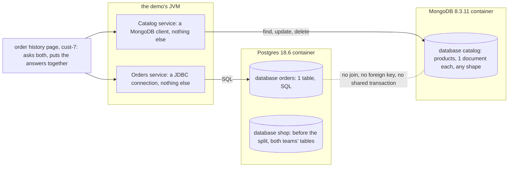

# Database per Service with Containers Pattern — Architecture Diagram

Two services, two containers, two engines. Each service has a connection to its own database and to nothing else. The only way from one side to the other is through the order history page, in Java, one question to each service.

Mermaid source

