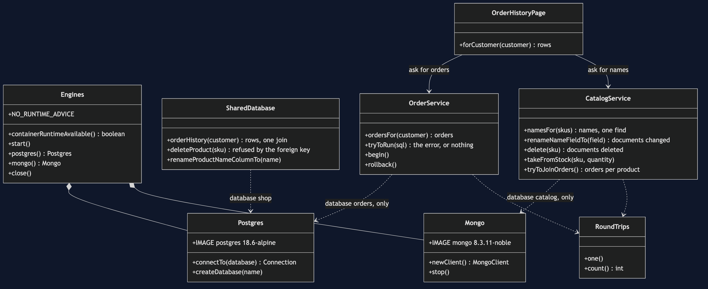
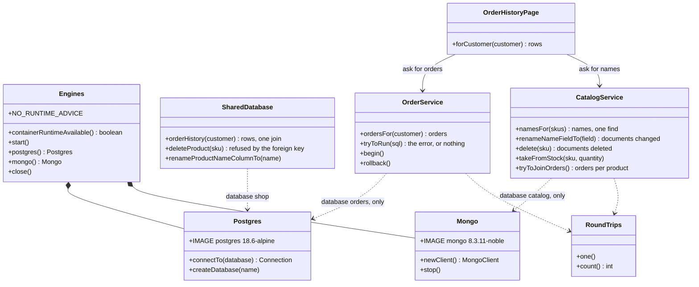

# Database per Service with Containers Pattern — Class Diagram

The pattern is two constructors. `OrderService` is given Postgres and nothing else; `CatalogService` is given MongoDB and nothing else. `OrderHistoryPage` is the join, rewritten in Java. `SharedDatabase` is the arrangement before the split, kept for the first two acts. Look for the arrows that are not there: no service reaches the other's engine.

Mermaid source

