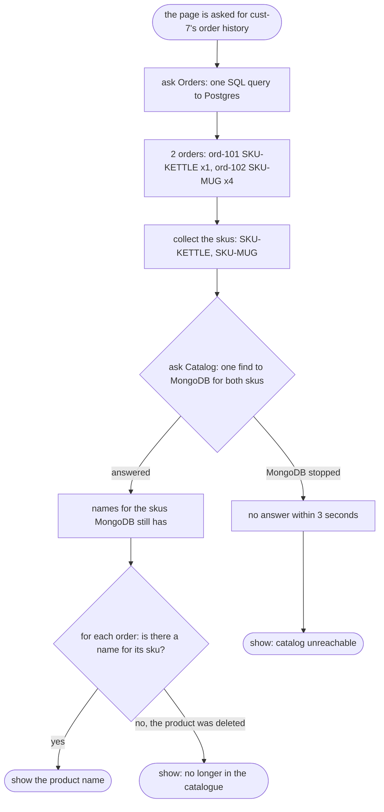

# Database per Service with Containers Pattern — Data Flow Diagram

One order history page, from two engines. Two questions, one assembly step, and two different reasons a product name can be missing — each of which the page must turn into something to show.

Mermaid source

