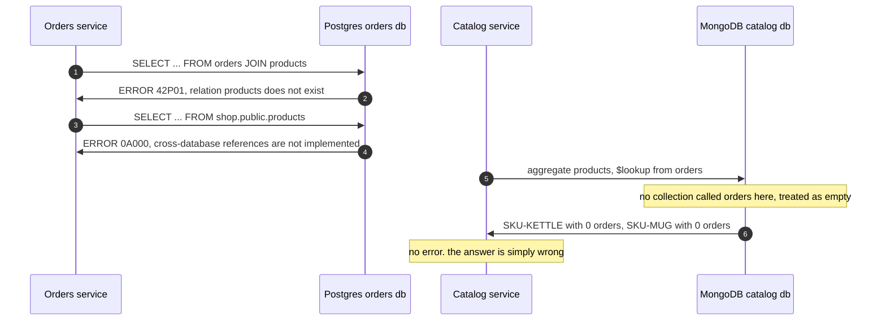
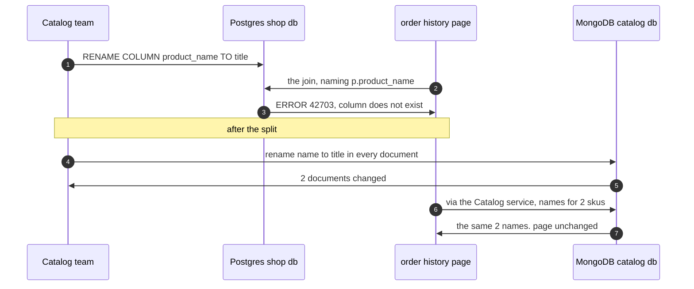
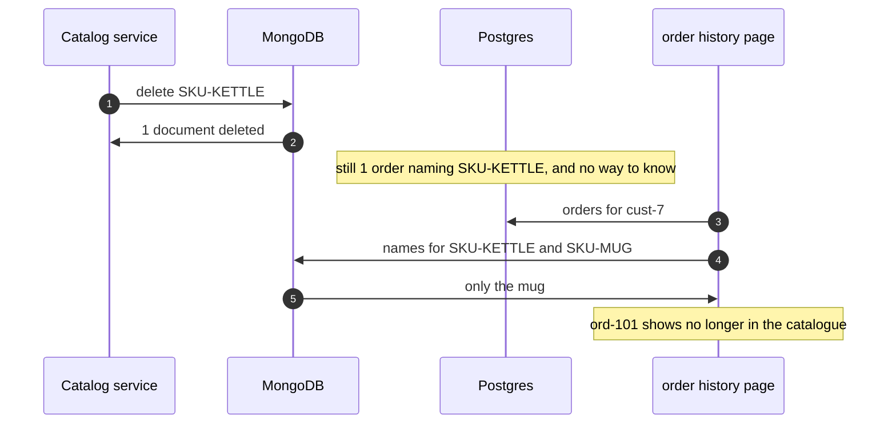
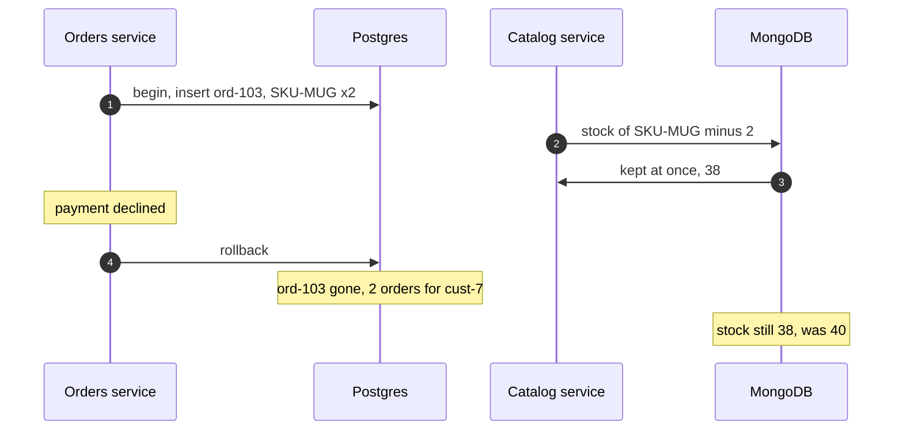

# Database per Service with Containers Pattern — UML Sequence Diagrams

Four sequences. The join tried from both sides comes first, because it is the one thing the hand-built twin could only describe.

## 1. The Join, Tried Anyway

From the Orders side, Postgres refuses the old join, and refuses even a reach into another database on the same server. From the Catalog side, MongoDB runs its own join into a collection it does not have, and answers with empty lists and no error.

Mermaid source

## 2. The Rename, Before And After

In the shared database the Catalog team's rename breaks the Orders team's query. After the split the same kind of rename touches only the Catalog's own documents and code.

Mermaid source

## 3. No Foreign Key Between Two Engines

Postgres refused this delete when both tables were in one database. Across two engines nothing can.

Mermaid source

## 4. A Rollback Stops At The Edge Of Its Engine

The order and the stock change are two writes to two engines. Undoing one does not undo the other.

Mermaid source

