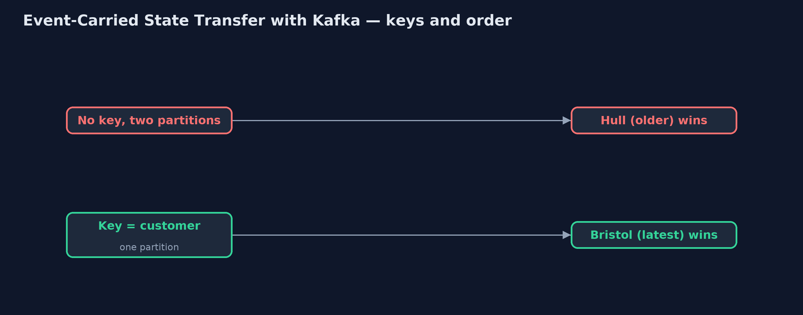

# Event-Carried State Transfer with Kafka Pattern

```
src/main/java/com/jk/explore/ecstkafka/
├── CustomerService.java        The owner of customer addresses
├── Kafka.java                  A real Kafka broker, running in a container that this demo starts and stops itself, with the few operations the demo needs: create a topic, send keyed events, and read a topic from the start
├── KafkaEventCarriedDemo.java  The five acts, against a real Kafka broker started and stopped by this program
└── ShippingCopy.java           The pattern: shipping's own copy of customer addresses, built only from the events on the topic
```

**Carry each customer's address in events on a real Kafka topic, keyed by customer and compacted, so shipping can build its own copy from the topic, keep each customer's updates in order, and learn of deletions through tombstones.**

This is the real-infrastructure version of the Event-Carried State Transfer
pattern. The plain Java version, a separate project in this category, passes
events by method calls and adds version numbers to keep them in order. Here a
real Kafka broker, started in a container by the demo itself, carries the
events.

Kafka changes three things. Events are kept on a topic, so a new copy can be
built by reading the topic from the beginning. Events with the same key go to
the same partition and stay in order, which replaces the version numbers. And
a compacted topic keeps the latest event for each key, with a tombstone, an
event with no value, meaning "this customer is gone".

## The idea in everyday terms

Think of a town's public noticeboard of address changes. Every move is pinned
up under the person's name, so a new postman can read the board once and know
every current address without asking anyone. Old notices for the same name
are taken down as new ones go up. And when someone leaves town, a notice says
so, and every postman must cross them off.

## The scenario

The online store's shipping service prints delivery labels, and the customer
service owns the addresses. Shipping used to call the customer service for
every label, so when that service was down, no labels could be printed at all.

## Run

This project needs a running container runtime, such as Docker Desktop: the
demo starts a real Kafka 4.3.1 broker in a container and removes it again.
Without one, it prints a sentence saying what to start, rather than failing.

```bash
./gradlew run
```

The demo tells the story in 5 acts, each printing exact numbers that the tests check:

| Act | What it shows |
| --- | --- |
| 1. Thin events and call-backs | Events say only "changed": 100 labels need 100 calls to the customer service, and with it down, 0 of 100 are printed. |
| 2. The address in the event | Address events on a compacted topic keyed by customer: shipping's copy holds 10 addresses and prints 100 of 100 labels with the owner down. |
| 3. A new copy from the topic | C1 moves to York; a fresh shipping instance reads 11 events for 10 customers and prints York; the old copy still says Leeds. |
| 4. Order within a partition | Two moves on different partitions, read partition 1 first, leave Hull; keyed by customer on one partition, they end on Bristol. |
| 5. Deleting is an event | C3 closes the account: a tombstone is sent, and a copy built from the topic holds 9 addresses and no label for C3. |

## Test

```bash
./gradlew test
```

2 tests in `DemoRunsTest`. Every number the demo prints is asserted against a real Kafka broker. Reads stop when they have caught up with the topic, never after a fixed time. Without a container runtime, the broker test is skipped rather than failed.

## What the simulation got right, and what it left out

The plain Java version got the idea right: put the address in the event, keep
a local copy, stop calling the owner, accept that the copy lags, and guard
against events arriving out of order. What it left out is what Kafka adds. The
topic is the history, so a brand-new copy is built by reading it from the
start. Keying events by customer keeps each customer's updates in order on
one partition, where the plain version needed version numbers; unkeyed
events on two partitions arrived in the wrong order. A compacted topic keeps
the latest address for each customer. And deleting is an event too: a
tombstone that every copy must honour.

## Technologies and versions

| Technology | Version | Used for |
| --- | --- | --- |
| Java | 21 | the code (toolchain set in `build.gradle`) |
| Gradle | 9.2.1 (wrapper) | build and run, nothing to install |
| JUnit | 5.10.2 | the tests |
| Apache Kafka | 4.3.1 (container image apache/kafka) | the topics, partitions, compaction and tombstones |
| Kafka Java client | 4.3.1 | producing keyed events and reading topics |
| Testcontainers | 2.0.5 | starts and stops the Kafka container from the demo |
| Docker | 24 or later | runs the container |
| SLF4J simple | 2.0.17 | library logging, switched off |
| videokit | repository tool | the narrated video and animation: Piper `en_US-amy-medium`, speed 0.8, longer pauses (the approved `amy-slow` voice) |

## Learning Material

| Document | What it is for |
| --- | --- |
| [Dependencies](docs/dependencies.md) | what the framework and infrastructure are, and why they are here |
| [Problem statement](docs/problem-statement.md) | the situation and what the project must show |
| [Prerequisites](docs/prerequisites.md) | what you need to know first |
| [Event-Carried State Transfer with Kafka, explained](docs/event-carried-state-transfer-with-kafka-pattern-explained.md) | the acts in prose |
| [Session guide](docs/session.md) | a one-hour lesson with exercises |
| [Animated walkthrough](docs/animation.html) | the acts step by step, narrated |
| [Spec](docs/spec.md) | what this project must be true of |

### The pattern in one picture

The topic is the history; shipping keeps its own copy.


### Where each piece sits

The copy is built only from events.


### How the data moves

Same key, same partition, same order.



### Who calls whom, in order

Shipping never calls back.


### Video

`video/event-carried-state-transfer-with-kafka-pattern-explained.mp4` (with `.m4a` audio and `.srt` subtitles) is built by `video/build_video.sh`. Rendered media is not committed.

## What it costs

- **Order only within a partition.** Events for one customer must share a key, or they can arrive out of order.
- **Deleting is work.** A tombstone must be read and honoured by every copy, or personal data lives on.
- **More to run and store.** A Kafka cluster, a topic of every address, and a copy in each service.

## When this is too much

If only one or two services need the data, and rarely, calling the owner is
simpler. A Kafka topic of state pays off when many services read the data
often and must keep working when its owner is down.

## Where you have already met this

- Compacted Kafka topics used as the source of a service's local table.
- Kafka Streams `KTable`s, which are exactly this local copy.
- Change data capture with Debezium, publishing every row change.

## Where this sits

This project is in [micro-services-design-patterns](..). It is the
real-infrastructure version of the plain Java Event-Carried State Transfer
project in the same category, which is left unchanged.
