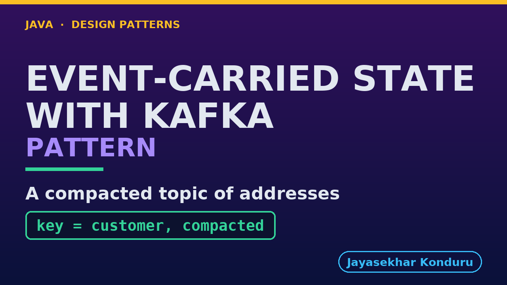

# YouTube — Event Carried State Transfer With Kafka Pattern

Everything needed to publish `video/event-carried-state-transfer-with-kafka-pattern-explained.mp4`. Copy the fields straight out of this file.

Chapter timings are generated from the video's `.srt`. Re-run `python3 docs/make_youtube_docs.py event-carried-state-transfer-with-kafka` after any change to the narration, or they will be wrong.

## Title

```
Event-Carried State Transfer with Kafka
```

39 characters — under the 60 YouTube shows before truncating in search results.

## Description

The first two lines are what a viewer sees above the fold, so they carry the hook rather than the boilerplate.

```
Event-Carried State Transfer pattern in Java with a real Kafka broker, using an online store where a customer service owns addresses and a shipping service prints labels. The new data travels in the event, so each service keeps its own copy, and Kafka keeps events on topics so a copy can be rebuilt at any time, like a town noticeboard a new postman reads once. We replace thin events and call-backs, build a brand-new copy from the topic, keep order within a partition by keying on the customer, and treat deleting as an event. We finish with the bill.

CHAPTERS
00:00 Introduction
01:10 The Scenario
01:28 Act One — Thin events and call-backs
01:55 Act Two — The address in the event
02:21 Act Three — A new copy from the topic
02:52 Act Four — Order within a partition
03:22 Act Five — Deleting is an event
03:55 The Pattern, in Kafka
04:17 Who Does What
04:37 Where You Have Seen It
04:57 When To Use It
05:16 Thanks for Watching

SOURCE CODE, WRITTEN NOTES AND AN INTERACTIVE ANIMATION
https://github.com/jk-boot-up/java-design-patterns/tree/main/gradle-java/micro-services-design-patterns/event-carried-state-transfer-with-kafka-pattern

WHAT YOU NEED FIRST
Java 21 and a working knowledge of classes and interfaces. No prior design-pattern knowledge is assumed. The full prerequisites are in docs/prerequisites.md in the repository.
```

## Chapters

YouTube renders these as chapters only if there are at least three and the first is at `00:00`.

```
00:00 Introduction
01:10 The Scenario
01:28 Act One — Thin events and call-backs
01:55 Act Two — The address in the event
02:21 Act Three — A new copy from the topic
02:52 Act Four — Order within a partition
03:22 Act Five — Deleting is an event
03:55 The Pattern, in Kafka
04:17 Who Does What
04:37 Where You Have Seen It
04:57 When To Use It
05:16 Thanks for Watching
```

## Tags

```
event-carried state transfer, kafka, compacted topic, tombstone, partition key, java, design patterns, java design patterns, gang of four, java 21, software design, clean code, object oriented design, java tutorial, ecommerce, programming tutorial
```

247 characters, under YouTube's 500 limit.

## Thumbnail



**Upload `docs/thumbnail.png`** — 1280×720, the size YouTube recommends, generated by `docs/make_thumbnails.py`. It is deliberately not the same image as the video's opening frame: a thumbnail is judged at about 360 pixels wide in a search result, so this one carries only the pattern name, one line of promise and one short piece of code, each set large enough to survive the shrink.

`video/poster.png` is the 1920×1080 opening frame, produced by the video build. It stays in the repository as the title card; it is not what gets uploaded.

YouTube will not pick the thumbnail up on its own — upload it under **Details → Thumbnail → Upload file**. A custom thumbnail requires a verified channel.

## Upload checklist

- [ ] Upload `video/event-carried-state-transfer-with-kafka-pattern-explained.mp4` (1080p, H.264, 30 fps, AAC 48 kHz — already YouTube's recommended settings, no re-encode needed)
- [ ] Set the video language to **English** first, or the subtitle option may not appear
- [ ] Add subtitles: *Video elements → Add subtitles → Upload file → With timing* → `video/event-carried-state-transfer-with-kafka-pattern-explained.srt`
- [ ] Upload `docs/thumbnail.png` as the thumbnail — do not let YouTube auto-pick a frame
- [ ] Paste the title, description and tags from above
- [ ] Add to the **Java Design Patterns** playlist, in learning order
- [ ] Wait for 1080p processing before sharing the link — code slides are unreadable at 360p

## Cards and end screen

End screen links to whichever pattern video goes up next — set it at upload time rather than assuming an order.

Add a card partway through pointing at the playlist, so a viewer who arrives at this pattern from search can find the rest of the series.

## Runtime

Approximately 06:05, narrated at 145 words per minute.
