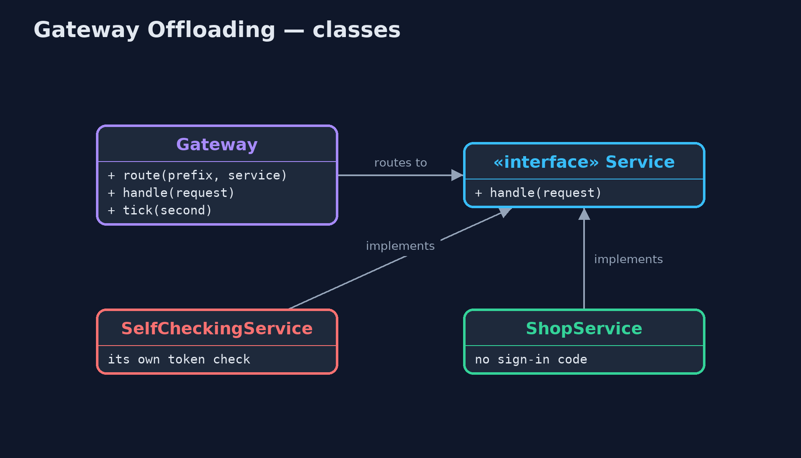
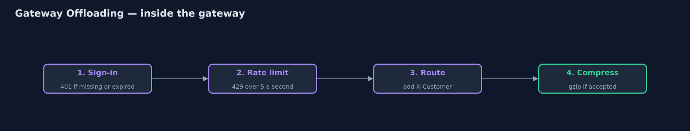
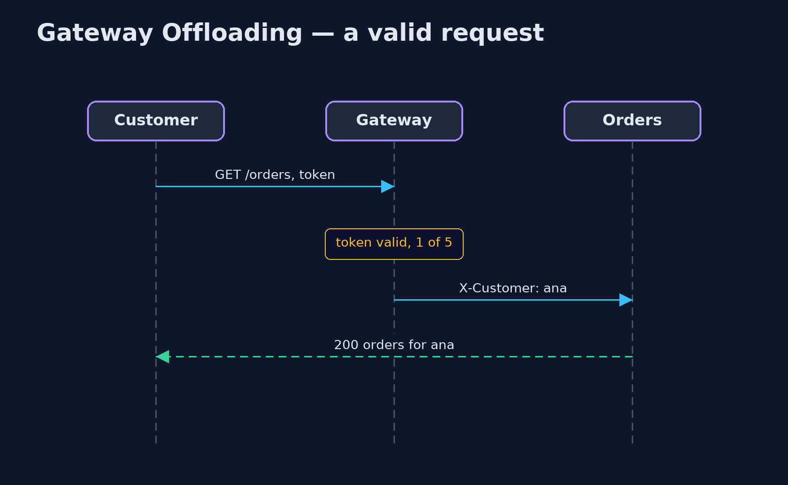

# Gateway Offloading Pattern

```
src/main/java/com/jk/explore/gatewayoffloading/
├── Gateway.java                The pattern: one gateway in front of every service does the shared chores once, sign-in checks, rate limiting and compression, so the services do not have to
├── GatewayOffloadingDemo.java  The five acts: every service checks for itself, one check at the gateway, rate limiting, compression, and the bill
├── Request.java                An HTTP-like request: a path and its headers
├── Response.java               An HTTP-like response: a status code, a body, and whether the body is gzip-compressed
├── SelfCheckingService.java    Before: each service checks the sign-in token itself, and each team wrote its own copy of the check
├── Service.java                A back-end service of the online store
├── ShopService.java            After: the service only does its own job
└── Tokens.java                 Sign-in tokens of the form {@code tok:<customer>:<expires-at-second>}
```

**Move the chores every service needs, such as sign-in checks, rate limiting and compression, out of the services and into the gateway in front of them, so they are done once and the same way.**

Gateway Offloading is a cloud design pattern. Many services need the same
chores done on every request: check who the caller is, stop callers who send
too much, compress the response, log it. When each service does these itself,
each team writes its own copy, and the copies drift apart.

The pattern moves those shared chores into the gateway that already sits in
front of the services. The gateway does them once, the same way for everyone,
and passes on only requests that passed. The services are left to do their
own business.

## The idea in everyday terms

Think of an office building with a reception desk. Visitors show their ID and
sign in once, at the front door. The teams upstairs do not each check
passports at their own door; they trust that anyone in the corridor has
already been checked. That only works if there is no side door.

## The scenario

The online store has three services: catalog, cart and orders. Each one
checked the customer's sign-in token itself, with its own copy of the code.
The orders team's copy forgot to check whether the token had expired, so a
customer whose sign-in expired an hour ago could still see and place orders.

## Run

```bash
./gradlew run
```

The demo tells the story in 5 acts, each printing exact numbers that the tests check:

| Act | What it shows |
| --- | --- |
| 1. Every service checks for itself | An expired token: catalog and cart refuse it with 401, but orders answers 200, because its copy of the check forgot expiry. |
| 2. One check, at the gateway | The gateway checks the token once: an expired token gets 401 from every service; a valid one reaches orders, which holds no sign-in code. |
| 3. Rate limiting | 5 requests a second per customer: of 8 requests, 5 pass and 3 are refused with 429; the orders service sees only 5. |
| 4. Compression | A 10,094-byte catalog page is gzipped at the gateway to under a fifth of its size, with no compression code in the catalog service. |
| 5. The bill | A call straight to the orders service, claiming to be ben, is answered 200: services must only be reachable through the gateway. |

## Test

```bash
./gradlew test
```

5 tests in `DemoRunsTest`, `GatewayTest`. Every number the demo prints is asserted, and nothing depends on the clock, so every run gives the same result.

## Technologies and versions

| Technology | Version | Used for |
| --- | --- | --- |
| Java | 21 | the code (toolchain set in `build.gradle`) |
| Gradle | 9.2.1 (wrapper) | build and run, nothing to install |
| JUnit | 5.10.2 | the tests |
| videokit | repository tool | the narrated video and animation: Piper `en_US-amy-medium`, speed 0.8, longer pauses (the approved `amy-slow` voice) |

## Learning Material

| Document | What it is for |
| --- | --- |
| [Problem statement](docs/problem-statement.md) | the situation and what the project must show |
| [Prerequisites](docs/prerequisites.md) | what you need to know first |
| [Gateway Offloading, explained](docs/gateway-offloading-pattern-explained.md) | the acts in prose |
| [Session guide](docs/session.md) | a one-hour lesson with exercises |
| [Animated walkthrough](docs/animation.html) | the acts step by step, narrated |
| [Spec](docs/spec.md) | what this project must be true of |

### The pattern in one picture

Shared chores at the door; business in the services.


### Where each piece sits

The services lose their sign-in code.



### How the data moves

Four steps, in order.



### Who calls whom, in order

The orders service only does orders.



### Video

`video/gateway-offloading-pattern-explained.mp4` (with `.m4a` audio and `.srt` subtitles) is built by `video/build_video.sh`. Rendered media is not committed.

## What it costs

- **No side doors.** The services now trust the gateway; a call straight to the orders service, claiming to be another customer, was accepted.
- **One place for everything.** A gateway fault, a slow gateway or a bad setting hits every page at once.
- **Scope creep.** Only shared, generic chores belong in the gateway; business rules must stay in the services.

## When this is too much

With one or two services, a shared library does the job without an extra hop.
Offloading pays off when many services, often written by different teams or
in different languages, need exactly the same chores.

## Where you have already met this

- API gateways: Kong, NGINX, Envoy, AWS API Gateway, Spring Cloud Gateway.
- TLS termination at a load balancer.
- Rate-limiting and JWT-validation plugins on a gateway.

## Where this sits

This project is in [micro-services-design-patterns](..). The
[API Gateway](../api-gateway-pattern) project shows the gateway as a single
entry point that routes and combines calls; this one is about what the gateway
takes off the services' hands.
