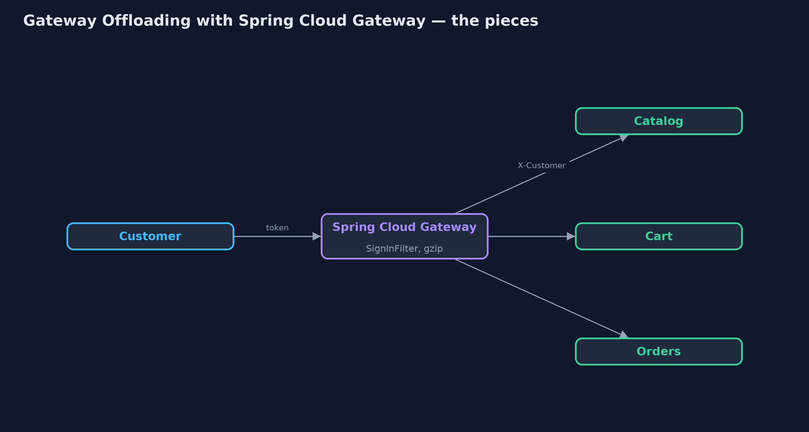
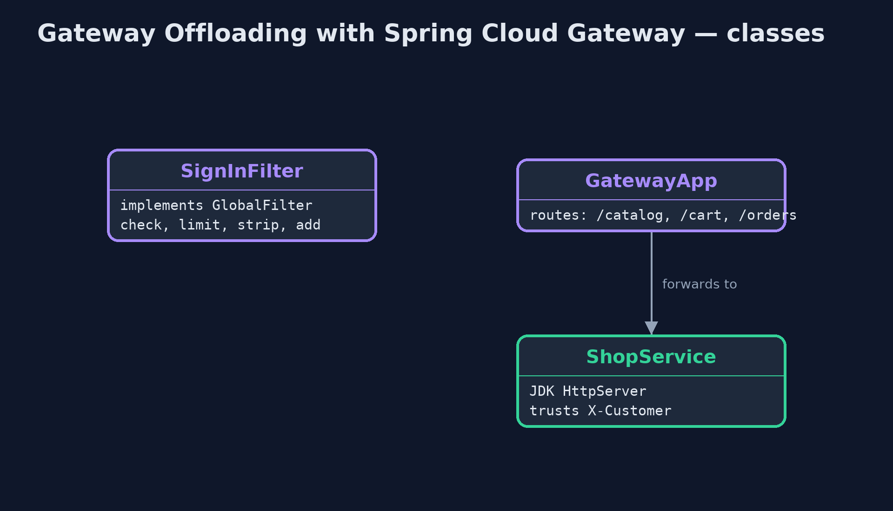
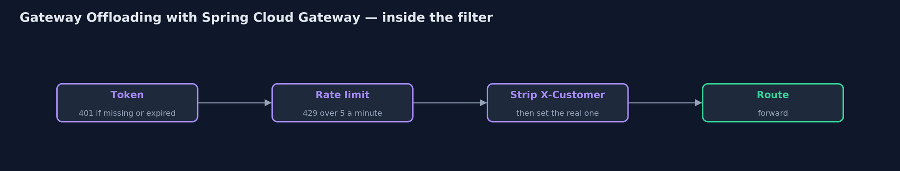
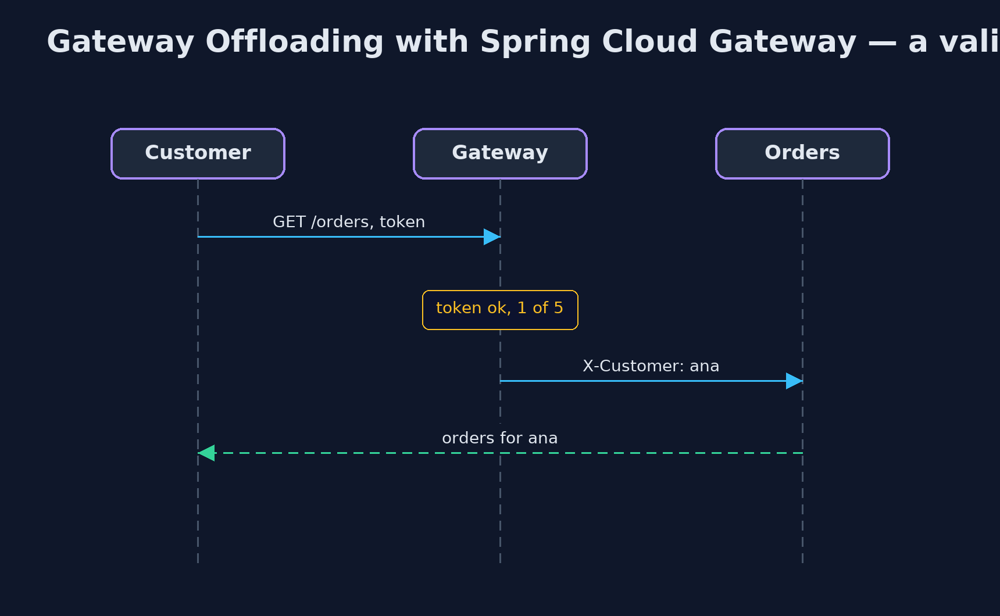

# Gateway Offloading with Spring Cloud Gateway Pattern

```
src/main/java/com/jk/explore/offloadgateway/
├── GatewayApp.java                   The gateway: one route per service
├── GatewayOffloadingSpringDemo.java  The five acts: three real back-end services and a real Spring Cloud Gateway in front of them
├── ShopService.java                  One of the shop's back-end services, a real HTTP server on a local port
├── SignInFilter.java                 The chores the gateway does for every service, before any route: check the sign-in token, limit each customer's requests, and pass on who the customer is, removing any X-Customer the caller sent
└── Tokens.java                       Sign-in tokens of the form {@code tok:<customer>:<expires-at-epoch-second>}
```

**Put a real Spring Cloud Gateway in front of the shop's catalog, cart and orders services, and move the shared chores into it: the sign-in check, a per-customer rate limit, response compression, and stripping a caller's claim to be someone else.**

This is the framework version of the Gateway Offloading pattern. The plain
Java version, a separate project in this category, writes a gateway as a
class. Here a real Spring Cloud Gateway runs on a local port in front of three
real back-end services, and every request in the demo is a real HTTP call.

The gateway has one route per service. A global filter, which runs before any
route, does the chores every service needs: it checks the sign-in token,
limits each customer's requests, removes any X-Customer header the caller
sent, and adds the checked customer instead. Reactor Netty, the server
underneath, compresses responses when a property says so. The services
behind hold no sign-in code at all.

## The idea in everyday terms

Think of an office building with a reception desk. Visitors sign in once at
the front door; the teams upstairs trust that anyone in the corridor has
been checked. Reception also turns away anyone who keeps coming back too
often. That only works if there is no side door.

## The scenario

The online store has three services: catalog, cart and orders. Each checked
the customer's sign-in token itself, with its own copy of the code, and the
orders team's copy forgot to check expiry.

## Run

Nothing to install beyond a Java 21 JDK: the three services and the gateway
all start inside the program, on local ports.

```bash
./gradlew run
```

The demo tells the story in 5 acts, each printing exact numbers that the tests check:

| Act | What it shows |
| --- | --- |
| 1. Every service checks for itself | Called directly, catalog and cart refuse an expired token with 401, but orders answers 200, because its copy of the check forgot expiry. |
| 2. One check at the gateway | Through Spring Cloud Gateway, the expired token gets 401 for all three services; a valid one reaches orders: 200 orders for ana. |
| 3. Rate limiting | The gateway allows 5 requests a minute per customer: 8 in a row give 5 passed and 3 refused with 429. |
| 4. Compression | The 10,093-byte catalog page comes back gzipped at the gateway, under a fifth of the size; the catalog service knows nothing about it. |
| 5. The bill | Through the gateway, a spoofed X-Customer: ben is replaced with ana; straight to orders, the same header gets 200 orders for ben. |

## Test

```bash
./gradlew test
```

1 tests in `DemoRunsTest`. Every result the demo prints is asserted, with real back-end services and a real Spring Cloud Gateway on local ports, called over HTTP.

## What the simulation got right, and what it left out

The plain Java version got the idea right: one check at the door, the same
for every service, rate limits and compression in one place, and the side
door and single point of failure as the costs. What it left out is a real
gateway. Here the check is a Spring Cloud Gateway global filter that runs
before any route; compression is a server property, not code; a spoofed
X-Customer header is stripped before the request goes on; and the routes are
real HTTP forwarding to real services. It also names what a single gateway
cannot do alone: its in-memory rate limit counts only on that one instance,
which is why production uses the built-in limiter with Redis.

## Technologies and versions

| Technology | Version | Used for |
| --- | --- | --- |
| Java | 21 | the code (toolchain set in `build.gradle`) |
| Gradle | 9.2.1 (wrapper) | build and run, nothing to install |
| JUnit | 5.10.2 | the tests |
| Spring Cloud Gateway | release train 2025.1.3 (server-webflux) | routes and the global filter |
| Spring Boot | 4.1.1 | the gateway application |
| Reactor Netty | with Spring Boot 4.1.1 | the gateway's server, with response compression |
| JDK HttpServer | Java 21 | the three back-end services |
| videokit | repository tool | the narrated video and animation: Piper `en_US-amy-medium`, speed 0.8, longer pauses (the approved `amy-slow` voice) |

## Learning Material

| Document | What it is for |
| --- | --- |
| [Dependencies](docs/dependencies.md) | what the framework and infrastructure are, and why they are here |
| [Problem statement](docs/problem-statement.md) | the situation and what the project must show |
| [Prerequisites](docs/prerequisites.md) | what you need to know first |
| [Gateway Offloading with Spring Cloud Gateway, explained](docs/gateway-offloading-with-spring-cloud-gateway-pattern-explained.md) | the acts in prose |
| [Session guide](docs/session.md) | a one-hour lesson with exercises |
| [Animated walkthrough](docs/animation.html) | the acts step by step, narrated |
| [Spec](docs/spec.md) | what this project must be true of |

### The pattern in one picture

Chores in the gateway; business in the services.



### Where each piece sits

A filter and three routes.



### How the data moves

In order, before any route.



### Who calls whom, in order

The service only does its own job.



### Video

`video/gateway-offloading-with-spring-cloud-gateway-pattern-explained.mp4` (with `.m4a` audio and `.srt` subtitles) is built by `video/build_video.sh`. Rendered media is not committed.

## What it costs

- **No side doors.** A call straight to the orders service, claiming to be ben, was answered 200.
- **One more hop, one more thing to run.** Every request passes the gateway, and a gateway outage stops every page.
- **Shared counts need shared storage.** The in-memory rate limit counts per gateway instance; production uses RequestRateLimiter with Redis.

## When this is too much

With one or two services, a shared library does the job without a gateway.
Offloading pays off when many services, often from different teams, need
exactly the same chores.

## Where you have already met this

- Spring Cloud Gateway global filters and route filters.
- Kong, NGINX, Envoy and cloud API gateways with auth and rate-limit plugins.
- `server.compression.enabled` on Spring Boot servers.

## Where this sits

This project is in [micro-services-design-patterns](..). It is the framework
version of the plain Java Gateway Offloading project in the same category,
which is left unchanged.
