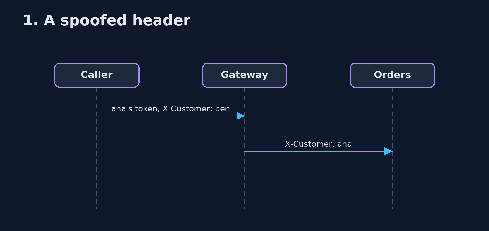
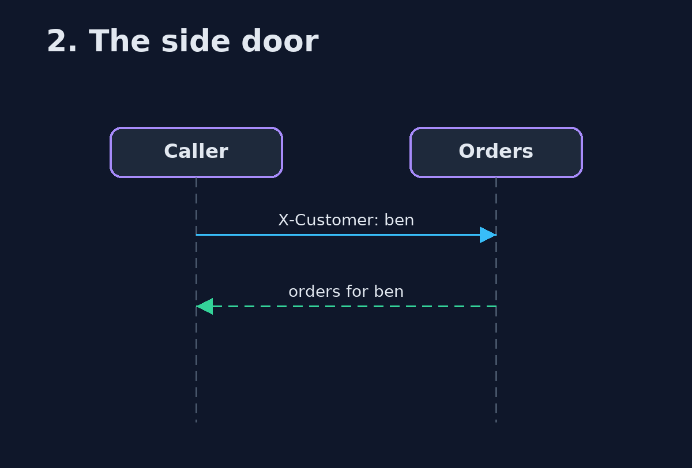

# Gateway Offloading with Spring Cloud Gateway Pattern — UML Sequence Diagrams

## 1. 1. A spoofed header

Replaced at the gateway.

## 2. 2. The side door

Why services must not be reachable directly.

